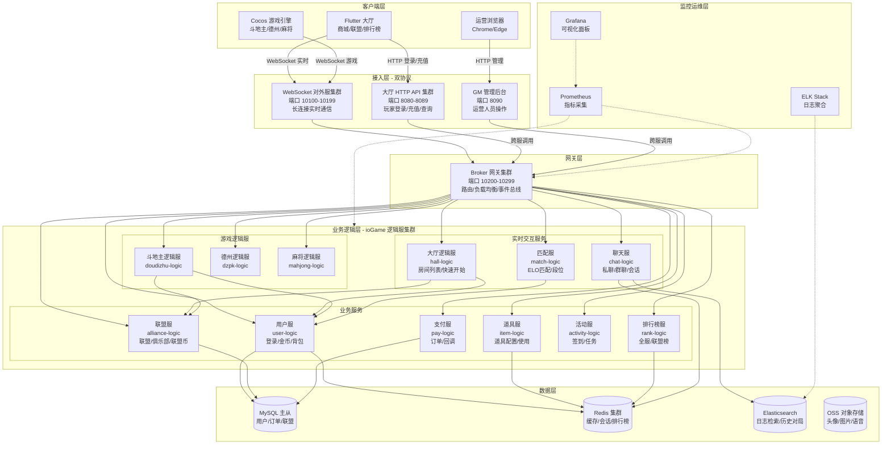
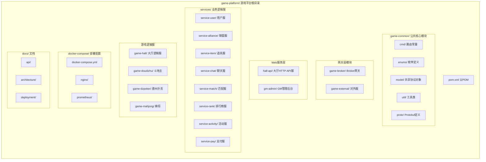
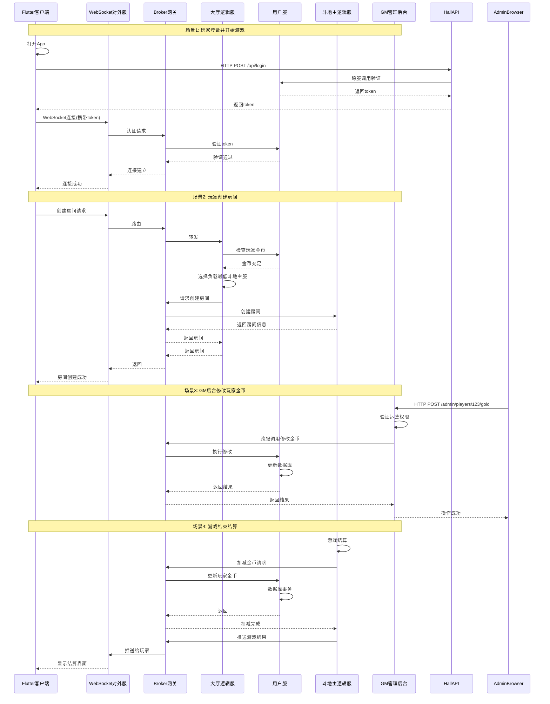
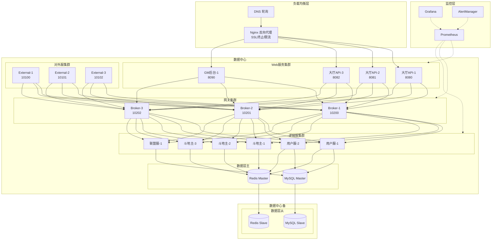
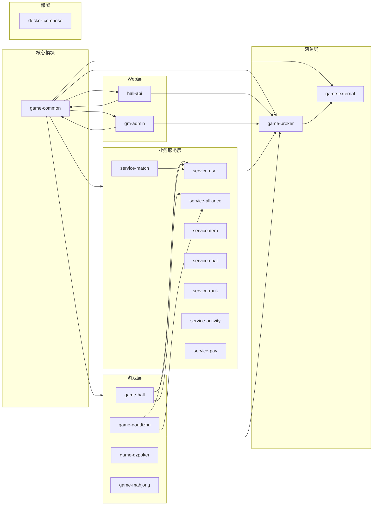

# 项目基本架构
## 1. 概要架构图

```mermaid
graph TB
    subgraph Client[客户端层]
        Cocos[Cocos 游戏引擎<br/>斗地主/德州/麻将]
        Flutter[Flutter 大厅<br/>商城/联盟/排行榜]
        AdminBrowser[运营浏览器<br/>Chrome/Edge]
    end

    subgraph Access[接入层 - 双协议]
        WS[WebSocket 对外服集群<br/>端口 10100-10199<br/>长连接实时通信]
        HTTP1[大厅 HTTP API 集群<br/>端口 8080-8089<br/>玩家登录/充值/查询]
        HTTP2[GM 管理后台<br/>端口 8090<br/>运营人员操作]
    end

    subgraph Gateway[网关层]
        Broker[Broker 网关集群<br/>端口 10200-10299<br/>路由/负载均衡/事件总线]
    end

    subgraph Logic[业务逻辑层 - ioGame 逻辑服集群]
        subgraph RealTime[实时交互服务]
            Hall[大厅逻辑服<br/>hall-logic<br/>房间列表/快速开始]
            Chat[聊天服<br/>chat-logic<br/>私聊/群聊/会话]
            Match[匹配服<br/>match-logic<br/>ELO匹配/段位]
        end
        
        subgraph Game[游戏逻辑服]
            DZ[斗地主逻辑服<br/>doudizhu-logic]
            DZPK[德州逻辑服<br/>dzpk-logic]
            MJ[麻将逻辑服<br/>mahjong-logic]
        end
        
        subgraph Business[业务服务]
            User[用户服<br/>user-logic<br/>登录/金币/背包]
            Alliance[联盟服<br/>alliance-logic<br/>联盟/俱乐部/联盟币]
            Item[道具服<br/>item-logic<br/>道具配置/使用]
            Rank[排行榜服<br/>rank-logic<br/>全服/联盟榜]
            Activity[活动服<br/>activity-logic<br/>签到/任务]
            Pay[支付服<br/>pay-logic<br/>订单/回调]
        end
    end

    subgraph Data[数据层]
        MySQL[(MySQL 主从<br/>用户/订单/联盟)]
        Redis[(Redis 集群<br/>缓存/会话/排行榜)]
        ES[(Elasticsearch<br/>日志检索/历史对局)]
        OSS[(OSS 对象存储<br/>头像/图片/语音)]
    end

    subgraph Monitor[监控运维层]
        Prometheus[Prometheus<br/>指标采集]
        Grafana[Grafana<br/>可视化面板]
        ELK[ELK Stack<br/>日志聚合]
    end

    %% 客户端连接
    Flutter -->|WebSocket 实时| WS
    Flutter -->|HTTP 登录/充值| HTTP1
    Cocos -->|WebSocket 游戏| WS
    AdminBrowser -->|HTTP 管理| HTTP2

    %% 接入层到网关
    WS --> Broker
    HTTP1 -->|跨服调用| Broker
    HTTP2 -->|跨服调用| Broker

    %% 网关到逻辑服
    Broker --> Hall
    Broker --> Chat
    Broker --> Match
    Broker --> DZ
    Broker --> DZPK
    Broker --> MJ
    Broker --> User
    Broker --> Alliance
    Broker --> Item
    Broker --> Rank
    Broker --> Activity
    Broker --> Pay

    %% 逻辑服间调用
    Hall --> User
    Hall --> Alliance
    DZ --> User
    DZ --> Alliance
    Match --> User

    %% 数据层连接
    User --> MySQL
    User --> Redis
    Alliance --> MySQL
    Item --> Redis
    Rank --> Redis
    Chat --> Redis
    Chat --> ES
    Pay --> MySQL

    %% 监控
    Prometheus -.-> Broker
    Prometheus -.-> Logic
    Grafana -.-> Prometheus
    ELK -.-> ES
```
## 2. 项目结构图

```mermaid
graph TB
    subgraph Project[game-platform/ 游戏平台根目录]
        direction TB
        
        Pom[pom.xml 父POM]
        
        subgraph Common[game-common/ 公共核心模块]
            Cmd[cmd/ 路由常量]
            Enum[enums/ 枚举定义]
            Model[model/ 共享协议对象]
            Util[util/ 工具类]
            Proto[proto/ Protobuf定义]
        end
        
        subgraph Gateway[网关层模块]
            Broker[game-broker/ Broker网关]
            External[game-external/ 对外服]
        end
        
        subgraph Web[Web服务层]
            HallAPI[hall-api/ 大厅HTTP API服]
            GMAdmin[gm-admin/ GM管理后台]
        end
        
        subgraph Services[services/ 业务逻辑服]
            User[service-user/ 用户服]
            Alliance[service-alliance/ 联盟服]
            Item[service-item/ 道具服]
            Chat[service-chat/ 聊天服]
            Match[service-match/ 匹配服]
            Rank[service-rank/ 排行榜服]
            Activity[service-activity/ 活动服]
            Pay[service-pay/ 支付服]
        end
        
        subgraph Games[游戏逻辑服]
            Hall[game-hall/ 大厅逻辑服]
            DZ[game-doudizhu/ 斗地主]
            DZPK[game-dzpoker/ 德州扑克]
            MJ[game-mahjong/ 麻将]
        end
        
        subgraph Deploy[docker-compose/ 部署配置]
            Compose[docker-compose.yml]
            Nginx[nginx/]
            Prometheus[prometheus/]
        end
        
        subgraph Doc[docs/ 文档]
            API[api/]
            Arch[architecture/]
            DeployDoc[deployment/]
        end
    end
```
## 3. 服务通信与数据流向图

```mermaid
sequenceDiagram
    participant C as Flutter客户端
    participant WS as WebSocket对外服
    participant B as Broker网关
    participant Hall as 大厅逻辑服
    participant User as 用户服
    participant DZ as 斗地主逻辑服
    participant GM as GM管理后台

    Note over C,GM: 场景1: 玩家登录并开始游戏
    
    C->>C: 打开App
    C->>HallAPI: HTTP POST /api/login
    HallAPI->>User: 跨服调用验证
    User-->>HallAPI: 返回token
    HallAPI-->>C: 返回token
    
    C->>WS: WebSocket连接(携带token)
    WS->>B: 认证请求
    B->>User: 验证token
    User-->>B: 验证通过
    B-->>WS: 连接建立
    WS-->>C: 连接成功

    Note over C,GM: 场景2: 玩家创建房间
    
    C->>WS: 创建房间请求
    WS->>B: 路由
    B->>Hall: 转发
    Hall->>User: 检查玩家金币
    User-->>Hall: 金币充足
    Hall->>Hall: 选择负载最低斗地主服
    Hall->>B: 请求创建房间
    B->>DZ: 创建房间
    DZ-->>B: 返回房间信息
    B-->>Hall: 返回房间
    Hall-->>B: 返回房间
    B-->>WS: 返回
    WS-->>C: 房间创建成功

    Note over C,GM: 场景3: GM后台修改玩家金币
    
    AdminBrowser->>GM: HTTP POST /admin/players/123/gold
    GM->>GM: 验证运营权限
    GM->>B: 跨服调用修改金币
    B->>User: 执行修改
    User->>User: 更新数据库
    User-->>B: 返回结果
    B-->>GM: 返回结果
    GM-->>AdminBrowser: 操作成功

    Note over C,GM: 场景4: 游戏结束结算
    
    DZ->>DZ: 游戏结算
    DZ->>B: 扣减金币请求
    B->>User: 更新玩家金币
    User->>User: 数据库事务
    User-->>B: 返回
    B-->>DZ: 扣减完成
    DZ->>B: 推送游戏结果
    B->>WS: 推送给玩家
    WS-->>C: 显示结算界面
```
## 4. 部署架构与高可用图

```mermaid
graph TB
    subgraph LB[负载均衡层]
        DNS[DNS 轮询]
        Nginx[Nginx 反向代理<br/>SSL终止/限流]
    end

    subgraph DC[数据中心]
        
        subgraph Web1[Web服务集群]
            HallAPI1[大厅API-1<br/>8080]
            HallAPI2[大厅API-2<br/>8081]
            HallAPI3[大厅API-3<br/>8082]
            GM1[GM后台-1<br/>8090]
        end
        
        subgraph Gateway1[网关集群]
            Broker1[Broker-1<br/>10200]
            Broker2[Broker-2<br/>10201]
            Broker3[Broker-3<br/>10202]
        end
        
        subgraph External1[对外服集群]
            Ext1[External-1<br/>10100]
            Ext2[External-2<br/>10101]
            Ext3[External-3<br/>10102]
        end
        
        subgraph Logic1[逻辑服集群]
            User1[用户服-1]
            User2[用户服-2]
            DZ1[斗地主-1]
            DZ2[斗地主-2]
            DZ3[斗地主-3]
            Alliance1[联盟服-1]
        end
        
        subgraph Data1[数据层主]
            MySQL_M[(MySQL Master)]
            Redis_M[(Redis Master)]
        end
    end

    subgraph DC2[数据中心备]
        subgraph Data2[数据层从]
            MySQL_S[(MySQL Slave)]
            Redis_S[(Redis Slave)]
        end
    end

    subgraph Monitor[监控层]
        Prometheus[Prometheus]
        Grafana[Grafana]
        Alert[AlertManager]
    end

    DNS --> Nginx
    Nginx --> HallAPI1 & HallAPI2 & HallAPI3
    Nginx --> GM1
    
    HallAPI1 & HallAPI2 & HallAPI3 --> Broker1 & Broker2 & Broker3
    GM1 --> Broker1 & Broker2 & Broker3
    Ext1 & Ext2 & Ext3 --> Broker1 & Broker2 & Broker3
    
    Broker1 & Broker2 & Broker3 --> User1 & User2
    Broker1 & Broker2 & Broker3 --> DZ1 & DZ2 & DZ3
    Broker1 & Broker2 & Broker3 --> Alliance1
    
    User1 & User2 --> MySQL_M
    User1 & User2 --> Redis_M
    DZ1 & DZ2 & DZ3 --> Redis_M
    Alliance1 --> MySQL_M
    
    MySQL_M --> MySQL_S
    Redis_M --> Redis_S
    
    Prometheus -.-> Web1
    Prometheus -.-> Gateway1
    Prometheus -.-> Logic1
    Grafana -.-> Prometheus
    Alert -.-> Prometheus
```
## 5. 模块依赖关系图

```mermaid
graph LR
    subgraph Core[核心模块]
        Common[game-common]
    end

    subgraph Gateway[网关层]
        Broker[game-broker]
        External[game-external]
    end

    subgraph Web[Web层]
        HallAPI[hall-api]
        GM[gm-admin]
    end

    subgraph Services[业务服务层]
        User[service-user]
        Alliance[service-alliance]
        Item[service-item]
        Chat[service-chat]
        Match[service-match]
        Rank[service-rank]
        Activity[service-activity]
        Pay[service-pay]
    end

    subgraph Games[游戏层]
        Hall[game-hall]
        DZ[game-doudizhu]
        DZPK[game-dzpoker]
        MJ[game-mahjong]
    end

    subgraph Deploy[部署]
        Docker[docker-compose]
    end

    Common --> Broker
    Common --> External
    Common --> HallAPI
    Common --> GM
    Common --> Services
    Common --> Games
    
    Broker --> External
    HallAPI --> Broker
    GM --> Broker
    
    Services --> Broker
    Games --> Broker
    
    HallAPI --> Common
    GM --> Common
    
    Hall --> User
    Hall --> Alliance
    DZ --> User
    DZ --> Alliance
    Match --> User
```
