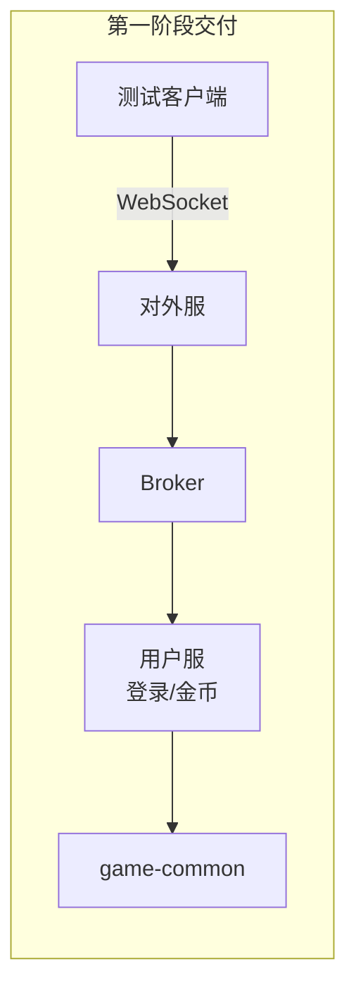
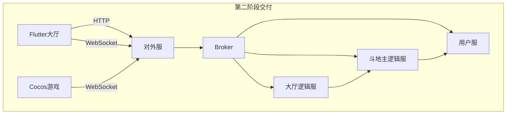
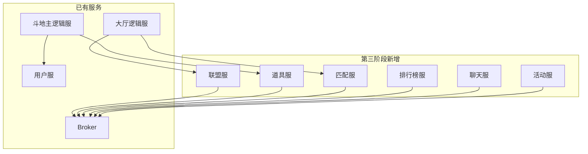
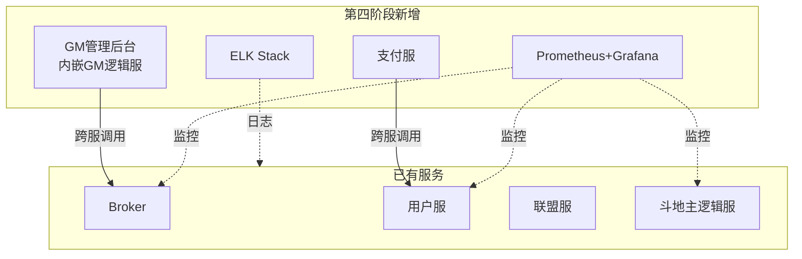

# 项目开发计划
总体实施策略：迭代式开发，逐步上线

```mermaid
graph LR
    subgraph Phase1[第一阶段: 基础框架]
        P1A[环境搭建]
        P1B[公共模块]
        P1C[用户服]
        P1D[对外服+网关]
    end
    
    subgraph Phase2[第二阶段: 核心玩法]
        P2A[斗地主逻辑服]
        P2B[大厅逻辑服]
        P2C[Flutter大厅对接]
        P2D[Cocos游戏对接]
    end
    
    subgraph Phase3[第三阶段: 生态功能]
        P3A[联盟/俱乐部]
        P3B[道具系统]
        P3C[排行榜/活动]
        P3D[聊天系统]
    end
    
    subgraph Phase4[第四阶段: 运营支撑]
        P4A[GM后台]
        P4B[支付接入]
        P4C[监控告警]
        P4D[数据统计]
    end
    
    Phase1 --> Phase2 --> Phase3 --> Phase4
```

## 📋 第一阶段：基础框架搭建
目标：跑通最基本的通信链路

| 序号 | 任务 | 产出 | 负责人建议 |
| :--- | :--- | :--- | :--- |
| 1.1 | 搭建 Maven 多模块项目 | 项目骨架 | 后端 |
| 1.2 | 定义 game-common 公共模块 | 路由常量、枚举、协议对象 | 后端 |
| 1.3 | 编写 Protobuf 协议文件 | user.proto, common.proto | 后端 |
| 1.4 | 启动 Broker 网关 | BrokerServer.java | 后端 |
| 1.5 | 启动对外服 | ExternalServer.java | 后端 |
| 1.6 | 开发用户服（登录、查询金币） | UserServer.java | 后端 |
| 1.7 | 开发简单测试客户端 | 验证 WebSocket 通信 | 后端/前端 |

### 第一阶段架构图

## 🎮 第二阶段：核心玩法实现
目标：跑通完整的游戏对局

| 序号 | 任务 | 产出 | 负责人建议 |
| :--- | :--- | :--- | :--- |
| 2.1 | 斗地主牌型判断算法 | CardUtil.java | 后端 |
| 2.2 | 斗地主逻辑服开发 | DouDiZhuAction, Room, RoomManager | 后端 |
| 2.3 | 大厅逻辑服开发 | HallAction（房间列表、快速开始） | 后端 |
| 2.4 | Flutter 大厅开发 | 登录页、大厅首页、房间列表 | 前端 |
| 2.5 | Cocos 游戏开发 | 斗地主游戏界面、动画 | 前端 |
| 2.6 | 前后端联调 | 完整对局 | 全员 |

### 第二阶段架构图

## 🌟 第三阶段：生态功能完善
目标：完善游戏周边功能

| 序号 | 任务 | 产出 | 优先级 |
| :--- | :--- | :--- | :--- |
| 3.1 | 联盟/俱乐部系统 | AllianceAction, ClubAction | 高 |
| 3.2 | 道具系统 | ItemAction, BagAction | 高 |
| 3.3 | 匹配服 | MatchAction, ELO 算法 | 中 |
| 3.4 | 排行榜服 | RankAction, Redis 排行 | 中 |
| 3.5 | 聊天系统 | ChatAction, 群聊/私聊 | 中 |
| 3.6 | 活动系统 | ActivityAction, 签到/任务 | 低 |

### 第三阶段架构图

## 🚀 第四阶段：运营支撑上线
目标：系统可上线、可运维

| 序号 | 任务 | 产出 | 说明 |
| :--- | :--- | :--- | :--- |
| 4.1 | **GM 管理后台** | 玩家管理、订单管理、配置管理 | 内嵌于 GM 逻辑服，实现高效管控 |
| 4.2 | **支付接入** | 支付宝/微信支付回调接口 | 与用户服对接，打通经济循环 |
| 4.3 | **监控告警** | Prometheus + Grafana | 实时监控服务状态，预警系统风险 |
| 4.4 | **日志系统** | ELK Stack (Elasticsearch, Logstash, Kibana) | 集中化日志收集与全文检索 |
| 4.5 | **压测调优** | 性能测试报告 | 模拟高并发，验证系统承载极限 |
| 4.6 | **容器化部署** | Docker + K8s 配置文件 | 实现自动扩缩容，确保高可用性 |
| 4.7 | **上线准备** | 灰度策略、应急回滚方案 | 建立容错机制，保障发布万无一失 |

### 第四阶段架构图
