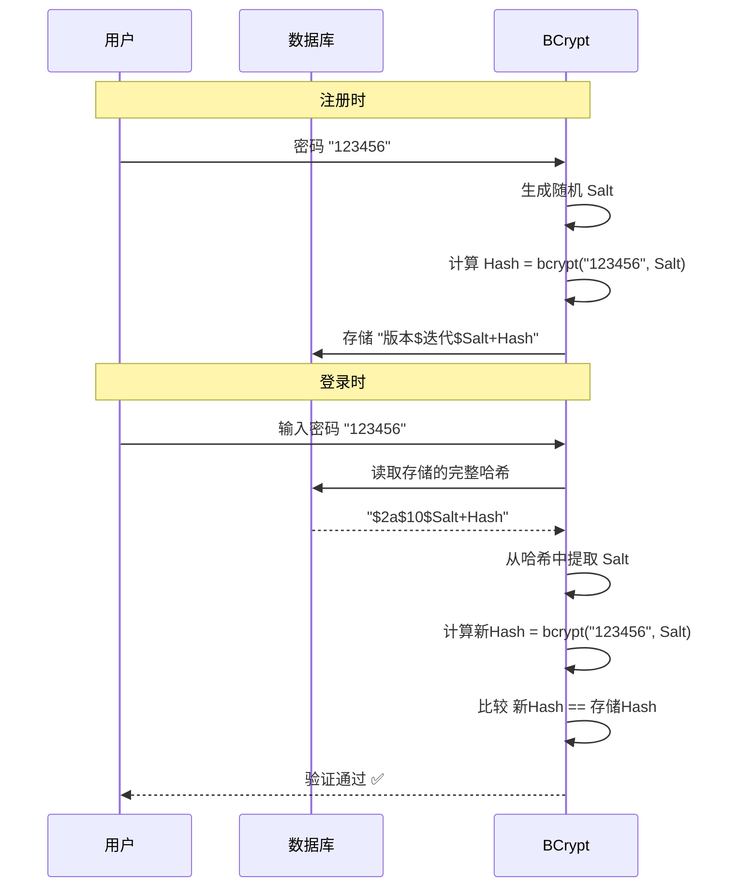

# BCrypt 加密算法
## 1. 介绍
BCrypt 是一种自适应哈希函数，专门用于密码存储。它的核心特点是：
1. 每次加密结果都不同（即使明文相同）
2. 内置 salt（盐值），防止彩虹表攻击
3. 可调节计算强度，随着硬件发展可以增加计算难度
## 2. 为什么每次加密结果都不一样？
BCrypt 在加密时会自动生成一个随机的 salt（盐值），然后把这个 salt 和密码一起计算哈希，最后把 salt 和哈希值拼接在一起输出。
```java
BCryptPasswordEncoder encoder = new BCryptPasswordEncoder();

System.out.println(encoder.encode("123456");
// 输出1: $2a$10$9fZ3E.8FqHqLqMqRqSqTq.uX9X9X9X9X9X9X9X9X9X9X9X9X9X
        System.out.println(encoder.encode("123456"));
// 输出2: $2a$10$AbCdEfGhIjKlMnOpQrStU.vY9Y9Y9Y9Y9Y9Y9Y9Y9Y9Y9Y9Y9Y
        System.out.println(encoder.encode("123456"));
// 输出3: $2a$10$ZxYwVuTsRqPoNmLkJiHfG.wZ8Z8Z8Z8Z8Z8Z8Z8Z8Z8Z8Z8Z8Z8
```
## 3. 密码格式解析
```text
$2a$10$9fZ3E.8FqHqLqMqRqSqTq.uX9X9X9X9X9X9X9X9X9X9X9X9X9X
│ │  │ └────────────────┬────────────────┘└────────┬────────┘
│ │  │                  │                          │
│ │  │                  Salt (22字符)               Hash (31字符)
│ │  │
│ │  迭代次数 (2^10 = 1024次)
│ │
│ 算法版本 (2a = BCrypt)
```
关键点：盐值（Salt）就包含在输出的字符串中！
## 4. 如何验证密码？
验证时，BCrypt 会：
1. 从存储的哈希中提取出 salt 
2. 用这个 salt 对输入的密码重新计算哈希 
3. 比较计算结果是否与存储的哈希一致
```java
// 存储的密码（已经包含 salt）
String storedHash = "$2a$10$9fZ3E.8FqHqLqMqRqSqTq.uX9X9X9X9X9X9X9X9X9X9X9X9X9X";

// 验证时
boolean matches = encoder.matches("123456", storedHash);
// matches = true

// 不需要单独存储 salt，因为它已经在 storedHash 里了
```
## 5. 验证流程详解

## 6. 对比其他加密方式

| 特性 | MD5/SHA | BCrypt |
| :--- | :--- | :--- |
| **每次结果** | **相同**：同样的输入永远得到同样的哈希值。 | **不同**：内置随机盐值，每次加密结果均不一致。 |
| **需要单独存储 Salt** | **需要**：必须在数据库另辟字段存储盐值以增强安全性。 | **不需要**：盐值已内置在生成的哈希字符串中。 |
| **彩虹表攻击** | **容易**：由于结果固定，可通过预计算的哈希表快速反查。 | **困难**：随机盐值使预计算变得几乎不可能。 |
| **暴力破解** | **快**：算法效率极高，黑客可每秒尝试数亿次。 | **慢**：故意设计的计算密集型算法，增加破解成本。 |
| **硬件升级** | **无法增强**：对抗硬件算力提升的能力较弱。 | **可调强度**：可通过增加 `Cost` 参数灵活应对硬件升级。 |
## 7. 为什么 BCrypt 更安全？
### 7.1 彩虹表攻击无效
```sql
-- MD5: 相同密码产生相同哈希
SELECT MD5('123456'); -- 每次都是 e10adc3949ba59abbe56e057f20f883e
-- 攻击者可以预先计算"常见密码→MD5"的彩虹表

-- BCrypt: 相同密码产生不同哈希
SELECT bcrypt('123456'); -- 每次不同，彩虹表无效
```
### 7.2 故意设计得"慢"
```java
// MD5: 1秒可计算数百万次
// BCrypt: 1秒只能计算几十次（可调节）

// 强度可调：2^10 = 1024次迭代（约0.1秒）
BCryptPasswordEncoder encoder = new BCryptPasswordEncoder(10);

// 强度提高：2^12 = 4096次迭代（约0.4秒）
BCryptPasswordEncoder encoder = new BCryptPasswordEncoder(12);
```
## 8. 实际使用示例
```java
@Service
public class UserService {
    
    private final BCryptPasswordEncoder encoder = new BCryptPasswordEncoder();
    
    // 注册时：加密存储
    public void register(String password) {
        String encodedPassword = encoder.encode(password);
        // 存储 encodedPassword 到数据库
        System.out.println("存储: " + encodedPassword);
        // 输出: $2a$10$9fZ3E.8FqHqLqMqRqSqTq.uX9X9X9X9X9X9X9X9X9X9X9X9X9X
    }
    
    // 登录时：验证密码
    public boolean login(String password, String storedHash) {
        // 直接比较，不需要知道 salt
        return encoder.matches(password, storedHash);
    }
}
```
## 9. 总结
| 问题 | 答案 |
| :--- | :--- |
| **为什么每次结果不同？** | **动态加盐**：算法在每次加密时生成一个全新的随机盐值。 |
| **盐值存在哪里？** | **内置存储**：生成的哈希字符串中已包含版本号、Cost值和随机盐。 |
| **怎么验证密码？** | **特征比对**：从库中哈希提取盐，用其对明文重新加密，比对最终摘要。 |
| **安全性如何？** | **高防抵御**：彻底免疫彩虹表，且计算密集型特性极大拉长暴破时间。 |


