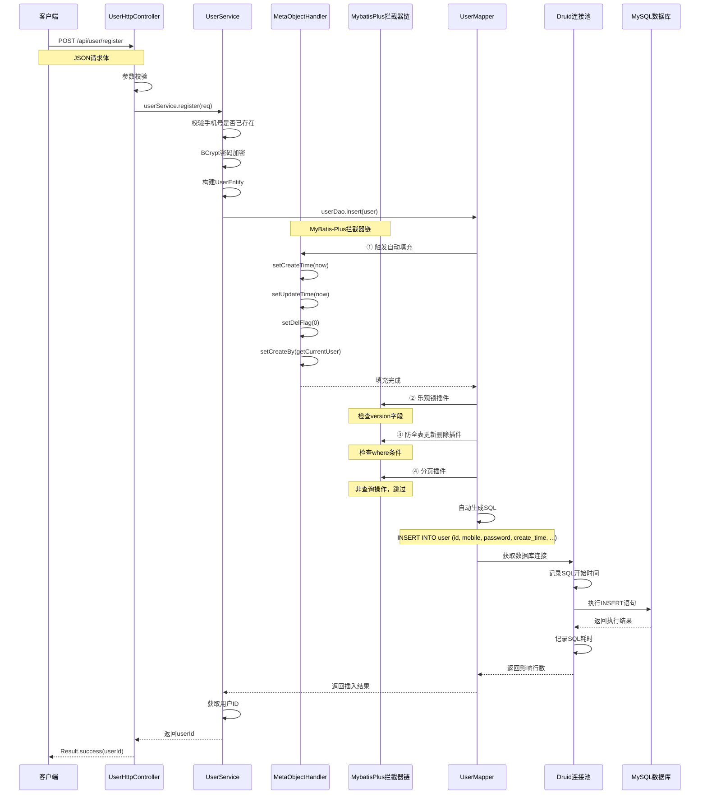
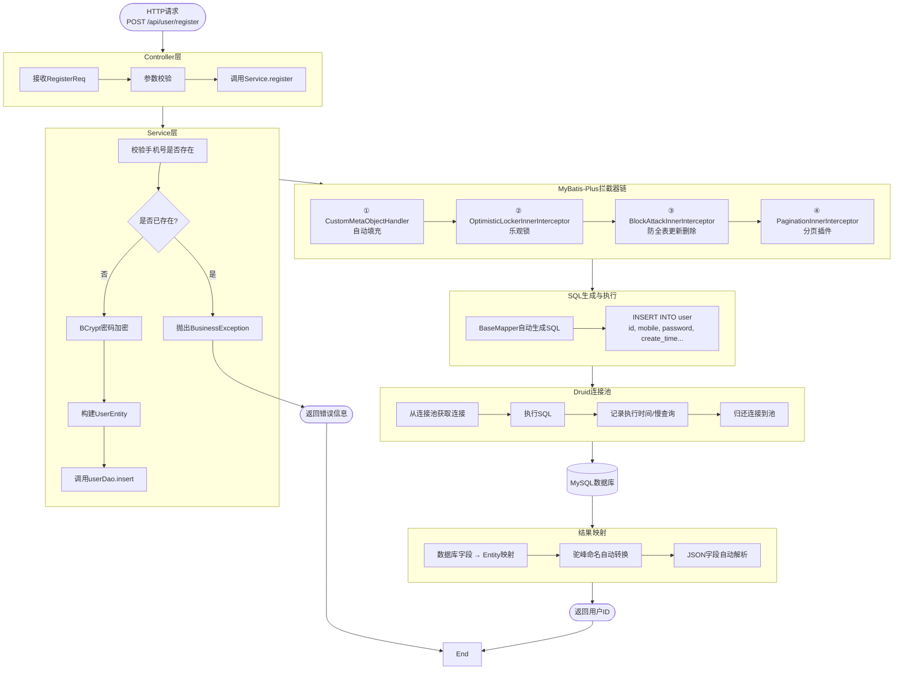
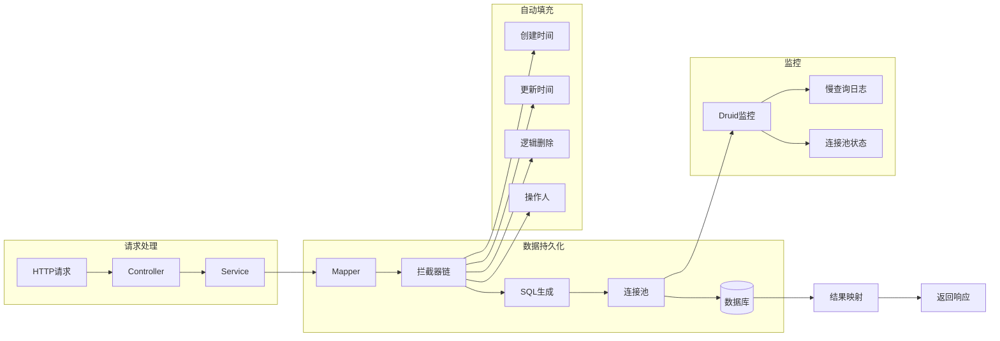
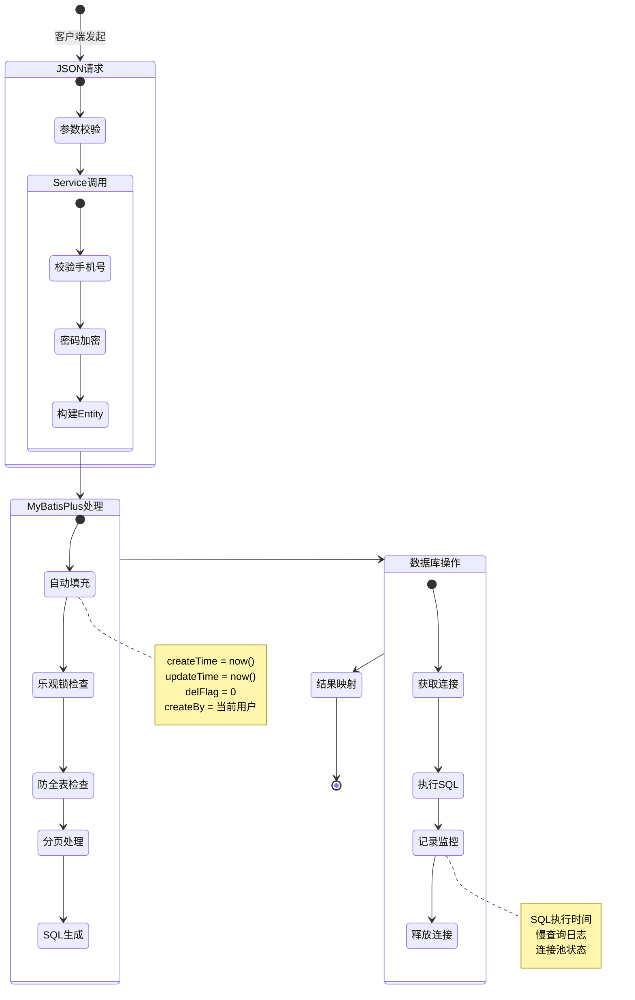

# Game-starter-mybatis 设计
## 详细时序图

```mermaid
sequenceDiagram
    participant Client as 客户端
    participant Controller as UserHttpController
    participant Service as UserService
    participant Handler as MetaObjectHandler
    participant Interceptor as MybatisPlus拦截器链
    participant Mapper as UserMapper
    participant Druid as Druid连接池
    participant DB as MySQL数据库

    Client->>Controller: POST /api/user/register
    Note over Client,Controller: JSON请求体
    
    Controller->>Controller: 参数校验
    Controller->>Service: userService.register(req)
    
    Service->>Service: 校验手机号是否已存在
    Service->>Service: BCrypt密码加密
    Service->>Service: 构建UserEntity
    
    Service->>Mapper: userDao.insert(user)
    
    Note over Handler,Interceptor: MyBatis-Plus拦截器链
    
    Mapper->>Handler: ① 触发自动填充
    Handler->>Handler: setCreateTime(now)
    Handler->>Handler: setUpdateTime(now)
    Handler->>Handler: setDelFlag(0)
    Handler->>Handler: setCreateBy(getCurrentUser)
    Handler-->>Mapper: 填充完成
    
    Mapper->>Interceptor: ② 乐观锁插件
    Note over Interceptor: 检查version字段
    
    Mapper->>Interceptor: ③ 防全表更新删除插件
    Note over Interceptor: 检查where条件
    
    Mapper->>Interceptor: ④ 分页插件
    Note over Interceptor: 非查询操作，跳过
    
    Mapper->>Mapper: 自动生成SQL
    Note over Mapper: INSERT INTO user (id, mobile, password, create_time, ...)
    
    Mapper->>Druid: 获取数据库连接
    Druid->>Druid: 记录SQL开始时间
    Druid->>DB: 执行INSERT语句
    DB-->>Druid: 返回执行结果
    Druid->>Druid: 记录SQL耗时
    
    Druid-->>Mapper: 返回影响行数
    Mapper-->>Service: 返回插入结果
    
    Service->>Service: 获取用户ID
    Service-->>Controller: 返回userId
    
    Controller-->>Client: Result.success(userId)
```
## 流程图

```mermaid
flowchart TD
    Start([HTTP请求<br/>POST /api/user/register]) --> Controller
    
    subgraph Controller [Controller层]
        A1[接收RegisterReq] --> A2[参数校验]
        A2 --> A3[调用Service.register]
    end
    
    Controller --> Service
    
    subgraph Service [Service层]
        B1[校验手机号是否存在] --> B2{是否已存在?}
        B2 -->|是| B3[抛出BusinessException]
        B2 -->|否| B4[BCrypt密码加密]
        B4 --> B5[构建UserEntity]
        B5 --> B6[调用userDao.insert]
    end
    
    B3 --> Error([返回错误信息])
    
    Service --> Interceptor
    
    subgraph Interceptor [MyBatis-Plus拦截器链]
        direction LR
        C1[① CustomMetaObjectHandler<br/>自动填充] --> C2[② OptimisticLockerInnerInterceptor<br/>乐观锁]
        C2 --> C3[③ BlockAttackInnerInterceptor<br/>防全表更新删除]
        C3 --> C4[④ PaginationInnerInterceptor<br/>分页插件]
    end
    
    Interceptor --> SQL
    
    subgraph SQL [SQL生成与执行]
        D1[BaseMapper自动生成SQL] --> D2[INSERT INTO user<br/>id, mobile, password, create_time...]
    end
    
    SQL --> Druid
    
    subgraph Druid [Druid连接池]
        E1[从连接池获取连接] --> E2[执行SQL]
        E2 --> E3[记录执行时间/慢查询]
        E3 --> E4[归还连接到池]
    end
    
    Druid --> DB[(MySQL数据库)]
    DB --> Result
    
    subgraph Result [结果映射]
        F1[数据库字段 → Entity映射] --> F2[驼峰命名自动转换]
        F2 --> F3[JSON字段自动解析]
    end
    
    Result --> Response([返回用户ID])
    Error --> End
    Response --> End

```
## 简化业务流程图

```mermaid
graph LR
    subgraph 请求处理
        A[HTTP请求] --> B[Controller]
        B --> C[Service]
    end
    
    subgraph 数据持久化
        C --> D[Mapper]
        D --> E[拦截器链]
        E --> F[SQL生成]
        F --> G[连接池]
        G --> H[(数据库)]
    end
    
    subgraph 自动填充
        E --> I[创建时间]
        E --> J[更新时间]
        E --> K[逻辑删除]
        E --> L[操作人]
    end
    
    subgraph 监控
        G --> M[Druid监控]
        M --> N[慢查询日志]
        M --> O[连接池状态]
    end
    
    H --> P[结果映射]
    P --> Q[返回响应]
```
## 状态图

```mermaid
stateDiagram-v2
    [*] --> JSON请求: 客户端发起
    
    state JSON请求 {
        [*] --> 参数校验
        参数校验 --> Service调用
    }
    
    state Service调用 {
        [*] --> 校验手机号
        校验手机号 --> 密码加密
        密码加密 --> 构建Entity
    }
    
    Service调用 --> MyBatisPlus处理
    
    state MyBatisPlus处理 {
        [*] --> 自动填充
        自动填充 --> 乐观锁检查
        乐观锁检查 --> 防全表检查
        防全表检查 --> 分页处理
        分页处理 --> SQL生成
    }
    
    MyBatisPlus处理 --> 数据库操作
    
    state 数据库操作 {
        [*] --> 获取连接
        获取连接 --> 执行SQL
        执行SQL --> 记录监控
        记录监控 --> 释放连接
    }
    
    数据库操作 --> 结果映射
    结果映射 --> [*]
    
    note right of 自动填充
        createTime = now()
        updateTime = now()
        delFlag = 0
        createBy = 当前用户
    end note
    
    note right of 记录监控
        SQL执行时间
        慢查询日志
        连接池状态
    end note
```
