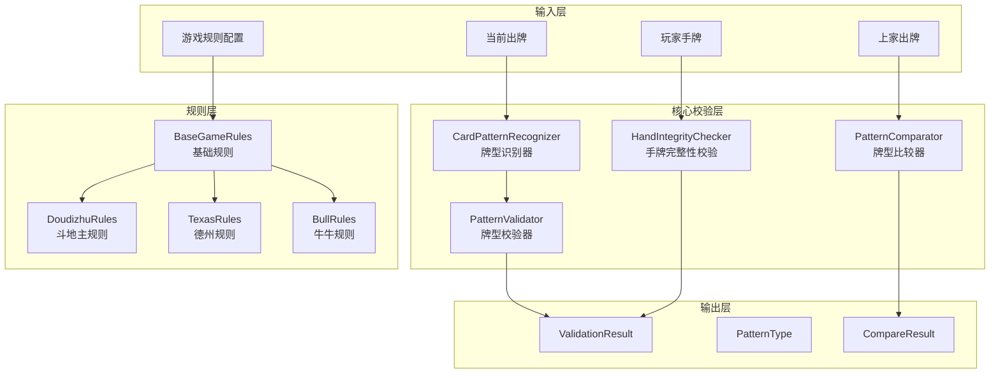
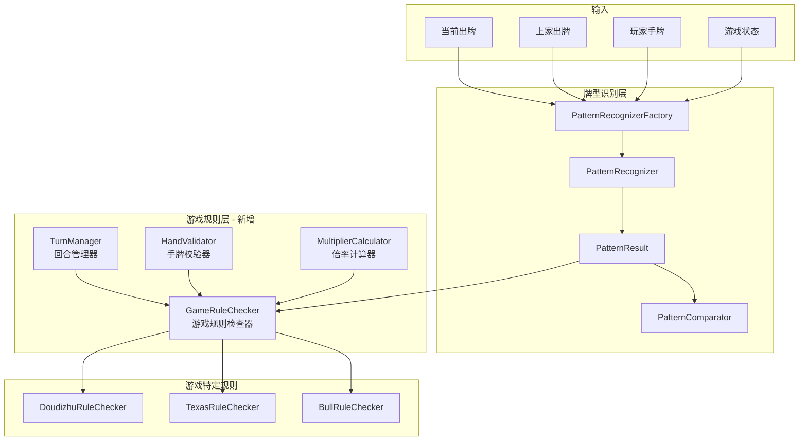
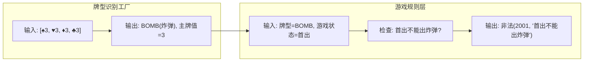
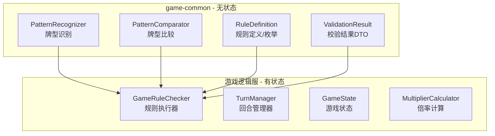
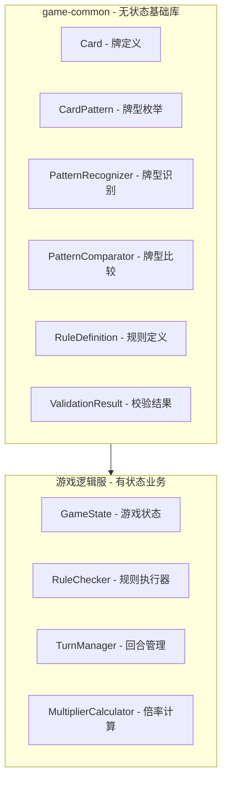

# 出牌校验设计
## 1. 架构设计
### 1.1 架构图 


## 2. 牌型识别工厂与游戏规则层的关系
### 2.1 核心区别

| 维度 | 牌型识别工厂 (Pattern Factory) | 游戏规则层 (Game Rules Layer) |
| :--- | :--- | :--- |
| **职责** | **身份识别**：仅负责解析当前牌组构成的物理牌型（如：这对牌是什么）。 | **逻辑判定**：负责根据当前对局状态判断该出牌动作是否合法。 |
| **输入** | 当前出的牌组 (Card IDs/List) | 当前牌组 + 游戏实时状态 + 历史出牌记录 (Context) |
| **输出** | 识别结果 (牌型枚举) + 主牌点数 (Power) | 合法性 (Boolean) + 错误码 (ErrorCode) + 状态变更 |
| **依赖** | **无状态 (Stateless)**：纯算法计算，不关心上家出过什么。 | **有状态 (Stateful)**：强依赖于游戏上下文与回合规则。 |
| **示例** | 算法识别出这四张牌是点数为 8 的 **“炸弹”**。 | 判定当前玩家是否能出炸弹、是否有过路、是否翻倍。 |

### 2.2 关系图

### 2.3 增加游戏规则层的好处
#### 2.3.1 职责分离

| 职责 | 牌型识别层 (Pattern Layer) | 游戏规则层 (Rules Layer) |
| :--- | :---: | :---: |
| **识别牌型** (如：是不是四条) | ✅ | ❌ |
| **比较大小** (如：A炸 > K炸) | ✅ | ❌ |
| **手牌完整性校验** (数量/是否存在) | ❌ | ✅ |
| **首出限制检查** (如：必须出黑桃3) | ❌ | ✅ |
| **回合顺序检查** (轮到谁出牌) | ❌ | ✅ |
| **炸弹倍率计算** (翻倍逻辑) | ❌ | ✅ |
| **春天/反春判定** (连击结算) | ❌ | ✅ |
| **结束条件检查** (手牌是否清空) | ❌ | ✅ |

#### 2.3.2 代码复用
```java
// 没有规则层：每个游戏都要重复实现
public class DoudizhuGameService {
    public boolean validatePlay(...) {
        // 1. 识别牌型
        // 2. 比较大小
        // 3. 检查首出限制
        // 4. 检查回合
        // 5. 更新状态
    }
}

// 有规则层：复用通用逻辑
public class DoudizhuGameService {
    private final GameRuleChecker ruleChecker;
    
    public boolean validatePlay(...) {
        // 1. 识别牌型（工厂）
        // 2. 规则检查（规则层）
        return ruleChecker.validate(playCards, context);
    }
}
```
#### 2.3.3 易于扩展
```java
// 新增游戏只需实现规则接口
public class NewGameRuleChecker implements GameRuleChecker {
    @Override
    public ValidationResult validate(List<Card> playCards, GameContext context) {
        // 只需实现游戏特定的规则
    }
}
```
#### 2.3.4 可测试性
```java
// 可以独立测试规则层
@Test
void testFirstPlayCannotPlayBomb() {
    GameContext context = GameContext.builder().isFirstPlay(true).build();
    ValidationResult result = ruleChecker.validate(bombCards, context);
    assertThat(result.isValid()).isFalse();
}
```
#### 2.3.5 支持热更新
```java
// 规则配置可以动态加载
@Configuration
public class GameRuleConfig {
    // 是否允许首出炸弹
    private boolean allowFirstPlayBomb = false;
    
    // 炸弹倍率基数
    private int bombMultiplierBase = 2;
}
```
### 3. 规则层拆分
规则层应该拆分为"无状态规则"和"有状态管理器"

| 组件 | 是否有状态 | 部署位置 | 原因 |
| :--- | :---: | :--- | :--- |
| **牌型识别 (PatternRecognizer)** | ❌ 无状态 | `game-common` | 纯算法逻辑：给定一组牌 ID，输出对应的牌型（如：四条）。 |
| **牌型比较 (PatternComparator)** | ❌ 无状态 | `game-common` | 纯比较逻辑：仅根据牌型等级和主牌分值判定胜负。 |
| **规则定义 (RuleDefinition)** | ❌ 无状态 | `game-common` | 静态数据：存放游戏的基础枚举值、常量和配置信息。 |
| **校验结果 (ValidationResult)** | ❌ 无状态 | `game-common` | 纯 DTO：用于跨服务传输合法性检查的结果及错误码。 |
| **规则执行器 (RuleChecker)** | ✅ 有状态 | **游戏逻辑服** | 业务核心：必须结合当前牌局状态（如：上家出的牌）进行校验。 |
| **回合管理器 (TurnManager)** | ✅ 有状态 | **游戏逻辑服** | 流程控制：实时记录当前操作玩家索引、倒计时和操作序列。 |
| **倍率计算器 (MultiplierCalculator)** | ✅ 有状态 | **游戏逻辑服** | 结算逻辑：随局势累加炸弹次数、翻倍奖励及封顶限制。 |


## 4. 目录结构
```text
game-common/src/main/java/com/pokergame/common/
├── card/                                   # 牌定义（已有）
├── pattern/                                # 牌型识别（已有）
│   ├── PatternRecognizer.java
│   ├── PatternRecognizerFactory.java
│   ├── PatternResult.java
│   ├── PatternComparator.java
│   ├── doudizhu/
│   │   └── DoudizhuPatternRecognizer.java
│   ├── texas/
│   │   └── TexasPatternRecognizer.java
│   └── bull/
│       └── BullPatternRecognizer.java
│
├── rule/                                   # 【新增】规则定义（无状态）
│   ├── RuleType.java                       # 规则类型枚举
│   ├── RuleConfig.java                     # 规则配置DTO
│   ├── ValidationResult.java               # 校验结果DTO
│   └── GameRuleDefinition.java             # 游戏规则定义
│
└── util/                                   # 工具类（已有）

game-doudizhu/src/main/java/com/pokergame/doudizhu/
├── DoudizhuLogicServer.java                # 逻辑服启动类
├── action/                                 # Action层
├── service/                                # 业务服务
├── state/                                  # 【新增】游戏状态（有状态）
│   ├── GameState.java                      # 游戏状态
│   ├── TurnManager.java                    # 回合管理器
│   └── MultiplierCalculator.java           # 倍率计算器
├── rule/                                   # 【新增】规则执行器（有状态）
│   └── DoudizhuRuleChecker.java            # 斗地主规则执行器
└── model/                                  # 数据模型
    ├── Room.java
    └── Player.java
```
