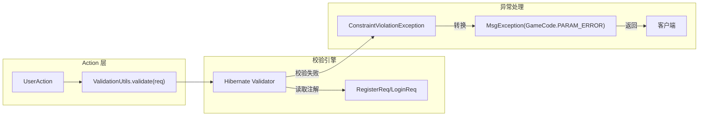

# 参数校验设计
## 1. 背景与目标
### 1.1 现状问题
- 当前 UserAction 中通过手写正则表达式和 if 语句进行参数格式校验，代码臃肿、重复。
- 校验逻辑与业务代码混在一起，降低可读性和可维护性。
- 缺少统一、声明式的校验方式，容易遗漏校验规则。
### 1.2 目标
- 采用 声明式 校验，将校验规则以注解方式定义在 DTO 字段上。
- 实现 校验与业务逻辑分离，Action 层只需一行代码触发校验。
- 与 ioGame 的 MsgException 异常体系无缝集成，校验失败自动抛出 GameCode.PARAM_ERROR。
- 提供可扩展、可国际化的校验框架。
## 2. 技术选型
| 组件 | 版本 | 说明 |
| :--- | :--- | :--- |
| **Jakarta Bean Validation 3.0** | `3.0.2` | **标准规范**：Java EE 迁移到 Jakarta 后定义的数据校验标准 API。 |
| **Hibernate Validator** | `8.0.1.Final` | **核心实现**：Bean Validation 的官方参考实现，提供强大的校验引擎。 |
| **Spring Boot Starter Validation** | `3.2.x` | **自动配置**：集成 Spring 生态的启动器，自动配置 Validator Bean 并支持 AOP 校验。 |

> **注**：Spring Boot 2.3+ 已移除默认 Web 依赖中的 Validation，需手动引入 `spring-boot-starter-validation` 依赖。

## 3. 整体设计
### 3.1 架构图

### 3.2 核心组件
| 组件 | 职责 |
| :--- | :--- |
| **DTO 校验注解** | **规则定义**：在 `RegisterReq`、`LoginReq` 等传输对象的字段上标记校验规则（如 `@NotBlank`、`@Pattern`、`@Range`），实现声明式校验。 |
| **ValidationUtils** | **逻辑封装**：静态工具类，封装底层 `Validator` 引擎，提供 `validate(Object)` 方法。当校验失败时，统一抛出自定义 `MsgException` 以便全局拦截。 |
| **Validator Bean** | **核心引擎**：由 Spring Boot 自动配置的校验工厂实例，负责扫描注解并执行实际的匹配与判定逻辑，支持手动注入自定义规则。 |
## 4. 详细设计
### 4.1 添加依赖
```xml
<dependency>
    <groupId>org.springframework.boot</groupId>
    <artifactId>spring-boot-starter-validation</artifactId>
</dependency>
```
### 4.2 DTO 校验注解示例
RegisterReq.java
```java
@Data
@ProtobufClass
public class RegisterReq {
    @Pattern(regexp = "^[a-zA-Z0-9]{4,20}$", message = "用户名必须为4-20位字母或数字")
    private String username;

    @Pattern(regexp = "^1[3-9]\\d{9}$", message = "手机号格式不正确")
    private String mobile;

    @Email(message = "邮箱格式不正确")
    private String email;

    @NotBlank(message = "密码不能为空")
    @Size(min = 6, max = 20, message = "密码长度必须为6-20位")
    private String password;

    @Size(min = 1, max = 20, message = "昵称长度必须为1-20位")
    private String nickname;

    // 风控字段（无需校验）
    private String registerIp;
    private String registerDeviceId;
    // ... 其他字段
}
```
LoginReq.java
```java
@Data
@ProtobufClass
public class LoginReq {
    @Pattern(regexp = "^[a-zA-Z0-9]{4,20}$", message = "用户名格式不正确")
    private String username;

    @Pattern(regexp = "^1[3-9]\\d{9}$", message = "手机号格式不正确")
    private String mobile;

    @Email(message = "邮箱格式不正确")
    private String email;

    @NotBlank(message = "密码不能为空")
    private String password;

    // 风控字段
    private String loginIp;
    private String loginDeviceId;
    // ...
}
```
> 说明：由于客户端可能只提供用户名、手机号、邮箱中的一种，因此校验注解不会因为字段为空而报错（@Pattern 默认对 null 视为通过）。若需要强制至少提供一种，可以在 Action 层或 DTO 上自定义类级别校验（例如 @ScriptAssert）。
### 4.3 统一校验工具类
```java
package com.pokergame.common.util;

import com.iohao.game.action.skeleton.core.exception.MsgException;
import com.pokergame.common.exception.GameCode;

import javax.validation.ConstraintViolation;
import javax.validation.Validation;
import javax.validation.Validator;
import java.util.Set;

public final class ValidationUtils {
    private static final Validator validator = Validation.buildDefaultValidatorFactory().getValidator();

    private ValidationUtils() {}

    /**
     * 校验对象，失败抛出 MsgException（错误码 = GameCode.PARAM_ERROR）
     * @param obj 待校验对象
     * @throws MsgException 参数错误异常
     */
    public static void validate(Object obj) throws MsgException {
        Set<ConstraintViolation<Object>> violations = validator.validate(obj);
        if (!violations.isEmpty()) {
            // 取第一个校验失败的消息
            String message = violations.iterator().next().getMessage();
            throw new MsgException(GameCode.PARAM_ERROR.getCode(), message);
        }
    }
}
```
> 优化点：如果希望返回所有校验错误，可以收集所有 violations 消息，拼接后返回。
### 4.4 在 Action 中使用
```java
@ActionController(UserCmd.CMD)
public class UserAction {

    @ActionMethod(UserCmd.REGISTER)
    public RegisterResp register(RegisterReq req) {
        // 一行代码完成参数校验
        ValidationUtils.validate(req);
        
        // 业务逻辑
        Long userId = userService.register(req);
        // ...
    }

    @ActionMethod(UserCmd.LOGIN)
    public LoginResp login(LoginReq req) {
        ValidationUtils.validate(req);
        // ...
    }
}
```
### 4.5 国际化支持
- 在 src/main/resources/ValidationMessages.properties 中配置消息键值对。
- 注解中的 message 可以引用键名，例如 message = "{user.username.pattern}"。
- Hibernate Validator 会自动读取资源文件。

## 5. 与 ioGame 异常体系集成
- ValidationUtils.validate() 直接抛出 MsgException，与 ioGame 的异常处理机制完全兼容。
- 框架会自动将 MsgException 转换为错误响应返回给客户端，无需额外处理。

## 6. 高级扩展
### 6.1 自定义校验注解
例如：校验 username、mobile、email 至少提供一种。
```java
@Target({TYPE})
@Retention(RUNTIME)
@Constraint(validatedBy = AtLeastOneValidator.class)
public @interface AtLeastOne {
    String message() default "用户名、手机号、邮箱至少填写一项";
    Class<?>[] groups() default {};
    Class<? extends Payload>[] payload() default {};
    String[] fields();
}
```
实现 ConstraintValidator，然后在 RegisterReq 类上标注 @AtLeastOne(fields = {"username","mobile","email"})。
### 6.2 分组校验
在注册和登录场景中，某些字段的校验规则可能不同（例如注册时密码有长度限制，登录时密码只需非空）。可以使用 @Validated 分组功能。
## 7. 测试建议
- 编写单元测试验证 ValidationUtils.validate() 对非法参数抛出异常。
- 集成测试中验证 Action 层返回的错误码和错误信息是否符合预期。
## 8. 迁移计划
- 添加 spring-boot-starter-validation 依赖。
- 在 RegisterReq、LoginReq 等 DTO 上添加校验注解。
- 创建 ValidationUtils 工具类。
- 修改 UserAction，在每个方法入口调用 ValidationUtils.validate(req)。
- 删除原有的手写校验代码。
- 运行测试，确保校验逻辑覆盖完整。
## 9. 总结
本方案通过 Bean Validation 实现了参数校验的声明式管理，显著减少了样板代码，提升了可维护性。同时与 ioGame 异常机制无缝集成，保持了框架的一致性。未来新增 DTO 只需添加注解，无需重复编写校验逻辑。