# 发牌策略设计
## 1. 发牌策略体系架构
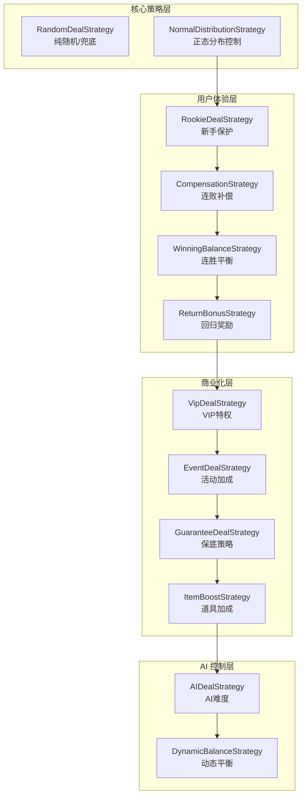

| 策略 (Strategy) | 功能 | 触发条件      | 大厂实践 |
| :--- | :--- |:----------| :--- |
| **NormalDistributionStrategy** | 全局概率控制 | 每局        | 腾讯专利技术 |
| **CompensationStrategy** | 连败补偿 | 连败 >=3 局  | 通用留存策略 |
| **WinningBalanceStrategy** | 连胜平衡 | 连胜 >=3 局  | 通用平衡策略 |
| **VipDealStrategy** | VIP特权 | VIP等级 >=1 | 商业化必备 |
| **ReturnBonusStrategy** | 回归奖励 | 流失 >=3 天  | 召回流失玩家 |
| **EventDealStrategy** | 活动加成 | 活动期间      | 运营活动 |
| **GuaranteeDealStrategy** | 保底策略 | 使用道具      | 道具系统 |
| **ItemBoostStrategy** | 道具加成 | 使用道具      | 道具系统 |
| **RookieDealStrategy** | 新手保护 | 新手期       | 新手引导 |
| **AIDealStrategy** | AI难度 | AI玩家      | 机器人控制 |

## 2. 发牌策略的工作原理
### 2.1 整体工作流程
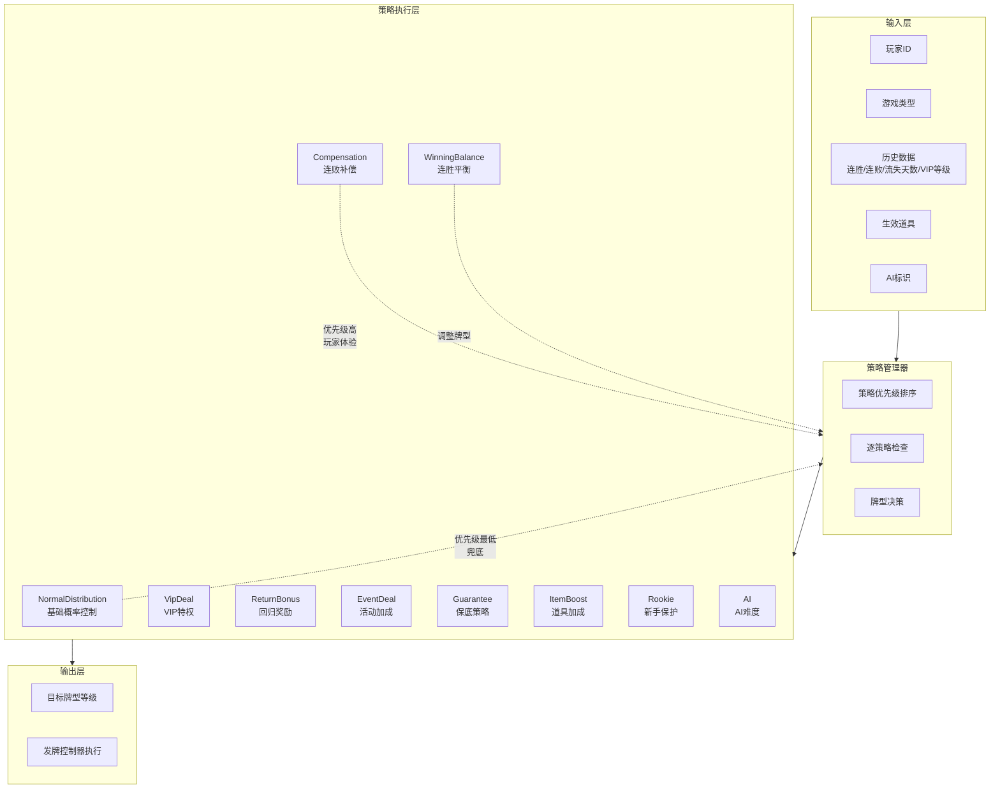
### 2.2 每种策略的详细工作原理
#### 策略1：正态分布策略 (NormalDistributionStrategy)
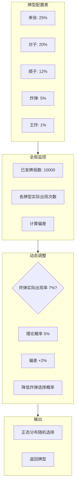
##### 工作原理：
1. 牌型配置表：预设每种牌型的理论概率（基于正态分布）
2. 全局监控：记录所有牌局中每种牌型的实际出现次数
3. 偏差计算：比较实际概率与理论概率的差异
4. 动态调整：实际概率过高时降低选择概率，过低时提高
5. 随机选择：使用高斯分布随机选择牌型

#### 策略2：连败补偿策略 (CompensationStrategy)
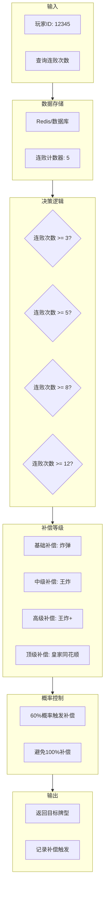
##### 工作原理：
1. 记录连败：每次玩家输牌，连败计数器+1；赢牌时归零
2. 阈值判断：3/5/8/12 连败分别触发不同等级补偿
3. 概率触发：不是100%补偿，连败越多触发概率越高
4. 牌型提升：根据连败等级给予对应强度的牌型

#### 策略3：连胜平衡策略 (WinningBalanceStrategy)
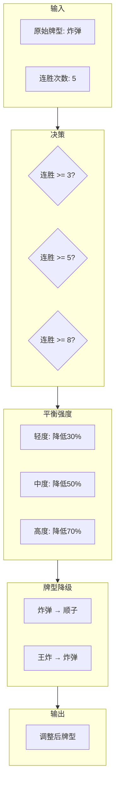
##### 工作原理：
1. 记录连胜：每次玩家赢牌，连胜计数器+1；输牌时归零
2. 平衡触发：连胜达到阈值后触发平衡
3. 强度计算：根据连胜次数计算平衡强度系数
4. 牌型降级：将原始牌型降低指定等级

#### 策略4：VIP特权策略 (VipDealStrategy)
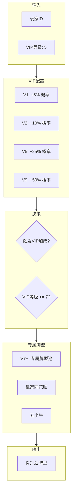
##### 工作原理：
1. VIP等级查询：获取玩家当前VIP等级
2. 加成计算：根据等级计算加成系数（5%-50%）
3. 概率判定：随机判定是否触发VIP加成
4. 专属牌型：高等级VIP可触发专属牌型池

#### 策略5：回归奖励策略 (ReturnBonusStrategy)
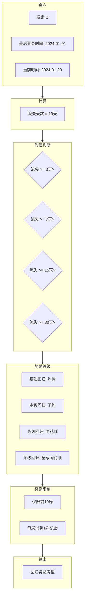
##### 工作原理：
1. 流失计算：当前时间 - 最后登录时间 = 流失天数
2. 阈值判断：3/7/15/30天分别对应不同奖励等级
3. 奖励次数：回归后前N局享受奖励（如10局）
4. 次数消耗：每局消耗一次奖励机会

#### 策略6：活动加成策略 (EventDealStrategy)
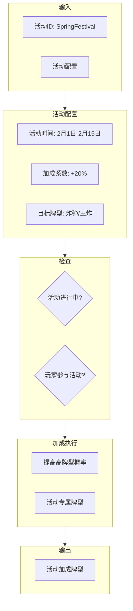
##### 工作原理：
1. 活动配置：后台配置活动时间、加成系数、目标牌型
2. 资格检查：确认活动进行中且玩家已参与
3. 概率提升：提高高牌型出现概率
4. 专属内容：可能解锁活动专属牌型

#### 策略7：保底策略 (GuaranteeDealStrategy)
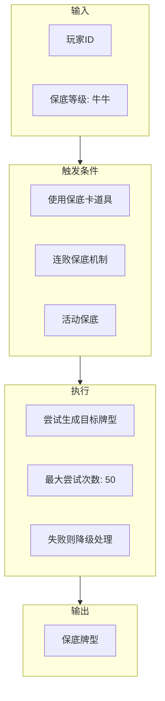
##### 工作原理：
1. 触发条件：道具使用、连败保底、活动保底
2. 目标设定：设定保底牌型等级（如至少牛牛）
3. 尝试生成：发牌时反复尝试直到达到目标 
4. 降级处理：超过尝试次数则返回最接近的牌型

#### 策略8：道具加成策略 (ItemBoostStrategy)
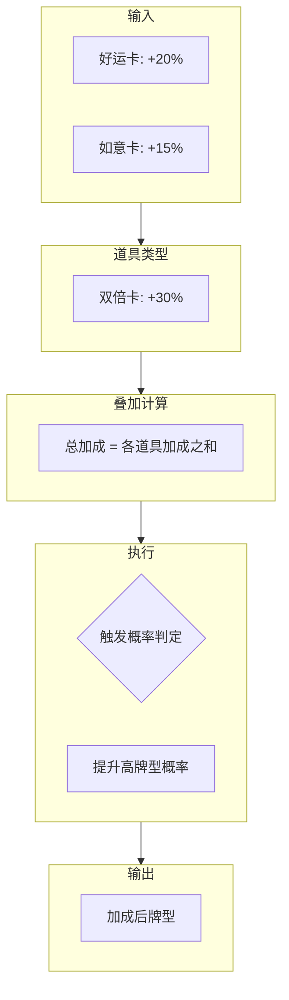
##### 工作原理：
1. 道具查询：获取玩家生效中的道具列表 
2. 加成叠加：多个道具的加成系数可叠加 
3. 概率判定：根据总加成计算触发概率 
4. 效果执行：触发后提升高牌型出现概率

#### 策略9：新手保护策略 (RookieDealStrategy)
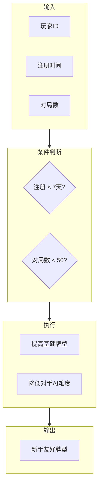
##### 工作原理：
1. 新手判定：注册时间<7天 或 对局数<50 
2. 保护执行：提高新手的基础牌型质量 
3. 保护期限：新手期结束后自动失效

#### 策略10：AI难度策略 (AIDealStrategy)
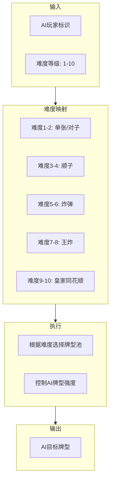
##### 工作原理：
1. 难度配置：AI难度分为1-10级 
2. 牌型映射：不同难度对应不同的牌型池 
3. 强度控制：难度越高，AI获得好牌的概率越大

## 3. 数据库设计
### 3.1 架构图
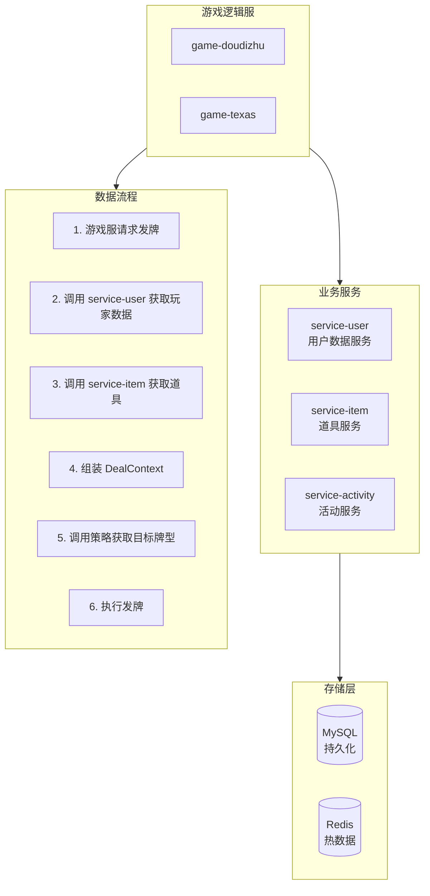
### 3.2 核心原则
1. game-common：只包含无状态的接口定义、枚举、纯算法 
2. 策略类接收参数而非主动查询数据 
3. 游戏逻辑服负责组装数据并调用策略

## 4. 牌型池
### 4.1 牌型池在游戏中的价值
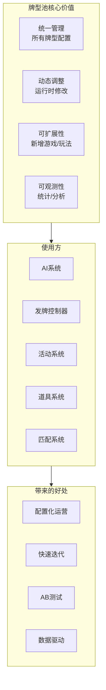
### 4.2 应用场景

| 场景 | 是否需要牌型池 | 原因 |
| :--- | :---: | :--- |
| **AI难度控制** | ✅ 核心 | 不同难度等级需对应不同权重的牌型池（如：困难级AI高概率获得“三条”或“四条”） |
| **VIP特权** | ✅ 核心 | 根据VIP等级动态调整高阶牌型（如：同花、顺子）在牌型池中的出现概率 |
| **活动加成** | ✅ 核心 | 活动期间通过临时替换或增强牌型池，提升特定牌型的全局产出 |
| **新手保护** | ✅ 核心 | 使用简化或高胜率牌型池，确保新手玩家在初期获得较好的心流体验 |
| **道具加成** | ✅ 核心 | 玩家使用道具后，系统临时提升该玩家在牌型池中获取高分牌的权重 |
| **连败补偿** | ⚠️ 可选 | 既可基于牌型池强制发好牌，也可通过调整现有发牌算法的权重实现 |
| **正态分布** | ✅ 核心 | 基础概率分布本身就是通过“标准牌型池”来确保全局胜率符合预期 |

### 4.3 可扩展的牌型池系统
#### 设计原则
1. 配置驱动：牌型池通过配置文件/数据库定义
2. 运行时可修改：支持热更新 
3. 支持继承/组合：可基于基础池创建变体 
4. 多游戏扩展：新增游戏只需添加配置
#### 完整架构
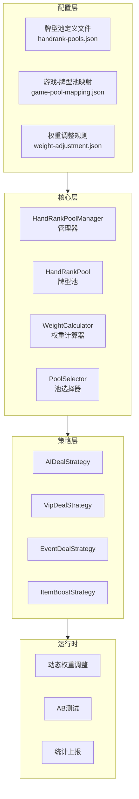
