# 发牌策略设计
## 1. 发牌策略体系架构
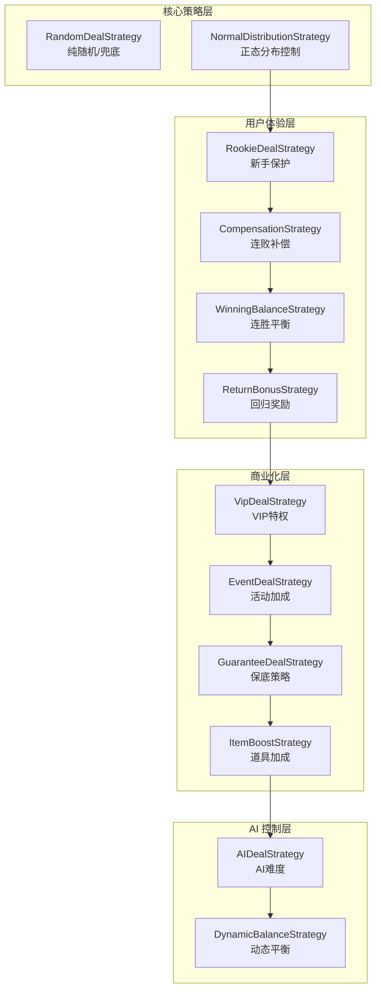

| 策略 (Strategy) | 功能 | 触发条件      | 大厂实践 |
| :--- | :--- |:----------| :--- |
| **NormalDistributionStrategy** | 全局概率控制 | 每局        | 腾讯专利技术 |
| **CompensationStrategy** | 连败补偿 | 连败 >=3 局  | 通用留存策略 |
| **WinningBalanceStrategy** | 连胜平衡 | 连胜 >=3 局  | 通用平衡策略 |
| **VipDealStrategy** | VIP特权 | VIP等级 >=1 | 商业化必备 |
| **ReturnBonusStrategy** | 回归奖励 | 流失 >=3 天  | 召回流失玩家 |
| **EventDealStrategy** | 活动加成 | 活动期间      | 运营活动 |
| **GuaranteeDealStrategy** | 保底策略 | 使用道具      | 道具系统 |
| **ItemBoostStrategy** | 道具加成 | 使用道具      | 道具系统 |
| **RookieDealStrategy** | 新手保护 | 新手期       | 新手引导 |
| **AIDealStrategy** | AI难度 | AI玩家      | 机器人控制 |

## 2. 发牌策略的工作原理
### 2.1 整体工作流程
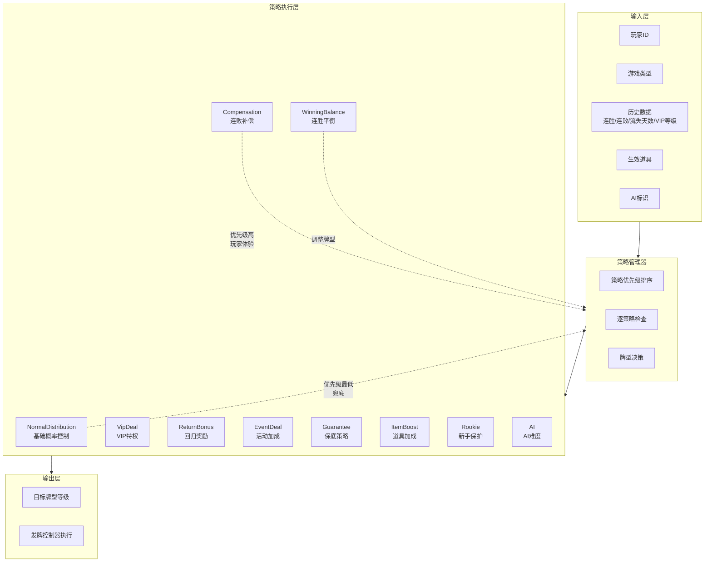
### 2.2 每种策略的详细工作原理
#### 策略1：正态分布策略 (NormalDistributionStrategy)
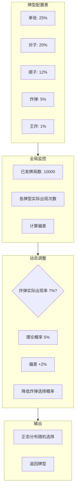
##### 工作原理：
1. 牌型配置表：预设每种牌型的理论概率（基于正态分布）
2. 全局监控：记录所有牌局中每种牌型的实际出现次数
3. 偏差计算：比较实际概率与理论概率的差异
4. 动态调整：实际概率过高时降低选择概率，过低时提高
5. 随机选择：使用高斯分布随机选择牌型

#### 策略2：连败补偿策略 (CompensationStrategy)
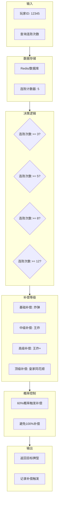
##### 工作原理：
1. 记录连败：每次玩家输牌，连败计数器+1；赢牌时归零
2. 阈值判断：3/5/8/12 连败分别触发不同等级补偿
3. 概率触发：不是100%补偿，连败越多触发概率越高
4. 牌型提升：根据连败等级给予对应强度的牌型

#### 策略3：连胜平衡策略 (WinningBalanceStrategy)
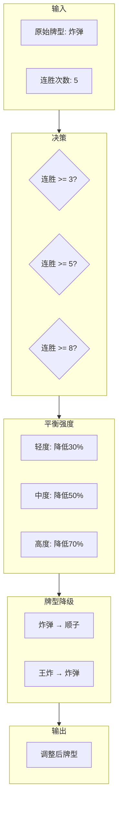
##### 工作原理：
1. 记录连胜：每次玩家赢牌，连胜计数器+1；输牌时归零
2. 平衡触发：连胜达到阈值后触发平衡
3. 强度计算：根据连胜次数计算平衡强度系数
4. 牌型降级：将原始牌型降低指定等级

#### 策略4：VIP特权策略 (VipDealStrategy)
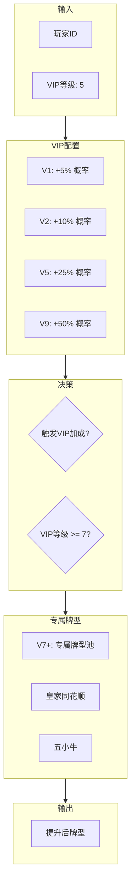
##### 工作原理：
1. VIP等级查询：获取玩家当前VIP等级
2. 加成计算：根据等级计算加成系数（5%-50%）
3. 概率判定：随机判定是否触发VIP加成
4. 专属牌型：高等级VIP可触发专属牌型池

#### 策略5：回归奖励策略 (ReturnBonusStrategy)
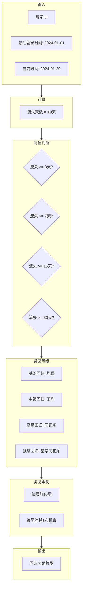
##### 工作原理：
1. 流失计算：当前时间 - 最后登录时间 = 流失天数
2. 阈值判断：3/7/15/30天分别对应不同奖励等级
3. 奖励次数：回归后前N局享受奖励（如10局）
4. 次数消耗：每局消耗一次奖励机会

#### 策略6：活动加成策略 (EventDealStrategy)
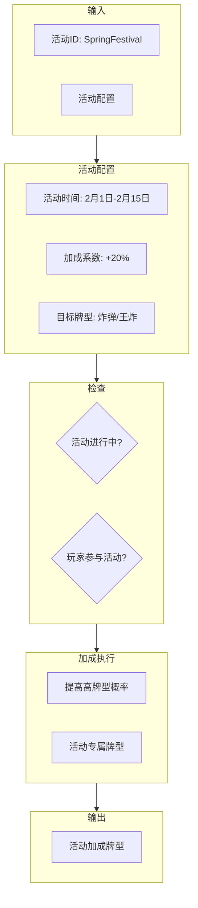
##### 工作原理：
1. 活动配置：后台配置活动时间、加成系数、目标牌型
2. 资格检查：确认活动进行中且玩家已参与
3. 概率提升：提高高牌型出现概率
4. 专属内容：可能解锁活动专属牌型

#### 策略7：保底策略 (GuaranteeDealStrategy)
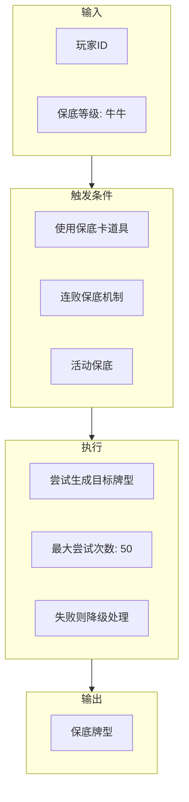
##### 工作原理：
1. 触发条件：道具使用、连败保底、活动保底
2. 目标设定：设定保底牌型等级（如至少牛牛）
3. 尝试生成：发牌时反复尝试直到达到目标 
4. 降级处理：超过尝试次数则返回最接近的牌型

#### 策略8：道具加成策略 (ItemBoostStrategy)
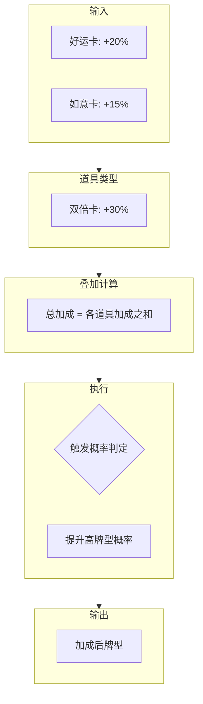
##### 工作原理：
1. 道具查询：获取玩家生效中的道具列表 
2. 加成叠加：多个道具的加成系数可叠加 
3. 概率判定：根据总加成计算触发概率 
4. 效果执行：触发后提升高牌型出现概率

#### 策略9：新手保护策略 (RookieDealStrategy)
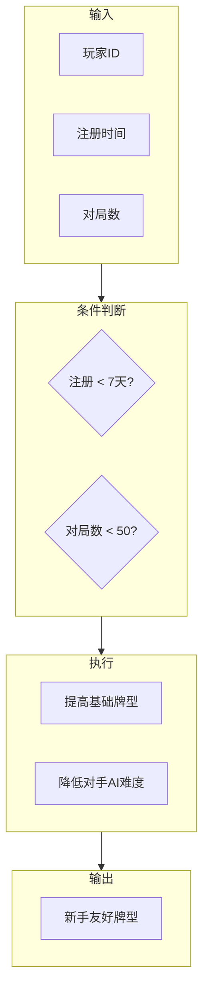
##### 工作原理：
1. 新手判定：注册时间<7天 或 对局数<50 
2. 保护执行：提高新手的基础牌型质量 
3. 保护期限：新手期结束后自动失效

#### 策略10：AI难度策略 (AIDealStrategy)
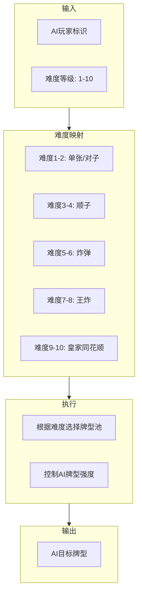
##### 工作原理：
1. 难度配置：AI难度分为1-10级 
2. 牌型映射：不同难度对应不同的牌型池 
3. 强度控制：难度越高，AI获得好牌的概率越大

## 3. 数据库设计
### 3.1 架构图
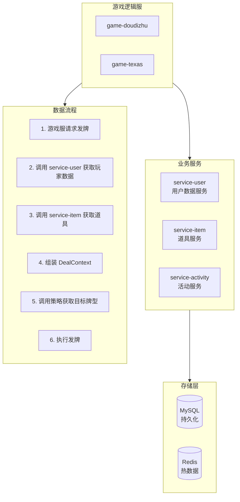
### 3.2 核心原则
1. game-common：只包含无状态的接口定义、枚举、纯算法 
2. 策略类接收参数而非主动查询数据 
3. 游戏逻辑服负责组装数据并调用策略

## 4. 牌型池
### 4.1 牌型池在游戏中的价值
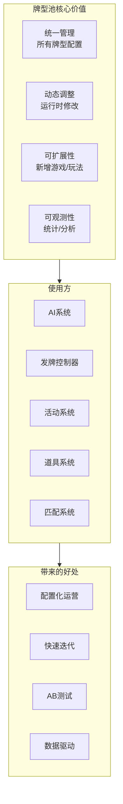
### 4.2 应用场景

| 场景 | 是否需要牌型池 | 原因 |
| :--- | :---: | :--- |
| **AI难度控制** | ✅ 核心 | 不同难度等级需对应不同权重的牌型池（如：困难级AI高概率获得“三条”或“四条”） |
| **VIP特权** | ✅ 核心 | 根据VIP等级动态调整高阶牌型（如：同花、顺子）在牌型池中的出现概率 |
| **活动加成** | ✅ 核心 | 活动期间通过临时替换或增强牌型池，提升特定牌型的全局产出 |
| **新手保护** | ✅ 核心 | 使用简化或高胜率牌型池，确保新手玩家在初期获得较好的心流体验 |
| **道具加成** | ✅ 核心 | 玩家使用道具后，系统临时提升该玩家在牌型池中获取高分牌的权重 |
| **连败补偿** | ⚠️ 可选 | 既可基于牌型池强制发好牌，也可通过调整现有发牌算法的权重实现 |
| **正态分布** | ✅ 核心 | 基础概率分布本身就是通过“标准牌型池”来确保全局胜率符合预期 |

### 4.3 可扩展的牌型池系统
#### 设计原则
1. 配置驱动：牌型池通过配置文件/数据库定义
2. 运行时可修改：支持热更新 
3. 支持继承/组合：可基于基础池创建变体 
4. 多游戏扩展：新增游戏只需添加配置
#### 完整架构
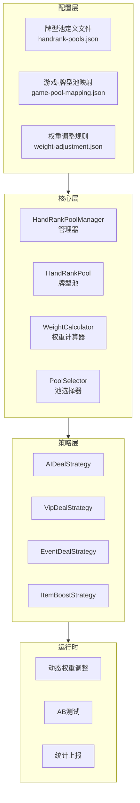
## 5. 发牌器设计
### 5.1 核心职责
1. 策略决策：根据玩家状态决定目标牌型（连败补偿、VIP加成、新手保护等）
2. 牌型生成：根据目标牌型从牌堆中生成符合要求的手牌 
3. 牌堆管理：维护牌堆状态，保证牌的唯一性
4. 多游戏适配：支持斗地主、德州扑克、牛牛等多种游戏类型
### 5.2 设计原则
1. 职责分离：策略决策与牌型执行分离，策略只负责"要什么牌"
2. 无状态策略：所有策略类无状态，数据通过 DealContext 传入
3. 扩展友好：新增游戏只需继承基类，无需修改核心逻辑
4. 牌唯一性：保证一副牌中每张牌只出现一次
### 5.3 整体架构
#### 5.3.1 发牌完整架构图
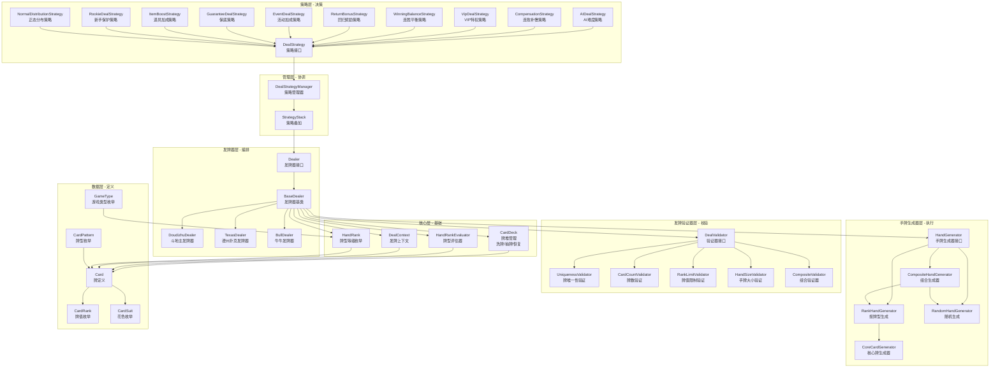
#### 5.3.2 数据流转图
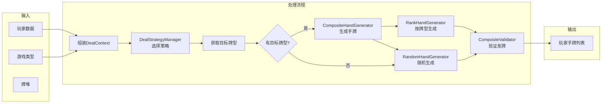
#### 5.3.3 组件交互时序图
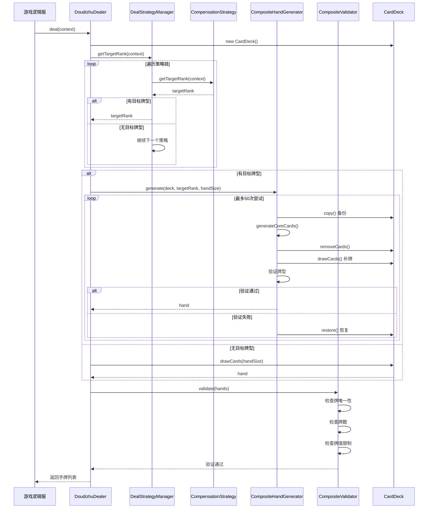

### 5.4 组件说明
#### 5.4.1 发牌策略层 (Strategy Layer)

| 组件 | 职责 | 输入 | 输出 |
| :--- | :--- | :--- | :--- |
| **DealStrategy** | 策略接口定义 | DealContext | HandRank (目标牌型) |
| **AIDealStrategy** | AI难度控制 | AI标识、难度等级 | 目标牌型 |
| **CompensationStrategy** | 连败补偿 | 连败次数 | 补偿牌型 |
| **VipDealStrategy** | VIP特权 | VIP等级 | 加成牌型 |
| **WinningBalanceStrategy** | 连胜平衡 | 连胜次数 | 调整后牌型 |
| **ReturnBonusStrategy** | 回归奖励 | 流失天数 | 奖励牌型 |
| **EventDealStrategy** | 活动加成 | 活动列表 | 加成牌型 |
| **GuaranteeDealStrategy** | 保底策略 | 保底条件 | 保底牌型 |
| **ItemBoostStrategy** | 道具加成 | 道具列表 | 加成牌型 |
| **RookieDealStrategy** | 新手保护 | 新手标志 | 保护牌型 |
| **NormalDistributionStrategy** | 正态分布 | 全局统计 | 随机牌型 |

#### 5.4.2 管理层 (Manager Layer)

| 组件 | 职责                                         |
| :--- |:-------------------------------------------|
| **DealStrategyManager** | **核心控制器**：负责管理整个策略链的生命周期，根据配置按优先级顺序触发各个策略。 |
| **StrategyStack** | **执行链路**：策略叠加。                             |

#### 5.4.3 手牌生成器层 (Generator Layer)

| 组件 | 职责 |
| :--- | :--- |
| **HandGenerator** | **手牌生成器接口**：定义生成手牌的标准契约，支持不同生成逻辑的扩展。 |
| **RankHandGenerator** | **定级生成器**：根据预设的目标牌型（如“四条”）从牌池中提取对应的卡牌 ID。 |
| **RandomHandGenerator** | **随机生成器**：作为系统兜底方案，在无特定策略触发时进行纯随机发牌。 |
| **CompositeHandGenerator** | **组合生成器**：复合逻辑实现，优先尝试按目标牌型生成，若失败则自动回退至随机模式。 |
| **CoreCardGenerator** | **核心牌构造器**：专门负责构造牌型骨架（如生成“四张 8”作为炸弹核心），并配合踢脚牌补齐手牌。 |

#### 5.4.4 发牌验证器层 (Validator Layer)

| 组件 | 职责 |
| :--- | :--- |
| **DealStrategy** | **验证器接口**：定义发牌校验的标准契约，确保生成的牌组符合业务规则。 |
| **UniquenessValidator** | **唯一性验证**：检查生成的 ID 序列中是否存在重复卡牌，防止“同花色点数”出现两次。 |
| **CardCountValidator** | **总数验证**：校验单局游戏发出的总牌数（底牌+公共牌）是否符合玩法设定。 |
| **RankLimitValidator** | **数值范围验证**：确保生成的卡牌 ID 均在有效范围内（如 0-51），剔除异常值。 |
| **HandSizeValidator** | **手牌规格验证**：验证每个玩家获得的手牌数量是否精确对齐（如德州扑克必须为 2 张）。 |
| **CompositeValidator** | **组合验证器**：封装验证链条，按顺序执行所有子验证逻辑，任意一项失败即触发重算。 |

#### 5.4.5 发牌器层 (Dealer Layer)

| 组件 | 职责 |
| :--- | :--- |
| **Dealer** | **发牌器接口**：定义发牌核心契约，支持不同游戏玩法的抽象接入。 |
| **BaseDealer** | **发牌器基类**：整合策略、生成、验证组件，提供标准的发牌流水线（Pipeline）。 |
| **DoudizhuDealer** | **斗地主实现**：处理 54 张牌（含王牌）、底牌预留及 17-20 张手牌的分发逻辑。 |
| **TexasDealer** | **德州扑克实现**：处理 52 张牌、2 张底牌、5 张公共牌及燃烧牌（Burn Cards）逻辑。 |
| **BullDealer** | **牛牛实现**：处理 5 张手牌分发，并与牌型评估器配合判定“牛牛”等级。 |

#### 5.4.6 核心层 (Core Layer)

| 组件 | 职责 |
| :--- | :--- |
| **CardDeck** | **牌堆管理器**：负责 52/54 张牌的洗牌（Shuffle）、按序抽牌、当前状态备份及异常回滚恢复。 |
| **HandRankEvaluator** | **牌型评估器**：核心算法组件，用于计算并识别手牌等级（如：判定是否触发“四条”或“同花顺”）。 |
| **DealContext** | **发牌上下文**：数据透传容器，封装玩家画像、历史胜率、策略开关等所有影响发牌决策的中间变量。 |
| **HandRank** | **牌型枚举**：定义游戏合法牌型的等级标准（从高到低），作为策略输出与逻辑判定的标准量尺。 |

#### 5.4.7 数据层 (Data Layer)

| 组件 | 职责 |
| :--- | :--- |
| **Card** | **牌实体定义**：封装单张牌的核心属性（ID、点数、花色）。 |
| **CardRank** | **牌值枚举**：定义点数权重（如：3-10, J, Q, K, A, 2）。 |
| **CardSuit** | **花色枚举**：定义黑桃、红桃、梅花、方块（Spade, Heart, Club, Diamond）。 |
| **CardPattern** | **牌型枚举**：定义组合模式（如：单张、对子、顺子、四条）。 |
| **GameType** | **游戏类型枚举**：区分不同玩法逻辑（如：Texas, Doudizhu, Baccarat）。 |

### 5.5 BaseDealer 详解
#### 5.5.1 概述
BaseDealer 是发牌器的抽象基类，它封装了所有游戏通用的发牌逻辑，同时为具体游戏（斗地主、德州扑克、牛牛）提供扩展点。
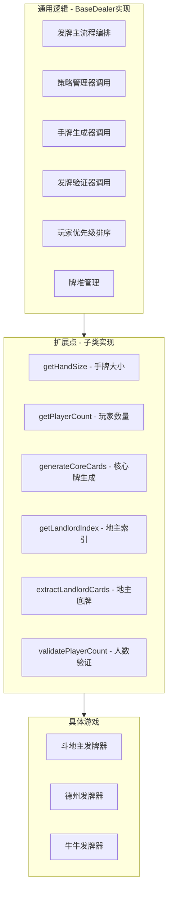

| 维度 | 说明 |
| :--- | :--- |
| **核心作用** | **逻辑封装器**：统一管理发牌全生命周期，通过抽象接口为不同游戏玩法提供标准化的扩展点。 |
| **设计模式** | **复合模式应用**：<br>1. **模板方法**：定义发牌主流程骨架。<br>2. **策略模式**：动态切换分牌权重逻辑。<br>3. **组合模式**：组合多个验证器与生成器。 |
| **主要组件** | **三大核心驱动**：策略管理器 (StrategyManager)、手牌生成器 (HandGenerator)、发牌验证器 (DealValidator)。 |
| **扩展点数量** | **高度可定制**：内置 **6 个核心抽象方法**（如玩家数校验、核心牌生成）以及多个可重写的钩子方法（Hooks）。 |
| **代码复用** | **全场景通用**：斗地主、德州、牛牛等多种扑克变体共享同一套底层算法流程，极大降低了维护成本。 |

####  5.5.2 BaseDealer 的核心职责
1. 发牌主流程编排
```java
public List<List<Card>> deal(DealContext context) {
    // 1. 初始化牌堆
    CardDeck deck = new CardDeck(getDecksCount());
    
    // 2. 确定地主/庄家
    int landlordIndex = getLandlordIndex(context);
    
    // 3. 按优先级排序玩家
    List<Integer> sortedIndices = sortPlayersByPriority(context);
    
    // 4. 为每个玩家发牌
    List<List<Card>> hands = initializeHands();
    
    for (int playerIndex : sortedIndices) {
        boolean isLandlord = (playerIndex == landlordIndex);
        int handSize = getHandSize(playerIndex, isLandlord);
        
        DealContext playerContext = buildPlayerContext(context, playerIndex);
        HandRank targetRank = strategyManager.getTargetRank(playerContext);
        
        List<Card> hand = handGenerator.generate(deck, targetRank, handSize, 50);
        hands.set(playerIndex, hand);
    }
    
    // 5. 处理地主底牌
    List<Card> landlordExtra = extractLandlordCards(deck, landlordIndex);
    if (landlordExtra != null && !landlordExtra.isEmpty()) {
        hands.get(landlordIndex).addAll(landlordExtra);
    }
    
    // 6. 验证发牌结果
    dealValidator.validate(hands);
    
    return hands;
}
```
2. 策略管理器调用
```java
// 策略管理器负责按优先级执行策略链
private final DealStrategyManager strategyManager;

// 获取目标牌型
HandRank targetRank = strategyManager.getTargetRank(playerContext);
```
3. 手牌生成器调用
```java
// 手牌生成器负责实际生成手牌
private final HandGenerator handGenerator;

// 生成手牌（可能是目标牌型或随机牌）
List<Card> hand = handGenerator.generate(deck, targetRank, handSize, 50);
```
4. 发牌验证器调用
```java
// 发牌验证器负责验证结果合法性
private final DealValidator dealValidator;

// 验证牌不重复、数量正确、牌值不超限
dealValidator.validate(hands);
```
#### 5.5.3 BaseDealer 的扩展点
1. 抽象方法（子类必须实现）

| 方法 | 作用 | 斗地主实现 | 德州实现 | 牛牛实现 |
| :--- | :--- | :--- | :--- | :--- |
| **validatePlayerCount** | 验证玩家数量 | 2-3人 | 2-9人 | 2-6人 |
| **getHandSize** | 获取手牌大小 | 17/20张 | 2张 | 5张 |
| **getTotalCardCount** | 获取总牌数 | 54张 | 玩家数 × 2 + 5 (公共牌) | 玩家数 × 5 |
| **generateCoreCards** | 生成核心牌 | 炸弹 / 顺子 / 王炸 | 一对 / 高牌 / 四条 | 五小牛 / 四炸 / 金牛 |
| **getLandlordIndex** | 获取地主索引 | 0 - 2 (动态确认) | 0 (不适用) | 0 (不适用) |
| **extractLandlordCards** | 获取地主底牌 | 3张 | 0张 | 0张 |

2. 可重写方法（子类可选重写）

| 方法 | 默认行为 | 重写场景 |
| :--- | :--- | :--- |
| **getDecksCount** | 返回 1 (单副牌) | 需要多副牌的游戏 (如：21点、8副牌百家乐) |
| **sortPlayersByPriority** | 按策略优先级排序 | 需要特定的座位顺序或动态优先级排序 (如：庄家/地主优先) |
| **getPlayerPriority** | 返回 0 (默认权重) | 根据 VIP 等级或连败权重自定义玩家的发牌优先级 |
| **createHandGenerator** | 创建 `CompositeHandGenerator` | 需要特殊的发牌逻辑 (如：斗地主补发底牌、德州燃烧牌) |
| **createDealValidator** | 创建默认验证链 | 需要添加特定游戏的合法性校验 (如：牛牛手牌必须为 5 张) |

