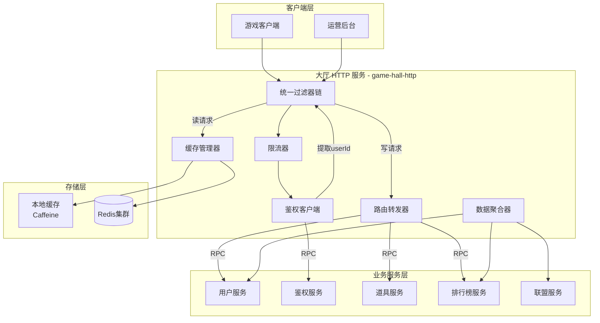

# 大厅 HTTP 服务设计
## 1. 概述
### 1.1 定位
大厅 HTTP 服务是游戏系统的统一 HTTP 入口（BFF 层），负责接收客户端所有 HTTP 请求，提供统一鉴权、请求路由、数据聚合、缓存管理等能力。
## 1.2 核心职责
| 职责 | 说明 |
| :--- | :--- |
| **统一入口** | **全局访问点**：作为客户端（如 APP 或 Web）所有 HTTP 请求的单一入口，简化客户端对后端微服务拓扑的感知。 |
| **统一鉴权** | **身份守卫**：集中处理 Token 验证，通过调用鉴权服务提取并注入用户 ID，确保下游服务仅接收已认证的合法请求。 |
| **请求路由** | **流量分发**：根据请求路径将业务流量精准转发至对应的业务逻辑服（如用户服、游戏服等）。 |
| **数据聚合** | **效能优化**：通过在网关层聚合多个后端服务的返回数据，显著减少客户端的往返请求次数（RTT），提升加载速度。 |
| **缓存管理** | **压力缓冲**：对高频访问的热点数据实施本地缓存，减少重复的跨服务查询，降低下游业务系统的负载压力。 |
| **限流熔断** | **系统保护**：实时监控流量波动，通过限流与熔断机制防止瞬时突发流量冲击导致下游服务发生雪崩效应。 |

## 2. 架构设计
### 2.1 整体架构图

### 2.2 项目结构
```text
gateways/gateway-hall/
├── pom.xml
├── src/main/java/com/pokergame/gateway/hall/
│   ├── GatewayHallApplication.java           # 启动类（含 @EnableJMultiCache）
│   ├── config/
│   │   ├── HallConfig.java                   # 配置属性（白名单等）
│   │   ├── CacheConfig.java                  # 多级缓存配置（可选，如需自定义）
│   │   └── WebConfig.java                    # Web MVC 配置（拦截器、跨域等）
│   ├── filter/
│   │   └── AuthFilter.java                   # 统一鉴权过滤器（调用 Auth 服务）
│   ├── controller/
│   │   ├── UserController.java               # 用户相关接口（注册、登录、信息）
│   │   ├── CurrencyController.java           # 货币查询接口
│   │   ├── RankController.java               # 排行榜接口
│   │   └── HealthController.java             # 健康检查
│   ├── service/
│   │   ├── RouteService.java                 # RPC 路由转发（封装 Broker 调用）
│   │   ├── AggregateService.java             # 数据聚合服务（个人中心等）
│   │   └── CacheService.java                 # 缓存管理服务（清理、预热）
│   ├── dto/                                   # 聚合响应 DTO（如个人中心）
│   │   └── PersonalCenterResp.java
│   └── util/                                  # 工具类（可选）
├── src/main/resources/
│   ├── application.yml
│   └── logback-spring.xml
└── src/test/java/                             # 测试代码
```
