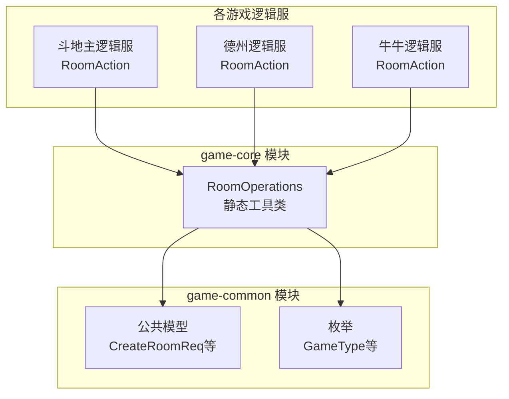
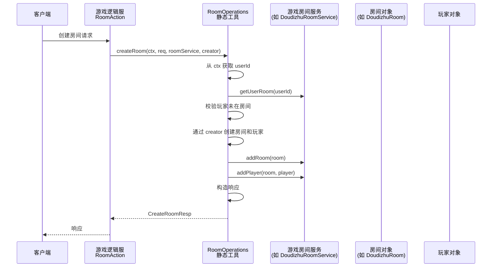

# 房间操作公共库设计文档
## 1. 概述
### 1.1 文档目的
本文档定义了一个用于棋牌游戏（斗地主、德州扑克、牛牛等）的房间操作公共静态工具库，旨在消除各游戏逻辑服中重复的房间管理代码，提供统一、可复用的房间创建、加入、离开、准备、开始游戏等操作实现。
### 1.2 设计原则
- 轻量无侵入：纯静态方法，不引入新服务或复杂框架，各游戏逻辑服自行调用。
- 类型安全：通过泛型和回调接口支持不同游戏的房间（Room）和玩家（Player）类型。
- 上下文明确：所有操作依赖 ioGame 的 FlowContext 获取当前用户，不依赖请求参数中的 userId 或 roomId（除明确需要）。
- 错误处理统一：使用 GameCode 断言抛出业务异常，由 ioGame 框架自动捕获返回客户端。
- 与事件发布解耦：如需发布机器人服务需要的事件，由调用方自行调用 EventPublisher，工具库不内嵌事件发布逻辑。
- 命名直观：工具库命名为 RoomOperations，清晰表达其提供房间操作的能力。
### 1.3 适用范围
- 所有基于 ioGame 框架的棋牌游戏逻辑服（斗地主、德州、牛牛等）。
- 房间管理逻辑简单、不需要复杂状态机或 OperationHandler 模式的场景。
- 
## 2. 架构设计
### 2.1 模块依赖关系图

### 2.2 调用序列图（以创建房间为例）

### 2.3 与 OperationHandler 的关系说明
- OperationHandler 是 ioGame 为复杂房间操作（如出牌、回合切换）设计的模式，它通过 PlayerOperationContext 提供房间状态、玩家信息等，适合需要访问游戏当前状态的场景。
- 房间管理操作（创建、加入、离开、准备、开始游戏）通常只需要 FlowContext 和房间服务，不需要 PlayerOperationContext，因此不需要使用 OperationHandler 模式，直接调用静态工具类更简洁。
- 若未来某些房间操作变得复杂（例如开始游戏前需要校验所有玩家的段位、金币等），也可以单独为某个游戏实现 OperationHandler，与 RoomOperations 不冲突。

## 3. 核心接口定义
### 3.1 回调接口
```java
@FunctionalInterface
public interface RoomCreator<R extends Room, P extends Player> {
    /**
     * 创建房间和房主玩家
     * @param userId 房主用户ID
     * @param req 创建房间请求
     * @return 包含房间和玩家的结果对象
     */
    RoomCreationResult<R, P> create(long userId, CreateRoomReq req);
}

@FunctionalInterface
public interface PlayerCreator<P extends Player> {
    P create(long userId, String nickname);
}

@FunctionalInterface
public interface RoomReadyHandler {
    void onReady(FlowContext ctx, Room room, long userId);
}

@FunctionalInterface
public interface GameStartHandler<R extends Room> {
    void onGameStart(FlowContext ctx, R room);
}
```
### 3.2 返回值封装
```java
public class RoomCreationResult<R extends Room, P extends Player> {
    private final R room;
    private final P owner;
    // constructor, getters...
}
```
### 3.3 核心方法签名
```java
public final class RoomOperations {

    // 创建房间
    public static <R extends Room, P extends Player> CreateRoomResp createRoom(
        FlowContext ctx,
        CreateRoomReq req,
        RoomService<R> roomService,
        RoomCreator<R, P> creator
    );

    // 加入房间
    public static <R extends Room, P extends Player> JoinRoomResp joinRoom(
        FlowContext ctx,
        JoinRoomReq req,
        RoomService<R> roomService,
        PlayerCreator<P> playerCreator,
        EnterRoomNotifier notifier  // 可选，用于通知房间内其他玩家
    );

    // 离开房间
    public static void leaveRoom(
        FlowContext ctx,
        LeaveRoomReq req,
        RoomService<?> roomService,
        LeaveRoomNotifier notifier
    );

    // 准备/取消准备
    public static void ready(
        FlowContext ctx,
        ReadyRoomReq req,
        RoomService<?> roomService,
        RoomReadyHandler handler
    );

    // 开始游戏
    public static <R extends Room> void startGame(
        FlowContext ctx,
        StartGameReq req,
        RoomService<R> roomService,
        GameStartHandler<R> handler
    );

    // 广播消息给房间内所有玩家（可选排除某人）
    public static void broadcastToRoom(
        FlowContext ctx,
        Room room,
        int cmd,
        int subCmd,
        Object data,
        Long excludeUserId
    );
}
```

## 4. 实现细节
### 4.1 创建房间实现要点
1. 从 ctx.getUserId() 获取房主 ID。
2. 调用 roomService.getUserRoom(userId) 确保玩家当前未在任何房间。
3. 通过 creator.create(userId, req) 创建具体房间对象和房主玩家对象。
4. 将房间和玩家添加到 roomService。
5. 构建 CreateRoomResp 返回。
### 4.2 加入房间实现要点
1. 获取当前玩家 ID，校验未在其他房间。
2. 通过 req.getRoomId() 获取目标房间，检查存在、未满、游戏未开始。
3. 通过 playerCreator.create(userId, nickname) 创建玩家对象（昵称优先使用 req.getPlayerName()，否则可从 ctx 获取）。
4. 添加玩家到房间。
5. 调用 notifier.notifyEnter(ctx, room, newPlayer) 通知房间内其他玩家（广播）。
6. 返回 JoinRoomResp。
### 4.3 准备/开始游戏
- ready 方法：更新玩家准备状态，调用 handler.onReady 执行广播。
- startGame 方法：校验房主权限、所有玩家已准备，更改游戏状态，调用 handler.onGameStart 触发游戏开始逻辑（如发牌、发布事件）。
### 4.4 错误处理
- 所有业务校验使用 GameCode.assertTrueThrows(condition, errorCode) 或 GameCode.assertTrueThrows(condition, errorCode, message)，例如：
```java
GameCode.PLAYER_ALREADY_IN_ROOM.assertTrueThrows(existingRoom != null);
GameCode.ROOM_FULL.assertTrueThrows(room.isFull());
```

## 5. 事件发布说明
机器人服务需要订阅的游戏事件（如 GameStartEvent、TurnChangedEvent 等）应由游戏逻辑服在适当位置主动发布，RoomOperations 不负责发布这些事件。例如：
- 在 startGame 的 GameStartHandler 中，由调用方发布 GameStartEvent。
- 在 joinRoom 的 EnterRoomNotifier 中，如果需要通知机器人“玩家加入房间”，可以发布相应事件。

这样做保持了 RoomOperations 的通用性，避免与具体事件类型耦合。

## 6. 使用示例（斗地主逻辑服）
### 6.1 实现回调
```java
// 创建房间回调
RoomCreator<DoudizhuRoom, DoudizhuPlayer> createRoomCallback = (userId, req) -> {
    DoudizhuRoom room = new DoudizhuRoom();
    room.setOwnerId(userId);
    room.setMaxPlayers(req.getMaxPlayers());
    DoudizhuPlayer player = new DizhuPlayer(userId, req.getPlayerName());
    return new RoomCreationResult<>(room, player);
};

// 加入房间回调
PlayerCreator<DoudizhuPlayer> joinPlayerCreator = (userId, nickname) -> 
    new DoudizhuPlayer(userId, nickname);

// 准备回调
RoomReadyHandler readyHandler = (ctx, room, userId) -> {
    // 更新玩家准备状态
    DoudizhuPlayer player = ((DoudizhuRoom) room).getDoudizhuPlayer(userId);
    player.setReady(true);
    // 广播准备状态
    DoudizhuBroadcastKit.broadcastReady(userId, room);
};

// 开始游戏回调
GameStartHandler<DoudizhuRoom> startHandler = (ctx, room) -> {
    room.changeGameStatus(DoudizhuGameStatus.BIDDING);
    // 发布游戏开始事件（供机器人服务）
    EventPublisher.publishGameStart(room, ctx);
    // 发牌逻辑...
};
```
### 6.2 RoomAction 实现
```java
@ActionController(DoudizhuCmd.CMD)
public class DoudizhuRoomAction {

    private final DoudizhuRoomService roomService = DoudizhuRoomService.me();

    @ActionMethod(DoudizhuCmd.CREATE_ROOM)
    public CreateRoomResp createRoom(CreateRoomReq req, FlowContext ctx) {
        return RoomOperations.createRoom(ctx, req, roomService, createRoomCallback);
    }

    @ActionMethod(DoudizhuCmd.JOIN_ROOM)
    public JoinRoomResp joinRoom(JoinRoomReq req, FlowContext ctx) {
        return RoomOperations.joinRoom(ctx, req, roomService, joinPlayerCreator, 
            (c, r, p) -> DoudizhuBroadcastKit.broadcastEnterRoom(p, (DoudizhuRoom) r));
    }

    @ActionMethod(DoudizhuCmd.READY)
    public void ready(ReadyRoomReq req, FlowContext ctx) {
        RoomOperations.ready(ctx, req, roomService, readyHandler);
    }

    @ActionMethod(DoudizhuCmd.START_GAME)
    public void startGame(StartGameReq req, FlowContext ctx) {
        RoomOperations.startGame(ctx, req, roomService, startHandler);
    }
}
```
## 7. 放置位置与模块归属
- 模块：game-core
- 包路径：com.pokergame.core.room.RoomOperations
- 依赖模块：game-common（使用其中的 CreateRoomReq、JoinRoomReq 等模型）
- 不依赖：Spring、具体游戏逻辑服、机器人服务
## 8. 优缺点总结
### 8.1 优点
- 消除重复代码，各游戏逻辑服的 RoomAction 仅剩极薄的调用层。
- 类型安全，通过泛型避免强制类型转换。
- 与 ioGame 自然集成，无需额外服务或复杂配置。
- 易于单元测试（静态方法可单独测试，回调可 Mock）。
## 8.2 缺点
- 每个游戏仍需定义回调实现（但可通过 Lambda 或复用公共回调减少工作量）。
- 静态方法无法直接利用 Spring 依赖注入，需要调用方传递服务实例（但 RoomService 通常是单例，问题不大）。
- 对于非常复杂的房间操作（如需要锁、分布式协调），静态方法可能不够，但棋牌房间通常简单。
## 9. 后续演进
- 如果未来出现大量跨游戏共享的房间操作，可以考虑将 RoomOperations 升级为独立的 RoomLogicService（非静态），但仍保持在同一进程。
- 若房间管理需要独立扩展，可基于 ioGame 的 RPC 再封装一层，但当前阶段不需要。
## 10. 结论
RoomOperations 是一个轻量、实用、符合 ioGame 设计理念的房间操作公共库，能够显著减少各游戏逻辑服的重复代码，提高维护效率。建议在斗地主逻辑服中先行试点，验证通过后推广到其他游戏。