# 斗地主逻辑服设计文档（1.0 已废弃）
## 1. 概述
### 1.1 设计目标
基于 ioGame 框架的房间模块，实现一个完整的斗地主游戏逻辑服，支持：
- 房间创建/加入/退出
- 玩家准备/取消准备
- 发牌
- 叫地主
- 出牌/过牌
- 游戏结算
### 1.2 整体架构
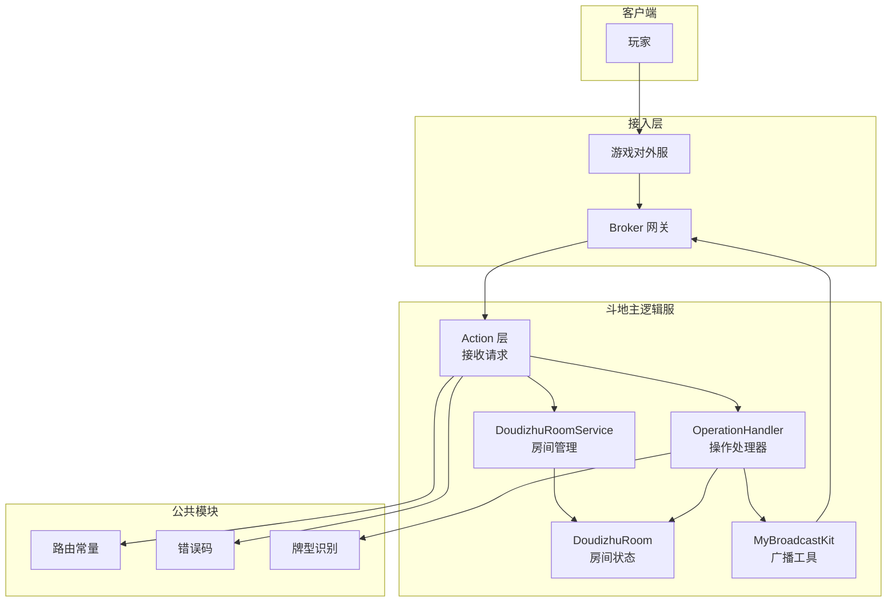
## 2. 核心流程
### 2.1 完整游戏流程
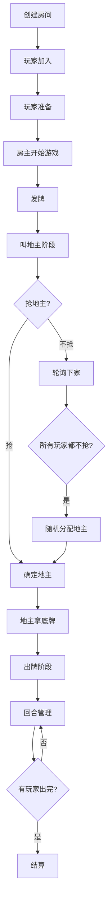
### 2.2 房间状态机
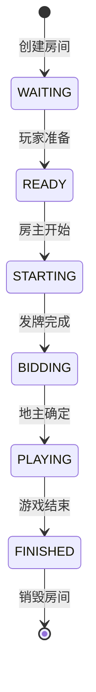
### 2.3 出牌阶段状态机
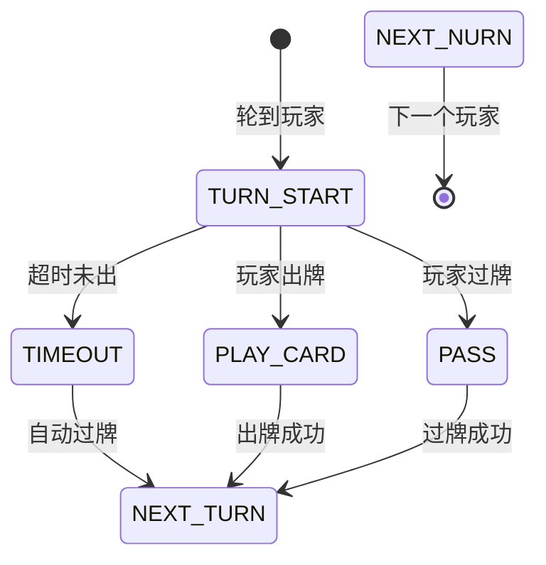
## 3. 模块设计
### 3.1 目录结构
```text
game-doudizhu/
├── pom.xml
└── src/main/java/com/pokergame/doudizhu/
    ├── DoudizhuLogicServer.java           # 启动类
    │
    ├── action/                            # Action 层
    │   └── RoomAction.java                # 房间操作
    │
    ├── room/                              # 房间模块
    │   ├── DoudizhuRoom.java              # 房间状态
    │   ├── DoudizhuPlayer.java            # 玩家状态
    │   └── DoudizhuRoomService.java       # 房间管理
    │
    ├── handler/                           # 操作处理器
    │   ├── InternalOperationEnum.java     # 内部操作枚举
    │   ├── ReadyOperationHandler.java     # 准备
    │   ├── StartGameOperationHandler.java # 开始游戏
    │   ├── PlayCardOperationHandler.java  # 出牌
    │   └── PassOperationHandler.java      # 过牌
    │
    ├── config/                            # 配置
    │   └── MyOperationConfigRunner.java   # 操作注册
    │
    ├── broadcast/                         # 广播
    │   └── MyBroadcastKit.java            # 广播工具
    │
    └── service/                           # 业务服务
        ├── DealService.java               # 发牌服务
        └── SettlementService.java         # 结算服务
```
### 3.2 路由定义
```java
// game-common/cmd/DoudizhuCmd.java
public interface DoudizhuCmd {
    int cmd = 2;

    // 房间操作
    int CREATE_ROOM = 1;
    int JOIN_ROOM = 2;
    int LEAVE_ROOM = 3;
    int ROOM_LIST = 4;

    // 游戏操作
    int READY = 10;           // 准备
    int START_GAME = 11;      // 开始游戏
    int GRAB_LANDLORD = 12;   // 抢地主
    int PLAY_CARD = 13;       // 出牌
    int PASS = 14;            // 过牌

    // 广播路由
    int READY_BROADCAST = 100;
    int GAME_START_BROADCAST = 101;
    int PLAY_CARD_BROADCAST = 102;
    int GAME_END_BROADCAST = 103;
}
```
### 3.3 错误码定义
```java
// game-common/exception/GameCodeEnum.java
public enum GameCodeEnum {
    SUCCESS(0, "成功"),
    
    // 房间错误
    ROOM_NOT_FOUND(10001, "房间不存在"),
    ROOM_FULL(10002, "房间已满"),
    ROOM_ALREADY_STARTED(10003, "游戏已开始"),
    ROOM_NOT_ENOUGH_PLAYERS(10004, "人数不足"),
    
    // 玩家错误
    PLAYER_NOT_IN_ROOM(20001, "玩家不在房间中"),
    NOT_YOUR_TURN(20002, "不是你的回合"),
    PLAYER_NOT_READY(20003, "玩家未准备"),
    NOT_ROOM_OWNER(20004, "不是房主"),
    ILLEGAL_OPERATION(20005, "非法操作"),
    
    // 出牌错误
    INVALID_PATTERN(30001, "无效的牌型"),
    CANNOT_BEAT(30002, "不能压过上家的牌"),
    CARDS_NOT_IN_HAND(30003, "手牌中没有这些牌"),
    NO_CARDS_TO_PLAY(30004, "没有能出的牌"),
    
    // 游戏错误
    GAME_NOT_STARTED(40001, "游戏未开始"),
    GAME_ALREADY_FINISHED(40002, "游戏已结束");
}
```
### 3.4 房间状态
```java
// room/GameStatus.java
public enum GameStatus {
    WAITING,    // 等待玩家
    READY,      // 准备中
    BIDDING,    // 叫地主中
    PLAYING,    // 游戏中
    FINISHED    // 已结束
}
```
### 3.5 玩家状态
```java
// room/DoudizhuPlayer.java
public class DoudizhuPlayer extends SimplePlayer {
    private List<Card> handCards;      // 手牌
    private boolean ready;              // 是否准备
    private boolean landlord;           // 是否地主
    private int order;                  // 出牌顺序
    private boolean finished;           // 是否出完
}
```
### 3.6 房间状态
```java
// room/DoudizhuRoom.java
public class DoudizhuRoom extends SimpleRoom {
    private GameStatus gameStatus;       // 游戏状态
    private long ownerId;                // 房主ID
    private int maxPlayers;              // 最大人数
    
    // 游戏数据
    private List<Long> playOrder;        // 出牌顺序
    private int currentTurnIndex;        // 当前回合
    private List<Card> lastPlayCards;    // 上一手牌
    private long lastPlayPlayerId;       // 上一手玩家
    private CardPattern lastPattern;     // 上一手牌型
    
    // 地主数据
    private long landlordId;             // 地主ID
    private List<Card> landlordExtraCards; // 底牌
    
    // 倍率
    private int bombCount;               // 炸弹次数
    private int multiplier;              // 当前倍率
}
```
## 4. 核心流程详解
## 4.1 创建房间流程
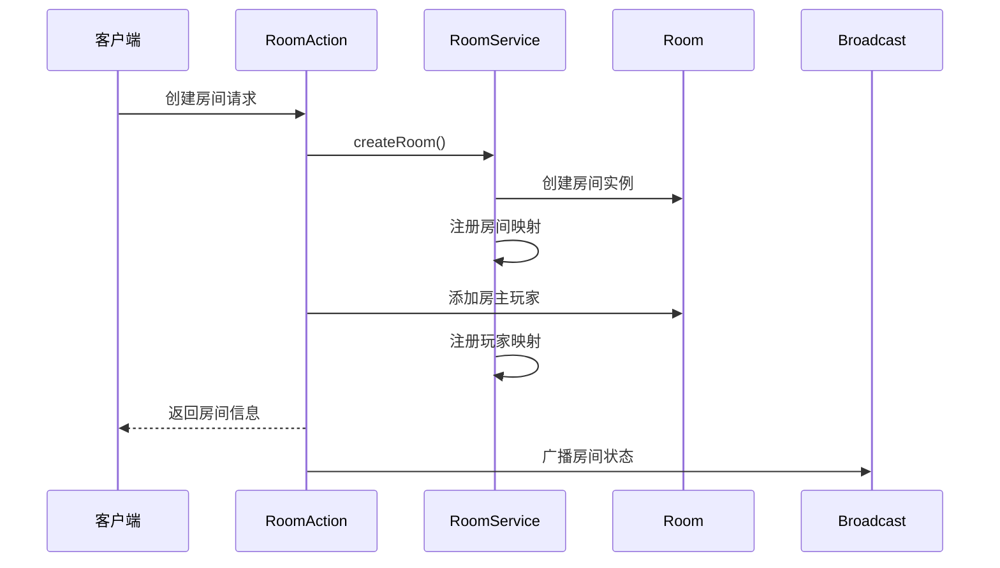
## 4.2 开始游戏流程
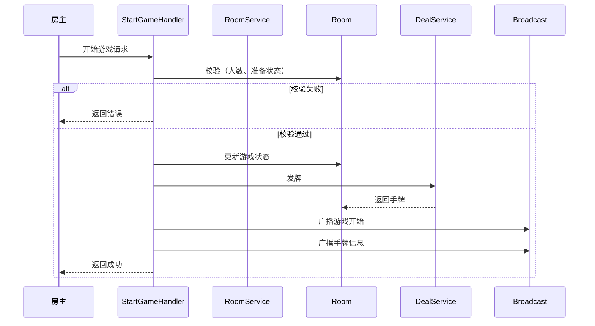
## 4.3 出牌流程
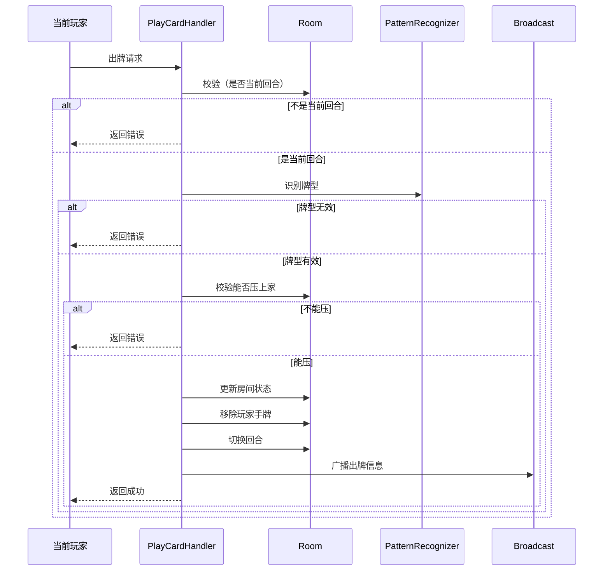
## 4.4 游戏结束与结算
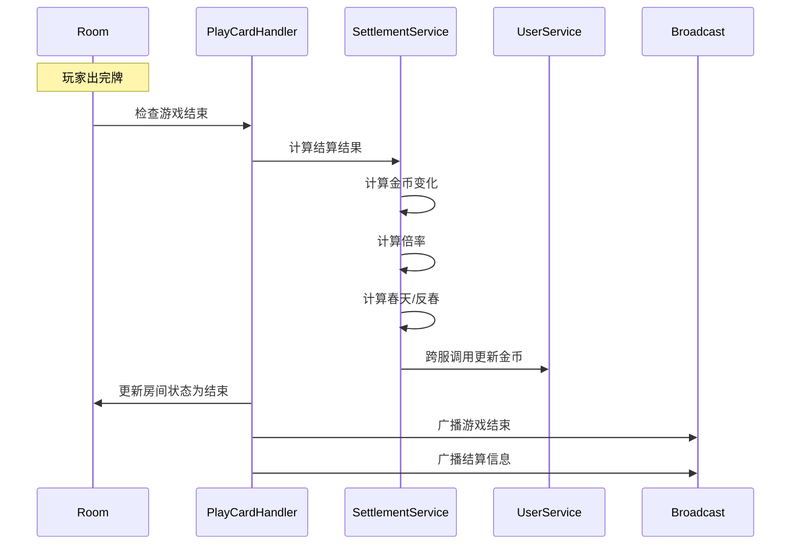
## 5. 数据流
### 5.1 房间生命周期
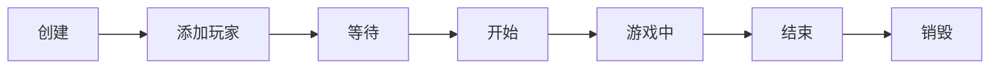
### 5.2 玩家状态变化
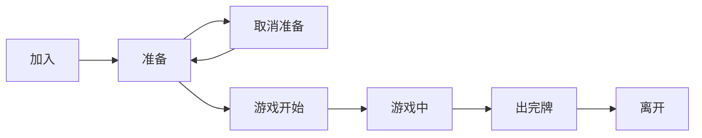
## 6. 关键接口定义
### 6.1 请求/响应协议
| 原因 | 说明 |
| :--- | :--- |
| **临时性 (Ephemerality)** | 游戏对局属于**瞬时状态**（Transient State），一旦结算完成并产生最终战报，中间过程数据（如：某一回合的具体手牌）通常不再具有保留价值。 |
| **高硬性能 (Performance)** | 扑克类游戏对响应延迟极其敏感。**内存操作**（纳秒级）远快于磁盘或分布式数据库（毫秒级），是保证万人在线流畅发牌、出牌的核心支撑。 |
| **设计简化 (Simplicity)** | 将核心逻辑限制在单机内存中，可以完全避免**分布式事务**、锁竞争及数据一致性等复杂架构问题，极大提升了开发与调试效率。 |
| **职责分离 (Separation)** | **分层架构**原则：`game-core` 只负责“算牌”与“跑逻辑”；而金币扣除、胜率统计等涉及资产的数据持久化，交由专门的 `Account/Data Service` 异步处理。 |
### 6.2 广播消息
| 广播消息 (Broadcast) | 包含字段 (Fields) | 功能说明 |
| :--- | :--- | :--- |
| **ReadyBroadcast** | `userId`, `isReady` | **准备通知**：同步房间内玩家的准备状态，全员 Ready 后触发开局。 |
| **GameStartBroadcast** | `hands`, `landlordId` | **开局指令**：下发初始手牌 ID（加密/私有）及初始操作者（如：地主/庄家）。 |
| **PlayCardBroadcast** | `userId`, `cards` | **出牌同步**：实时同步某个玩家出的牌组 ID，供其他客户端渲染动画。 |
| **GameEndBroadcast** | `winnerId`, `scoreChanges` | **结算结算**：通报获胜者及金币/积分的增减情况，清理房间状态。 |

## 7. 闭环验证
### 7.1 正向流程验证
| 步骤 | 操作 (Action) | 预期结果 (Expected Result) | 状态 |
| :--- | :--- | :--- | :---: |
| **1** | **玩家A创建房间** | 房间实体在内存中创建成功，A 设为房主。 | ✅ |
| **2** | **玩家B加入房间** | `RoomMgr` 更新 `ConcurrentHashMap`，B 加入成功。 | ✅ |
| **3** | **玩家C加入房间** | 房间人数达到上限（3人），触发全员准备检查。 | ✅ |
| **4** | **玩家A开始游戏** | `RuleChecker` 校验状态，触发 `GameStartBroadcast`。 | ✅ |
| **5** | **发牌 (Dealing)** | `TexasDealer/DoudizhuDealer` 分发 ID，每人 17 张，留 3 张底牌。 | ✅ |
| **6** | **叫地主 (Bidding)** | 经过抢地主逻辑，玩家 A 获得底牌并确认为地主。 | ✅ |
| **7** | **玩家A出牌** | `PatternRecognizer` 识别成功，轮次切换至 B。 | ✅ |
| **8** | **玩家B过牌 (Pass)** | `TurnMgr` 更新当前操作者索引，轮次切换至 C。 | ✅ |
| **9** | **玩家C出牌** | 校验出牌是否大于 A，成功后轮次切换回 A。 | ✅ |
| **...** | **循环出牌** | `Timer` 监控倒计时，驱动回合不断交替。 | ✅ |
| **N** | **结算 (Settlement)** | `HandRankEvaluator` 确认胜者，`MultiplierCalculator` 计算最终金币。 | ✅ |
### 7.2 异常流程验证
| 异常场景 (Exception) | 处理方式 (Handling Strategy) | 状态 |
| :--- | :--- | :---: |
| **房间已满加入** | `RoomMgr` 拦截请求，返回错误码 `ERR_ROOM_FULL`。 | ✅ |
| **非当前玩家出牌** | `TurnMgr` 校验 `userId` 与当前 `ActiveIndex` 不匹配，返回 `ERR_NOT_YOUR_TURN`。 | ✅ |
| **出牌不能压上家** | `PatternComparator` 返回 `False`，提示玩家“出牌点数不足”或“牌型不匹配”。 | ✅ |
| **房主离开** | 系统执行“房主移交”逻辑（通常给第二个加入的人）或直接执行 `destroyRoom`。 | ✅ |
| **玩家断线 (DC)** | `Timer` 触发超时，系统自动开启**AI托管 (Auto-Play)** 或在非游戏期将其踢出。 | ✅ |
## 8. 总结
| 维度 | 说明                                                                                                                                                                     |
| :--- |:-----------------------------------------------------------------------------------------------------------------------------------------------------------------------|
| **核心组件 (Components)** | **分层解耦**：<br>1. `RoomService`: 入口服务，负责路由。<br>2. `Room`: 业务核心，持有 ConcurrentHashMap 状态。<br>3. `OperationHandler`: 动作处理器，执行出牌/叫地主逻辑。<br>4. `BroadcastKit`: 通讯组件，封装所有下行广播。 |
| **关键流程 (Flow)** | **确定性链路**：<br>创建房间 -> 玩家准备 -> **策略发牌 (Dealer)** -> 叫分/抢庄 -> 循环出牌 -> 最终结算。                                                                                              |
| **状态管理 (State)** | **双重状态机**：<br>1. **房间状态** (IDLE, DEALING, PLAYING, SETTLING)。<br>2. **玩家状态** (WAITING, READY, OFFLINE, AUTO_PLAY)。                                                     |
| **通信方式 (Comm)** | **异步双向**：<br>1. **Action**: 客户端上行请求 (如: PlayCardRequest)。<br>2. **Broadcast**: 服务器下行全员通知 (如: PlayCardBroadcast)。                                                       |
| **错误处理 (Exception)** | **防御式编程**：<br>采用**统一错误码系统** + **断言式校验 (Assert)**。任何非法操作（如：非回合玩家出牌）立即拦截并返回 `ErrorCode`。                                                                                 |

# 斗地主逻辑服设计文档（修订版 2.0）
## 1. 概述
### 1.1 设计原则
| 原则 | 说明 |
| :--- | :--- |
| **职责分离** | **算法与业务解耦**：无状态算法（如牌型识别）放在 `game-common`，有状态逻辑（如房间状态）留在 `game-doudizhu`。 |
| **基类复用** | **避免重复造轮子**：通过继承 `game-core` 提供的基类（如 `BaseDealer`）快速构建新游戏逻辑。 |
| **简单优先** | **逻辑分层**：`OperationHandler` 仅负责简单的状态变更，复杂的业务校验和计算在 `Action` 层或 Service 层处理。 |
### 1.2 架构图
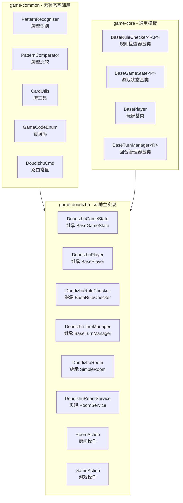
### 1.3 完整类图
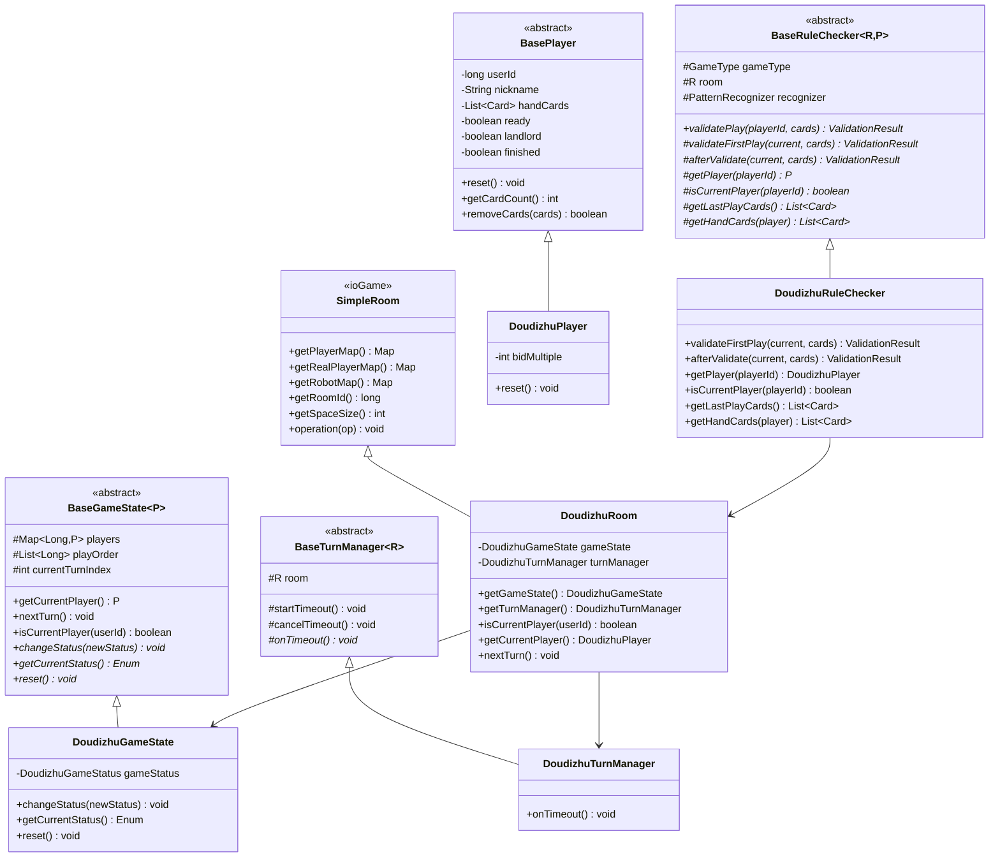
## 2. 目录结构
```text
game-doudizhu/
├── pom.xml
└── src/main/java/com/pokergame/doudizhu/
    ├── DoudizhuLogicServer.java           # 启动类
    │
    ├── action/                            # Action 层
    │   ├── RoomAction.java                # 房间操作（创建、加入、离开）
    │   └── GameAction.java                # 游戏操作（出牌、过牌、抢地主）
    │
    ├── broadcast/                         # 广播工具
    │   └── DoudizhuBroadcastKit.java      # 广播消息封装
    │
    ├── config/                            # 配置
    │   └── DoudizhuOperationConfigRunner.java  # OperationHandler 注册
    │
    ├── enums/                             # 枚举
    │   ├── DoudizhuGameStatus.java        # 游戏状态枚举
    │   └── InternalOperation.java         # 内部操作枚举
    │
    ├── handler/                           # OperationHandler（只处理简单状态）
    │   ├── EnterRoomOperationHandler.java # 进入房间
    │   ├── QuitRoomOperationHandler.java  # 离开房间
    │   ├── ReadyOperationHandler.java     # 准备
    │   └── StartGameOperationHandler.java # 开始游戏
    │
    ├── room/                              # 房间模块
    │   ├── DoudizhuRoom.java              # 房间（继承 SimpleRoom）
    │   ├── DoudizhuPlayer.java            # 玩家（继承 BasePlayer）
    │   └── DoudizhuRoomService.java       # 房间服务（单例）
    │
    ├── rule/                              # 规则执行器
    │   └── DoudizhuRuleChecker.java       # 出牌规则校验
    │
    ├── state/                             # 游戏状态
    │   └── DoudizhuGameState.java         # 游戏状态（继承 BaseGameState）
    │
    └── turn/                              # 回合管理
        └── DoudizhuTurnManager.java       # 回合管理器（继承 BaseTurnManager）
```
## 3. 核心流程
### 3.1 完整游戏流程
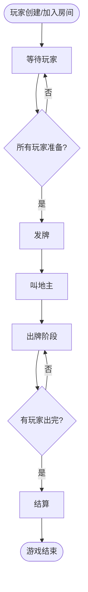
### 3.2 请求处理分工
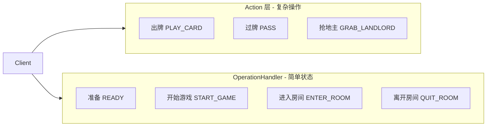
### 3.3 出牌流程（Action 层处理）
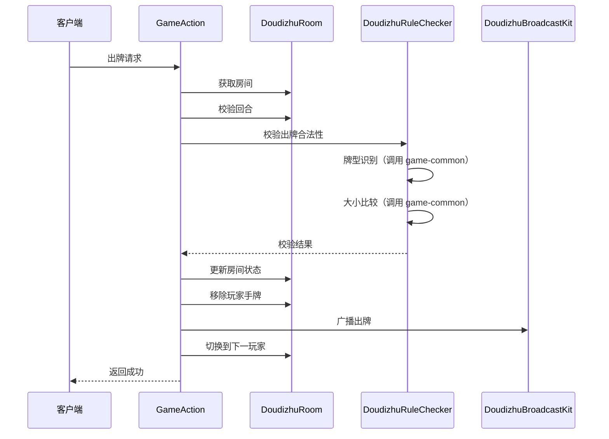
### 3.4 准备流程（OperationHandler 处理）
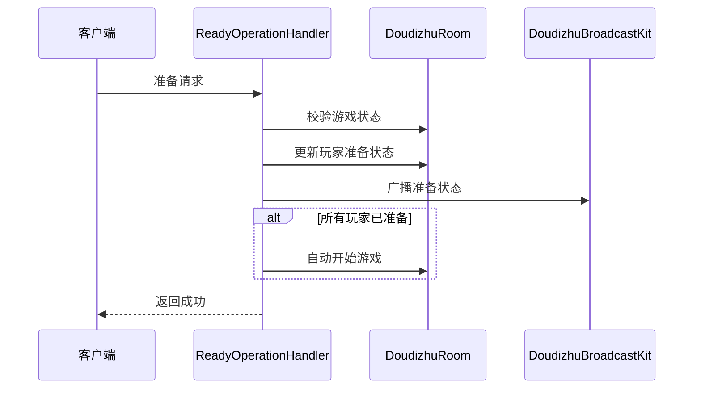
## 4. 请求处理分工表
| 操作 | 处理层 | 原因 |
| :--- | :--- | :--- |
| **创建房间** | **Action** | 涉及复杂的初始化逻辑：生成唯一 ID、分配内存、建立房主与房间的绑定关系。 |
| **加入房间** | **Action** | 包含多重前置校验：房间是否存在、人数是否满员、玩家黑名单及资产门槛检查。 |
| **离开房间** | **OperationHandler** | 属于原子操作：仅需将玩家从列表移除并触发简单的状态变更（如房主移交）。 |
| **准备** | **OperationHandler** | 状态极其简单：仅是对玩家对象的 `isReady` 字段进行布尔值切换。 |
| **开始游戏** | **OperationHandler** | 触发式逻辑：当全员 Ready 时，将房间状态机从 `IDLE` 切换至 `PLAYING`。 |
| **出牌** | **Action** | 数据密集型：需要解析牌组 ID、调用 `PatternRecognizer` 校验合法性并计算剩余手牌。 |
| **过牌** | **Action** | 规则敏感型：需要校验当前是否允许过牌（如首出不能过）并触发回合切换。 |
| **抢地主** | **Action** | 业务逻辑复杂：涉及倍数累加计算、抢地主优先权判定及底牌展示流程。 |
| **不抢地主** | **Action** | 流程驱动型：需判断是否触发“重新发牌”逻辑（若全员不抢）或顺延至下一位。 |
## 5. 组件清单
| 组件 (Component) | 模块位置 (Module/Package) | 说明 |
| :--- | :--- | :--- |
| **DoudizhuCmd** | `game-common/cmd` | **路由常量**：定义网络协议号与指令映射（如：1001-出牌）。 |
| **GameCodeEnum** | `game-common/exception` | **错误码**：全局统一的异常代码定义（如：房间满、牌型非法）。 |
| **BaseRuleChecker** | `game-core/rule` | **规则检查器基类**：提供校验逻辑的通用框架。 |
| **BaseGameState** | `game-core/state` | **游戏状态基类**：定义对局基础属性（如：底池、倍率）。 |
| **BasePlayer** | `game-core/state` | **玩家基类**：封装通用属性（如：UID、金币、在线状态）。 |
| **BaseTurnManager** | `game-core/state` | **回合管理器基类**：控制轮询逻辑与超时判定。 |
| **DoudizhuGameState** | `game-doudizhu/state` | **斗地主状态**：扩展特有属性（如：底牌、当前地主 ID）。 |
| **DoudizhuPlayer** | `game-doudizhu/room` | **斗地主玩家**：扩展特有数据（如：是否抢过地主、加倍状态）。 |
| **DoudizhuRoom** | `game-doudizhu/room` | **斗地主房间**：持有当前对局的所有实时内存数据。 |
| **DoudizhuRoomService** | `game-doudizhu/room` | **房间服务**：实现房间创建、加入、销毁的核心业务入口。 |
| **DoudizhuRuleChecker** | `game-doudizhu/rule` | **规则执行器**：实现斗地主特定的出牌合法性校验。 |
| **DoudizhuTurnManager** | `game-doudizhu/turn` | **回合管理器**：控制斗地主特有的叫分与出牌轮转逻辑。 |
| **DoudizhuBroadcastKit** | `game-doudizhu/broadcast` | **广播工具**：封装 ProtoBuf 或 JSON 消息的下发推送。 |
| **RoomAction** | `game-doudizhu/action` | **房间操作**：处理加入、退出、准备等非对局请求。 |
| **GameAction** | `game-doudizhu/action` | **游戏操作**：处理叫分、出牌、托管等对局核心请求。 |
| **\*OperationHandler** | `game-doudizhu/handler` | **状态处理器**：执行轻量级、无校验风险的状态字段变更。 |
## 6.测试设计
```text
game-test/src/test/java/com/pokergame/doudizhu/
├── rule/
│   └── DoudizhuRuleCheckerTest.java      # 出牌校验测试
├── handler/
│   ├── ReadyOperationHandlerTest.java    # 准备操作测试
│   └── StartGameOperationHandlerTest.java # 开始游戏测试
├── action/
│   ├── RoomActionTest.java               # 房间操作测试
│   └── GameActionTest.java               # 游戏操作测试
└── integration/
    └── DoudizhuIntegrationTest.java      # 整体集成测试
```

## 7. 总结
| 维度 | 说明 |
| :--- | :--- |
| **设计原则** | **核心三要素**：<br>1. **职责分离**：算法归 Common，状态归 Core，对局归 Game。<br>2. **基类复用**：模板方法模式，减少重复代码。<br>3. **简单优先**：逻辑分流，防止 Action 层臃肿。 |
| **基类数量** | **4 大核心基类**：<br>1. `BasePlayer` (玩家镜像)<br>2. `BaseGameState` (对局快照)<br>3. `BaseTurnManager` (轮转控制)<br>4. `BaseRuleChecker` (规则校验) |
| **保留 OperationHandler** | **原子操作专用**：仅保留 4 个执行“简单状态变更”的 Handler（如：准备、取消准备、开始游戏、离开房间），确保响应极速且无副作用。 |
| **Action 层处理** | **复杂业务枢纽**：承载**出牌、过牌、抢地主、加倍**等重逻辑。负责调用识别算法、判定倍率、执行扣牌及触发下一回合。 |
| **代码复用** | **插件式扩展**：通过继承 `game-core` 提供的基类，开发新游戏（如：德州扑克）仅需实现特定的**钩子方法 (Hooks)**，无需重写底层房间与回合管理。 |

# 斗地主逻辑服服补充设计
## 1. 叫地主
### 1.1 叫地主流程
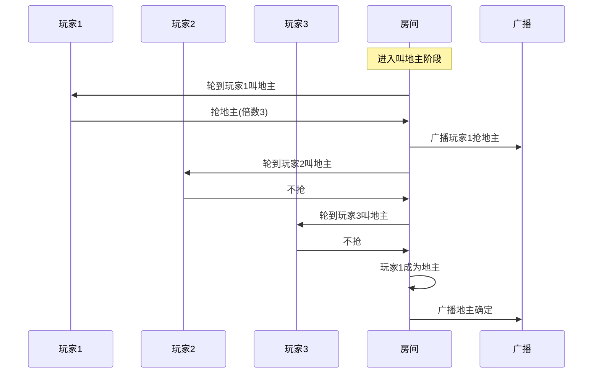
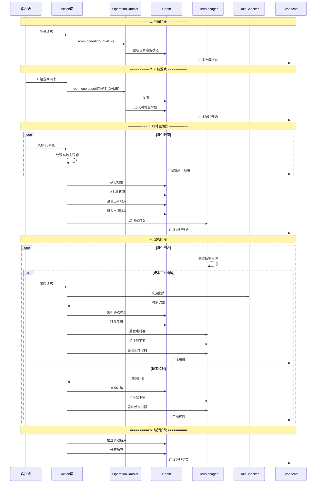
### 1.2 完整状态机
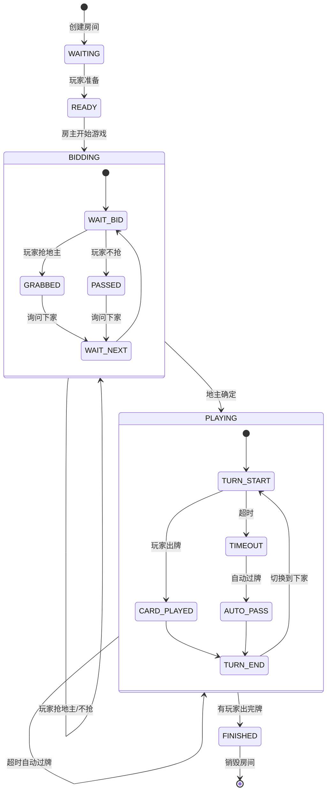
### 1.3 叫地主状态机
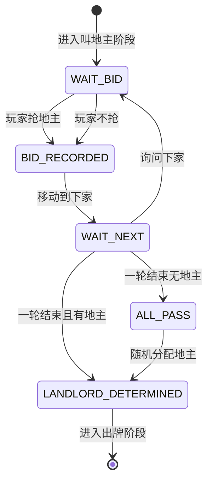
### 1.4 叫地主流程的状态机设计
| 状态 (State) | 说明 | 触发事件 (Trigger Event) |
| :--- | :--- | :--- |
| **WAIT_BID** | **等待叫分**：当前玩家正处于决策窗口（抢/不抢/叫分）。 | 收到玩家“抢/不抢”请求 |
| **BID_RECORDED** | **记录决策**：已将当前玩家的叫地主选择写入内存。 | 逻辑自动触发：移动操作权至下家 |
| **WAIT_NEXT** | **等待下家**：轮转至下一个玩家进行叫地主判定。 | 超时自动执行或玩家操作响应 |
| **ALL_PASS** | **流局处理**：所有玩家均选择不抢，触发系统兜底逻辑。 | 触发重新发牌或**随机分配地主** |
| **LANDLORD_DETERMINED** | **身份确立**：地主身份锁定，进入对局准备。 | **发底牌**、更新倍数并进入 `PLAYING` 阶段 |


## 2. 定时器
## 2.1 定时器启动时机
| 时机 | 操作 | 说明 |
| :--- | :--- | :--- |
| **进入出牌阶段** | `turnManager.startTimeout()` | **启动倒计时**：开启 15 秒（或其他配置值）的出牌计时，触发客户端进度条。 |
| **玩家出牌后** | `turnManager.resetTimeout()` | **重置定时器**：玩家完成合法操作后，立即停止当前定时任务，防止触发托管。 |
| **玩家过牌后** | `turnManager.resetTimeout()` | **清理计时**：过牌视为有效操作，清理当前计时并准备进入下一环节。 |
| **切换玩家后** | `turnManager.startTimeout()` | **重新启动**：为新的操作玩家开启一个完整的生命周期定时器，确保时间均等。 |
## 2.2 定时器时序图
```mermaid
sequenceDiagram
    participant T as TurnManager
    participant Timer as DelayTaskKit
    participant R as Room
    participant A as Action

    Note over T: 玩家A回合开始
    T->>Timer: 启动15秒定时器
    
    alt 玩家A在15秒内出牌
        A->>T: 玩家A出牌
        T->>Timer: 取消定时器
        T->>R: 切换到玩家B
        T->>Timer: 启动新定时器(15秒)
    else 玩家A超时
        Timer->>T: 15秒后触发超时
        T->>R: room.operation(PASS)
        R->>A: 自动过牌
        T->>R: 切换到玩家B
        T->>Timer: 启动新定时器(15秒)
    end
```

## 3. 结算服务
### 3.1 结算分层设计
```mermaid
graph TB
    subgraph Common[通用结算层 - game-common]
        C1[BaseSettlementContext<br/>结算上下文]
        C2[SettlementResult<br/>结算结果DTO]
        C3[SettlementRule<br/>结算规则接口]
    end
    
    subgraph Core[游戏引擎层 - game-core]
        Co1[BaseSettlementCalculator<br/>结算计算器基类]
        Co2[MultiplierCalculator<br/>倍率计算器]
    end
    
    subgraph Game[游戏层 - game-doudizhu]
        G1[DoudizhuSettlementCalculator<br/>继承基类]
        G2[具体倍率计算]
    end
    
    subgraph Service[业务服务层 - service-user]
        S1[金币更新接口]
    end
    
    Common --> Core
    Core --> Game
    Game --> Service
```
