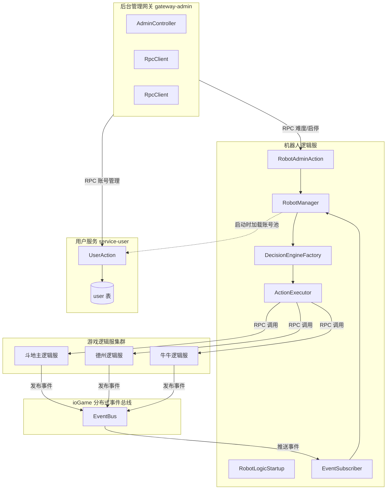
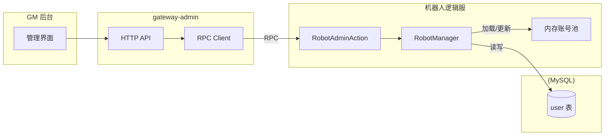
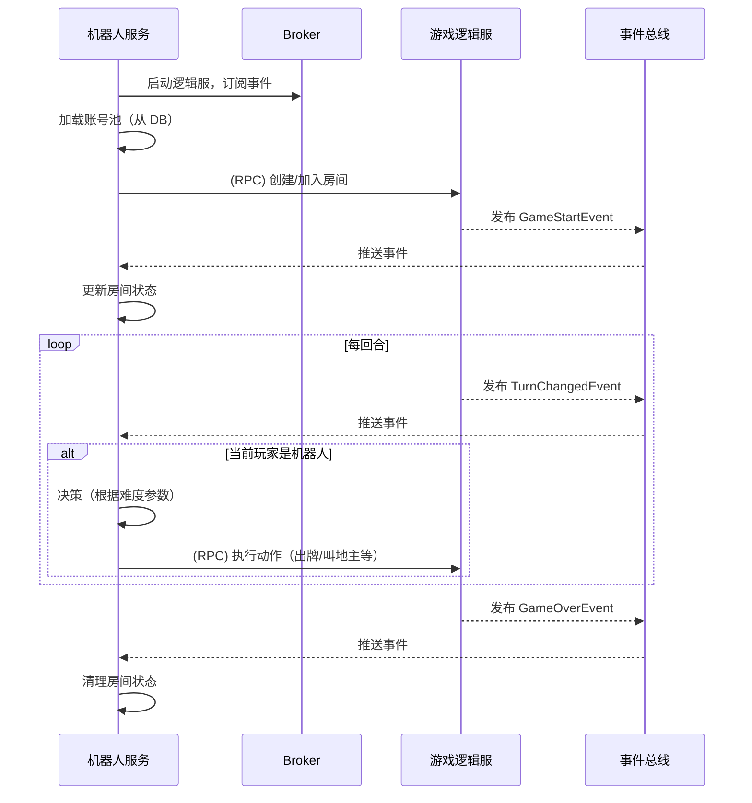
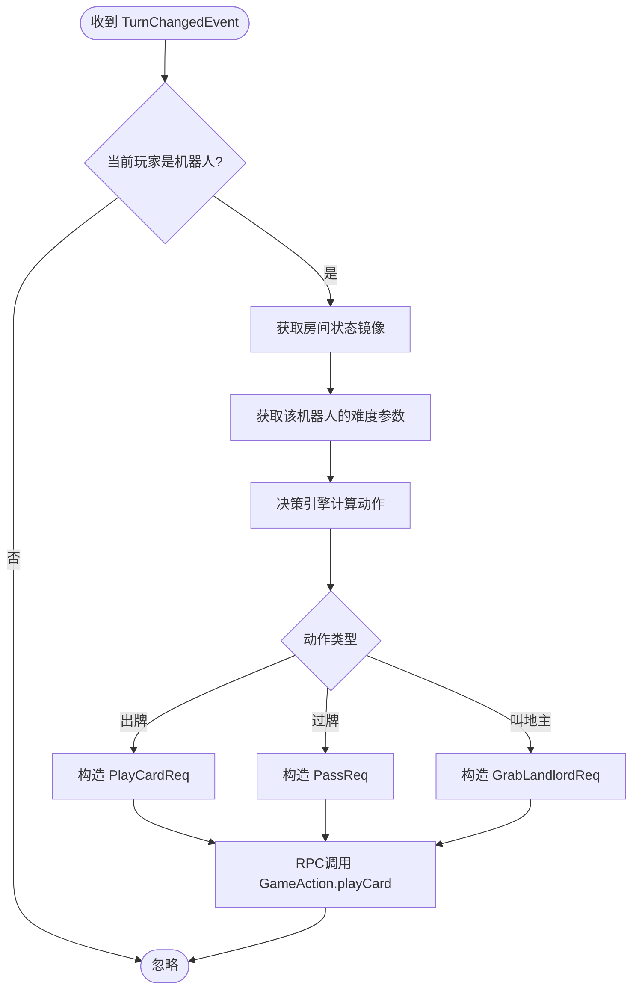
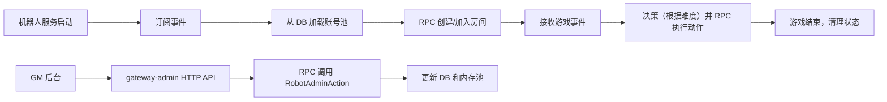
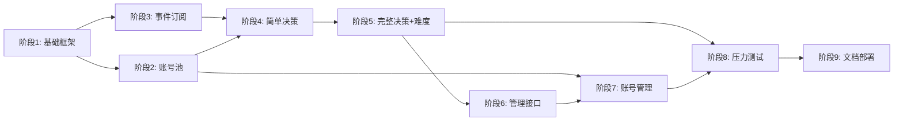

# 机器人逻辑服设计文档
## 1. 概述
### 1.1 设计目标
- 零侵入：机器人逻辑服不修改现有游戏逻辑服核心代码，仅通过 ioGame 事件总线订阅状态变化，通过 RPC 调用游戏 Action。
- 跨游戏复用：支持斗地主、德州扑克、牛牛等多种游戏，决策引擎插件化。
- 高性能：事件驱动 + 内部 RPC，无 WebSocket 开销。
- 难度可配置：支持简单、中等、困难多级难度，决策参数化。
- 可运维：提供 GM 后台管理接口，支持机器人账号管理、难度调整、启停控制。
### 1.2 整体架构图

## 2. 模块划分
### 2.1 机器人逻辑服内部结构
```text
game-robot/
├── src/main/java/com/pokergame/robot/
│   ├── RobotServiceApplication.java       # Spring Boot 启动类
│   ├── RobotLogicStartup.java             # ioGame 逻辑服启动类
│   ├── event/
│   │   └── GameEventSubscriber.java       # 事件订阅者
│   ├── manager/
│   │   ├── RobotManager.java              # 机器人实例管理（账号池、状态）
│   │   └── RoomState.java                 # 单个房间状态镜像
│   ├── decision/
│   │   ├── DecisionEngine.java            # 决策引擎接口
│   │   ├── factory/
│   │   │   └── DecisionEngineFactory.java
│   │   ├── param/
│   │   │   └── AIParams.java              # 难度参数配置
│   │   ├── doudizhu/
│   │   │   └── DoudizhuDecision.java
│   │   ├── texas/
│   │   │   └── TexasDecision.java
│   │   └── niuniu/
│   │       └── NiuniuDecision.java
│   ├── executor/
│   │   └── ActionExecutor.java            # RPC 执行器
│   ├── action/
│   │   └── RobotAdminAction.java          # 提供管理 RPC 接口（供 gateway-admin 调用）
│   └── config/
│       └── RobotConfig.java               # 配置（难度参数、账号池初始数量）
```
### 2.2 事件定义（在 game-common 中）
所有事件实现 Serializable，包含游戏类型和房间 ID。

| 事件类 | 字段 | 说明 |
| :--- | :--- | :--- |
| **GameStartEvent** | `roomId`, `gameType`, `players` | **游戏开始**：通知所有相关服务对局正式启动，初始化对局上下文。 |
| **CardsDealtEvent** | `roomId`, `playerId`, `handCards` | **发牌事件**：推送初始手牌信息（注意：逻辑上仅发送给对应玩家/机器人）。 |
| **TurnChangedEvent** | `roomId`, `currentPlayerId`, `timeoutSec` | **回合切换**：驱动流程移动到下一玩家，触发机器人的决策引擎计时。 |
| **BiddingEvent** | `roomId`, `playerId`, `currentMaxMultiple` | **叫地主（斗地主）**：同步当前叫分或抢地主状态，用于机器人评估牌力。 |
| **CardPlayedEvent** | `roomId`, `playerId`, `cards`, `pattern` | **出牌事件**：同步玩家出的牌及牌型（如单张、顺子），用于记牌器逻辑。 |
| **PassEvent** | `roomId`, `playerId` | **过牌事件**：记录玩家跳过本轮，用于判断一轮跟牌是否结束。 |
| **GameOverEvent** | `roomId`, `winnerId`, `result` | **游戏结束**：触发结算逻辑，清理机器人 Session 并更新战绩。 |

## 3. 数据库设计
### 3.1 用户表增加字段
```sql
ALTER TABLE `user` 
ADD COLUMN `is_robot` tinyint(1) NOT NULL DEFAULT 0 COMMENT '是否机器人：0-真人，1-机器人',
ADD COLUMN `robot_difficulty` tinyint(1) DEFAULT 2 COMMENT '机器人难度:1简单2中等3困难',
ADD COLUMN `robot_enabled` tinyint(1) DEFAULT 1 COMMENT '机器人是否启用（可单独禁用某个机器人）';
```
- is_robot：标识机器人账号。
- robot_difficulty：机器人难度等级，支持动态调整。
- robot_enabled：可单独禁用某个机器人（例如异常时临时下线）。
  
### 3.2 机器人账号池
机器人账号是预先在 user 表中创建的一批记录（is_robot=1）。创建方式：
- 手动通过 SQL 批量插入。
- 或通过 GM 后台调用 gateway-admin 的接口，由 gateway-admin 调用用户服务的注册接口批量创建（复用现有注册逻辑）。

## 4. 机器人账号池管理
### 4.1 账号池架构

### 4.2 账号池初始化
机器人服务启动时，RobotManager 从 user 表中加载所有 is_robot=1 且 robot_enabled=1 的账号到内存池。加载内容包括：
- userId
- nickname
- robot_difficulty
- 其他必要的玩家数据（如头像等）。
### 4.3 账号池管理（通过 GM 后台）
GM 后台通过 gateway-admin 的 HTTP 接口，调用机器人服务的 RobotAdminAction 的 RPC 方法，实现以下管理功能：

| 操作 | 说明 | 流程 |
| :--- | :--- | :--- |
| **添加机器人** | **批量创建**：生成新的机器人账号并初始化属性。 | `gateway-admin` → RPC → `RobotAdminAction.createRobots(count, difficulty)` → 调用用户服务注册接口 → 写入 `user` 表 → 加入内存池。 |
| **删除机器人** | **移除账号**：禁用或彻底删除机器人数据。 | `gateway-admin` → RPC → `RobotAdminAction.deleteRobot(userId)` → 标记 `user.enabled=0` 或物理删除 → 从内存池移除。 |
| **修改难度** | **策略调整**：动态改变机器人的决策算法等级。 | `gateway-admin` → RPC → `RobotAdminAction.setDifficulty(userId, difficulty)` → 更新 `user.robot_difficulty` → 同步更新内存池对象。 |
| **查询列表** | **状态监控** | `gateway-admin` → RPC → `RobotAdminAction.listRobots()` → 从内存池或数据库读取当前所有机器人账号及在线状态。 |
| **启停服务** | **全局开关** | `gateway-admin` → RPC → `RobotAdminAction.setServiceEnabled(enabled)` → 控制 `RobotManager` 是否响应事件总线通知和执行动作。 |

### 4.4 RobotAdminAction RPC 接口定义
```java
@ActionController(RobotAdminCmd.CMD)
public class RobotAdminAction {
    
    @ActionMethod(RobotAdminCmd.CREATE_ROBOTS)
    public CreateRobotsResp createRobots(CreateRobotsReq req) {
        // 批量创建机器人账号，调用用户服务注册接口
        // 返回创建成功的 userId 列表
    }
    
    @ActionMethod(RobotAdminCmd.DELETE_ROBOT)
    public DeleteRobotResp deleteRobot(DeleteRobotReq req) {
        // 禁用/删除机器人账号
    }
    
    @ActionMethod(RobotAdminCmd.SET_DIFFICULTY)
    public SetDifficultyResp setDifficulty(SetDifficultyReq req) {
        // 修改机器人难度
    }
    
    @ActionMethod(RobotAdminCmd.LIST_ROBOTS)
    public ListRobotsResp listRobots(ListRobotsReq req) {
        // 返回机器人列表（分页）
    }
    
    @ActionMethod(RobotAdminCmd.SET_SERVICE_ENABLED)
    public SetServiceEnabledResp setServiceEnabled(SetServiceEnabledReq req) {
        // 全局启停机器人服务
    }
}
```
## 5. 核心流程
### 5.1 机器人生命周期

### 5.2 机器人加入房间
机器人可以主动创建房间或加入已有房间。加入流程与普通玩家完全一致：通过 RPC 调用 RoomAction.joinRoom。
### 5.3 出牌决策流程（含难度）

## 6. 难度设定
### 6.1 难度等级定义
```java
public enum AIDifficulty {
    EASY(1, "简单"),
    NORMAL(2, "中等"),
    HARD(3, "困难");
    
    private final int level;
    private final String desc;
}
```
### 6.2 决策参数配置
每种游戏类型的决策引擎根据难度加载不同的参数集。参数可以放在 application.yml 中，也支持运行时通过 GM 后台动态修改。

#### 示例：斗地主难度参数（YAML）
```yaml
robot:
  doudizhu:
    easy:
      bid-threshold: 30       # 叫地主分数阈值（低，更易抢）
      play-aggressiveness: 0.3  # 出牌激进程度（0~1，越低越保守）
      bomb-usage-threshold: 0.8 # 炸弹使用门槛（手牌剩余比例）
    normal:
      bid-threshold: 50
      play-aggressiveness: 0.6
      bomb-usage-threshold: 0.6
    hard:
      bid-threshold: 70
      play-aggressiveness: 0.9
      bomb-usage-threshold: 0.4
```
### 6.3 决策引擎集成
```java
public class DoudizhuDecision implements DecisionEngine {
    private final AIDifficulty difficulty;
    private final DoudizhuAIParams params;
    
    public DoudizhuDecision(AIDifficulty difficulty) {
        this.difficulty = difficulty;
        this.params = loadParams(difficulty); // 从配置加载
    }
    
    @Override
    public int decideBid(RoomState state) {
        int handStrength = evaluateHandStrength(state.getMyHandCards());
        if (handStrength >= params.getBidThreshold()) {
            // 抢地主倍数：简单模式更倾向于叫3倍
            return difficulty == AIDifficulty.EASY ? 3 : 2;
        }
        return 0;
    }
    
    @Override
    public Action decidePlay(RoomState state) {
        // 根据 params.getPlayAggressiveness() 调整出牌策略
        // 激进：优先压牌，炸弹早出；保守：优先过牌，留炸弹保底
    }
}
```
### 6.4 动态难度调整
- 每个机器人实例拥有独立的难度（在创建机器人时指定）。
- 支持运行时通过 GM 后台接口修改难度，立即生效（无需重启）。修改流程：
  1. gateway-admin 调用 RobotAdminAction.setDifficulty 
  2. 更新数据库 user.robot_difficulty 
  3. 通知 RobotManager 更新内存池中对应机器人的难度参数。

## 7. GM 后台管理接口
### 7.1 管理功能
所有管理功能由 gateway-admin 提供 HTTP 接口，内部通过 RPC 调用机器人服务的 RobotAdminAction。

| 功能 | HTTP 端点 | 说明 |
| :--- | :--- | :--- |
| **添加机器人** | `POST /admin/robot/add` | **批量创建**：通过后台 API 触发，自动在用户服注册指定数量和难度的机器人。 |
| **删除机器人** | `POST /admin/robot/remove` | **账号下线**：移除指定机器人 ID，并从当前内存任务池中实时清理该实例。 |
| **修改难度** | `POST /admin/robot/set-difficulty` | **智能调控**：实时调整单个或批量机器人的策略等级（如：初级、中级、大师级）。 |
| **机器人列表** | `GET /admin/robot/list` | **状态看板**：分页获取机器人的在线状态、对局历史、所属房间及当前胜率。 |
| **全局启停** | `POST /admin/robot/enable` | **熔断控制** | 一键开启或关闭机器人代打/陪玩服务，紧急处理逻辑异常或维护。 |

## 8. 部署与配置
### 8.1 配置文件示例（game-robot/application.yml）
```yaml
spring:
  application:
    name: game-robot

robot:
  enabled: true
  pool:
    initial-size: 10       # 启动时加载的机器人数量（从 DB 加载）
    max-size: 100          # 最大同时活跃机器人数量（可选）
  default-difficulty: NORMAL
  games:
    doudizhu:
      easy:
        bid-threshold: 30
        play-aggressiveness: 0.3
        bomb-usage-threshold: 0.8
      normal:
        bid-threshold: 50
        play-aggressiveness: 0.6
        bomb-usage-threshold: 0.6
      hard:
        bid-threshold: 70
        play-aggressiveness: 0.9
        bomb-usage-threshold: 0.4
```
### 8.2 部署
- 机器人服务作为独立逻辑服，与 Broker、游戏逻辑服一起部署。
- 支持水平扩展（多个机器人服务实例），通过 Broker 自动负载均衡。
- gateway-admin 作为独立 HTTP 网关，对外提供管理接口。

## 9. 安全性
- 机器人只调用玩家可用的 Action（如 playCard, ready, grabLandlord），这些 Action 本身对外部开放。
- 机器人账号通过 is_robot 字段标记，便于运营管理。
- gateway-admin 的管理接口需要额外的权限验证（如 Admin Token、IP 白名单）。

## 10. 游戏逻辑服改动
- 发布事件：在状态变更处调用 flowContext.fire(event) 发布事件。
- 改动量：每个游戏约 10-20 行代码，无侵入核心逻辑。

## 11. 闭环验证

## 12. 总结
本设计文档详细说明了机器人逻辑服的内部结构、账号池管理、难度设定、与 GM 后台的集成方式。通过独立的 gateway-admin 服务提供管理接口，机器人服务仅通过 RPC 暴露管理 Action，实现了职责分离。数据库扩展了 is_robot、robot_difficulty 等字段，支撑账号池的持久化与动态管理。该设计可扩展至多种游戏，满足测试、陪玩、压力测试等需求。

----
# 机器人逻辑服开发流程（分阶段 + 可验证测试）
## 总体原则
- 小步快跑：每个阶段产出可独立验证的功能模块。
- 测试驱动：每个阶段完成时都有对应的单元测试或集成测试通过。
- 渐进集成：先本地模拟，再集成真实服务。
## 1. 阶段 1：基础设施搭建（1天）
### 目标
- 创建 game-robot Maven 模块。
- 配置 pom.xml，引入必要依赖（ioGame、Spring Boot、Redis、MySQL、Lombok 等）。
- 实现 RobotLogicStartup，能够成功连接到 Broker 并打印启动日志。
### 产出
- game-robot 模块骨架。
- 启动类 RobotServiceApplication + RobotLogicStartup。
- application.yml 基础配置。
### 验证测试
- 运行 RobotServiceApplication.main()，控制台输出 机器人逻辑服启动成功，无异常。
- 查看 Broker 日志，确认机器人逻辑服已注册（ConnectionEventType:【CONNECT】）。
## 阶段 2：机器人账号池加载（1天）
### 目标
- 实现从 service-user 的 RPC 接口获取机器人账号列表。
- 实现 RobotManager 内存管理账号池。
### 产出
- RobotManager 类，提供 loadRobotAccounts()、getRandomRobot() 等方法。
- 在 RobotLogicStartup 启动完成后调用加载。
### 验证测试
- 单元测试：Mock 用户服务 RPC 返回账号列表，验证 RobotManager 正确加载到内存。
- 集成测试：启动真实用户服务，验证能成功获取账号列表。
## 阶段 3：事件订阅与房间状态管理（2天）
### 目标
- 在游戏逻辑服（如斗地主）中添加事件发布（GameStartEvent、TurnChangedEvent 等）。
- 机器人服务实现 GameEventSubscriber，订阅并处理事件。
- 实现 RoomState 类，维护机器人所在房间的状态镜像。
**### 产出
- 游戏逻辑服增加事件发布代码（先只加斗地主）。
- 机器人服务：GameEventSubscriber、RoomState、RobotManager 维护 Map<roomId, RoomState>。
### 验证测试
- 单元测试：模拟 EventBus 发送事件，验证 RoomState 更新正确。
- 集成测试：启动真实斗地主逻辑服，人类玩家创建房间、开始游戏，机器人服务日志能收到事件并打印状态变化。**
## 阶段 4：决策引擎基础（2天）
### 目标
- 定义 DecisionEngine 接口。
- 实现斗地主决策器的简单版本（固定策略：永远不抢地主，首出最小单牌，不能压就过牌）。
- 集成到事件处理中：当收到 TurnChangedEvent 且当前玩家是机器人时，调用决策引擎生成动作。
### 产出
- DecisionEngine 接口。
- DoudizhuDecision 实现简单策略。
- ActionExecutor 执行动作（RPC 调用游戏逻辑服）。
### 验证测试
- 单元测试：给定手牌和上家牌，验证决策引擎返回期望的动作（过牌/出牌）。
- 集成测试：启动完整环境，机器人参与游戏，验证能自动执行动作（不报错）。
## 阶段 5：难度参数化与完整决策（2天）
### 目标
- 定义 AIDifficulty 枚举和参数配置。
- 实现完整决策逻辑：叫地主评估、出牌优先级、炸弹使用策略。
- 支持从 application.yml 加载难度参数。
### 产出
- 难度参数配置类 AIParams。
- 完整的 DoudizhuDecision（含叫地主、出牌、过牌、炸弹判断）。
- 机器人启动时根据账号难度创建决策实例。
### 验证测试
- 单元测试：覆盖各种手牌情况下的叫地主和出牌决策。
- 集成测试：运行多局游戏，观察机器人行为是否符合难度预期（简单更易抢地主，困难更激进）。
## 阶段 6：管理 RPC 接口（2天）
### 目标
- 在机器人逻辑服中定义 RobotAdminAction，提供管理 RPC 接口（修改难度、启停服务等）。
- 在 gateway-admin 中实现 HTTP 控制器，调用这些 RPC。
### 产出
- RobotAdminAction（RPC 接口）。
- gateway-admin 中的 RobotAdminController 和 RobotAdminService（RPC 客户端）。
### 验证测试
- 单元测试：Mock RPC 调用，验证管理接口逻辑。
- 集成测试：通过 Postman 调用 gateway-admin 的 HTTP 接口，观察机器人行为变化。
## 阶段 7：账号管理集成（1天）
### 目标
- 实现通过 gateway-admin 调用用户服务创建机器人账号。
- 机器人服务启动时加载所有机器人账号。
### 产出
- gateway-admin 调用用户服务 UserAction.register 批量创建机器人账号（设置 is_robot=1）。
- 机器人服务启动时从用户服务加载账号池。
### 验证测试
- 集成测试：通过 gateway-admin 添加机器人，验证账号创建成功且机器人服务能加载到内存。
## 阶段 8：压力与稳定性测试（2天）
### 目标
- 编写压力测试脚本，模拟多房间多机器人同时游戏。
- 验证机器人服务在负载下的性能（CPU、内存、决策耗时）。
### 产出
- 压测报告。
- 性能优化点（如线程池配置、决策缓存）。
### 验证测试
- 运行压测，满足预设指标（如 500 机器人同时游戏，决策耗时 < 50ms）。

## 各阶段依赖关系图

## 每个阶段的可验证测试清单

| 阶段 | 测试方法 | 通过标准 |
| :--- | :--- | :--- |
| **1. 基础启动** | **运行启动类** | 服务节点在 ioGame Broker 成功注册，日志无启动报错。 |
| **2. 机器人加载** | **单元测试 + 集成测试** | `RobotManager` 内存池成功加载数据库中的机器人账号信息。 |
| **3. 状态感知** | **单元测试 + 集成测试** | 机器人收到 `EventBus` 事件后，能正确映射并更新内部 `RoomState`。 |
| **4. 决策动作** | **单元测试 + 集成测试** | 机器人能根据当前手牌和出牌环境，通过 RPC 成功触发逻辑服动作（出牌/叫分）。 |
| **5. 难度适配** | **单元测试 + 集成测试** | 不同难度参数下，机器人对同一牌局的决策路径（策略选择）产生明显差异。 |
| **6. 管理接口** | **集成测试 + Postman** | 管理员通过 HTTP 接口可实时控制机器人状态，且配置在内存/DB 同步生效。 |
| **7. 闭环创建** | **集成测试** | 触发添加机器人指令后，用户服账号生成、DB 写入、内存加载流程全线打通。 |
| **8. 性能压测** | **压力测试 (JMeter)** | 在模拟千人对局并发下，机器人决策延迟在毫秒级，且不影响 Broker 通信。 |
| **9. 冒烟测试** | **端到端测试 (E2E)** | 模拟“玩家进房 -> 机器人陪玩 -> 结算注销”全流程，无卡死或逻辑漏洞。 |
