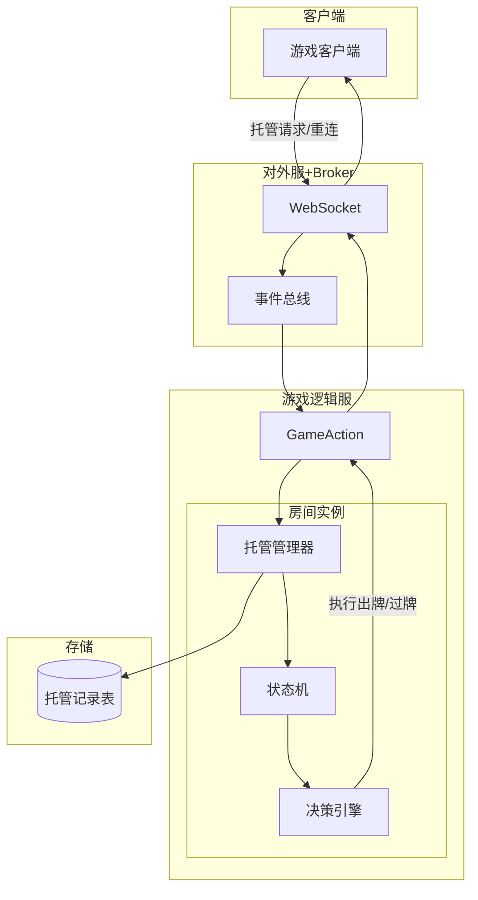
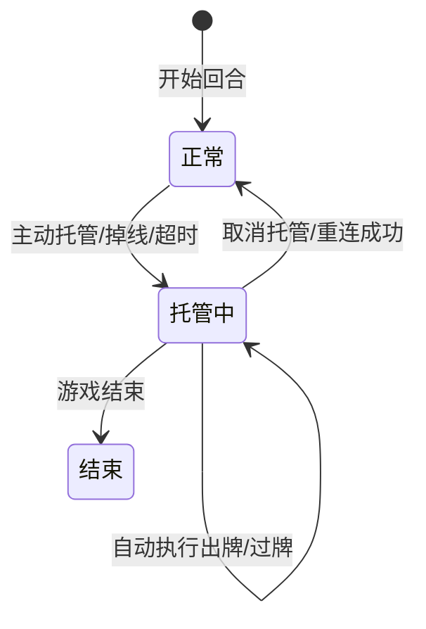
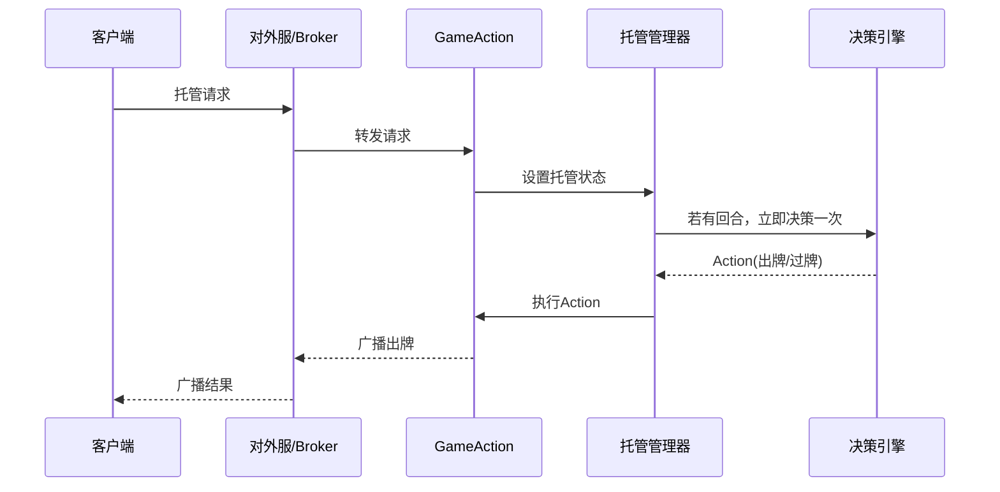

# 游戏托管功能设计文档
## 1. 概述
### 1.1 设计目标
提供统一的托管能力，支持主动托管、掉线托管、超时托管三种触发方式。
1. 托管后由服务端自动进行出牌决策（基于规则或AI策略），维持对局流畅。
2. 托管状态可随时取消（玩家重连或手动取消），恢复玩家操作。
3. 托管决策不依赖客户端，保证公平性与稳定性。
### 1.2 适用范围
- 斗地主、德州扑克、牛牛等所有棋牌游戏。
- 适用于玩家对局中的单人托管场景。
### 1.3 整体架构

## 2. 托管触发条件
| 触发类型 | 条件 | 说明 |
| :--- | :--- | :--- |
| **主动托管** | 玩家在客户端点击“托管”按钮 | **立即生效**：发送托管协议请求，逻辑服立即接管出牌决策。 |
| **掉线托管** | WebSocket 连接断开且超过重连等待时间 | **被动接管**：由网关检测连接状态，若在预设重连窗口（如30s）内未恢复，则通知逻辑服。 |
| **超时托管** | 玩家在一局游戏中连续超时未操作 | **惩罚逻辑**：每轮倒计时归零未操作则计数器加1，达到阈值（通常为2次）自动强制托管。 |
###  2.1 超时托管规则
- 设置全局超时阈值，例如：1局内累计超时次数 ≥ 2 次。
- 每轮超时单独计数，托管后重置计数。
- 玩家重新操作后，超时计数器清零。

## 3. 托管状态机

### 3.1 状态说明
- 正常：玩家可手动操作。
- 托管中：服务端自动控制玩家出牌/过牌；客户端界面显示托管标识，禁用手动操作按钮。

## 4. 模块设计
### 4.1 托管管理器 (TrusteeshipManager)
- 位置：每个房间实例内部，负责本房间所有玩家的托管状态。
- 职责：
  - 接收托管请求、定时器超时通知、断线通知。
  - 维护玩家托管状态（Map<userId, Boolean>）。
  - 触发托管决策，调用决策引擎。
  - 广播托管状态变化给房间内其他玩家。
### 4.2 托管决策引擎 (TrusteeshipDecision)
- 接口定义：
```java
public interface TrusteeshipDecision {
    Action decide(RoomState state, long userId);
}
```
- 实现规则：
  - 首出：出最小单张（或根据牌型策略）。
  - 跟牌：如果能压过上家则出最小能压的牌，否则过牌。
  - 残局特殊处理：若手牌只剩一手牌，直接出完。
  - 炸弹/王炸策略：可配置是否优先出炸弹（默认否）。
- 难度参数：可继承 AI 难度参数（简单/普通/困难），但托管通常偏向保守策略。
### 4.3 超时定时器
- 复用现有 BaseTurnManager，在其 onTimeout 中触发超时计数。
- 定义超时计数器：
```java
private final Map<Long, Integer> timeoutCount = new ConcurrentHashMap<>();
```
- 当 timeoutCount.get(userId) >= MAX_TIMEOUT_PER_GAME 时，触发超时托管。
### 4.4 断线检测与托管
- 对外服（External）检测到 WebSocket 断开后，通过事件总线发送 PlayerDisconnectEvent。
- 游戏逻辑服订阅该事件，延迟 N 秒（例如 30 秒）后若玩家仍未重连，则进入掉线托管。
- 重连成功时，玩家若处于掉线托管状态，自动解除托管。

## 5. 数据库设计
新增托管记录表（用于运营监控/玩家申诉）：
```sql
CREATE TABLE `trusteeship_log` (
    `id` bigint(20) NOT NULL AUTO_INCREMENT,
    `room_id` bigint(20) NOT NULL COMMENT '房间ID',
    `user_id` bigint(20) NOT NULL COMMENT '玩家ID',
    `trigger_type` tinyint(4) NOT NULL COMMENT '触发类型：1-主动，2-掉线，3-超时',
    `start_time` datetime NOT NULL COMMENT '托管开始时间',
    `end_time` datetime DEFAULT NULL COMMENT '托管结束时间',
    `cancel_reason` tinyint(4) DEFAULT NULL COMMENT '结束原因：1-手动取消，2-重连，3-游戏结束',
    PRIMARY KEY (`id`),
    KEY `idx_user_id` (`user_id`),
    KEY `idx_room_id` (`room_id`)
) ENGINE=InnoDB DEFAULT CHARSET=utf8mb4;
```
## 6. 流程设计
### 6.1 主动托管流程

### 6.2 超时托管流程
- 轮询超时在 TurnManager 中触发：
1. onTimeout 调用 timeoutCount.merge(userId, 1, Integer::sum)
2. 若 timeoutCount >= 2，调用 trusteeshipManager.trust(userId, TrustReason.TIMEOUT)
3. 托管后自动决策一次（相当于超时后自动出牌）。

## 7. 接口定义
### 7.1 客户端请求接口（GameAction 新增）
```java
@ActionMethod(GameCmd.TRUSTEESHIP)
public void trusteeship(TrusteeshipReq req, FlowContext ctx) {
    long userId = ctx.getUserId();
    // 设置托管状态
    room.getTrusteeshipManager().setTrustee(userId, true);
    // 如果当前正是该玩家的回合，立即触发一次决策
    if (room.isCurrentPlayer(userId)) {
        room.getTrusteeshipManager().autoAct(userId);
    }
}
```
### 7.2 内部托管管理器接口
```java
public interface TrusteeshipManager {
    void setTrustee(long userId, boolean enabled);
    boolean isTrustee(long userId);
    void autoAct(long userId);      // 执行一次自动操作（决策+执行）
    void cancelTrustee(long userId);
}
```
## 8. 广播与同步
当玩家进入/退出托管时，需广播 TrusteeshipChangeBroadcast 给房间内其他玩家，以便更新UI。
### 广播数据结构
```java
@Data
@ProtobufClass
public class TrusteeshipChangeData {
    private long userId;
    private boolean isTrustee;
}
```
使用 RoomCmd.TRUSTEESHIP_CHANGE_BROADCAST 子命令。
## 9. 决策引擎实现要点
### 9.1 策略优先级
1. 剩余手牌数 = 0 → 无需操作。
2. 剩余手牌数 = 1（且牌型合法）→ 直接出完。
3. 首出（lastPlayCards == null）： 
- 优先出最小单张，若有特殊策略可调整（如避免破坏顺子/连对）。
4. 跟牌：
- 同牌型比较，找出能压的上家牌的最小组合。
- 若无牌可压，过牌。
- 若持有炸弹/王炸，可配置是否立即出，默认先保留。
5. 若手牌只有炸弹，且无其他牌形，则出炸弹。
### 9.2 规则可配置化
在 application.yml 中可配置托管策略行为（是否优先出炸弹、是否最小单张等）。
## 10. 与机器人服务的区别

| 项目 | 机器人服务 (Robot Service) | 托管功能 (Auto-play) |
| :--- | :--- | :--- |
| **适用对象** | 系统创建的机器人账号 | 真实玩家 |
| **生命周期** | 独立登录、加入房间 | 依附于玩家会话 |
| **决策目的** | 模拟真实玩家，提升开局率 | 代替掉线/超时玩家完成基本操作，保证对局完整 |
| **决策复杂度** | 可能有难度分级（简单/普通/困难） | 偏简单、保守、不主动出炸弹 |

## 11. 风险与应对
- 恶意托管：如果玩家故意托管来拖时间，可增加托管惩罚（如扣分、限制匹配）。
- 断线重连失败：掉线托管后玩家再也未重连，游戏结束后需正常结算。
- 超时阈值设置：不宜过短（影响体验）也不宜过长（拖慢进度），默认2次超时触发托管。
- 托管中的并发操作：需保证对同一玩家的操作同步，避免托管决策与玩家手动操作同时发生。

## 12. 实施计划


| 阶段 | 任务 | 产出 | 工期 |
| :--- | :--- | :--- | :--- |
| **Phase 1** | **基础托管状态机 + 手动托管接口** | `TrusteeshipManager`、托管请求接口 | 1d |
| **Phase 2** | **超时托管 + 掉线托管** | 超时计数器、断线事件处理逻辑 | 1d |
| **Phase 3** | **简单决策引擎**（首出最小单张，跟牌最小能压牌） | `TrusteeshipDecision` 策略类 | 1d |
| **Phase 4** | **广播托管状态、数据库记录** | 状态广播数据类、托管操作日志表 | 0.5d |
| **Phase 5** | **集成测试与调优** | 压力测试与逻辑校验报告 | 1d |
