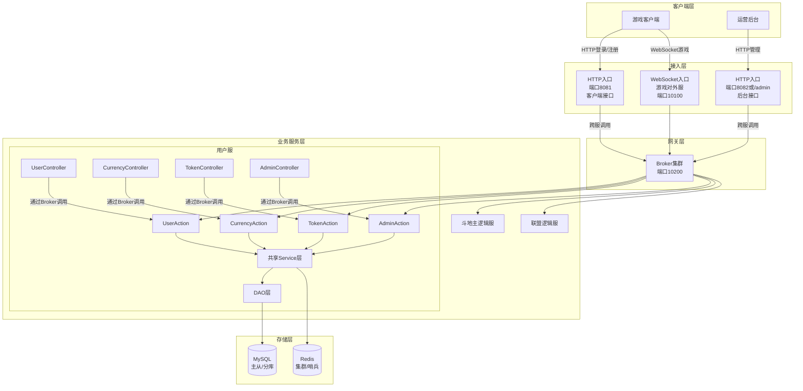
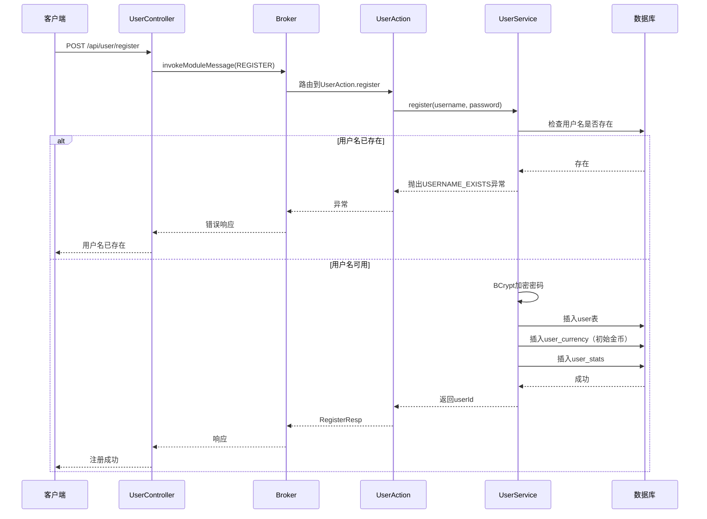
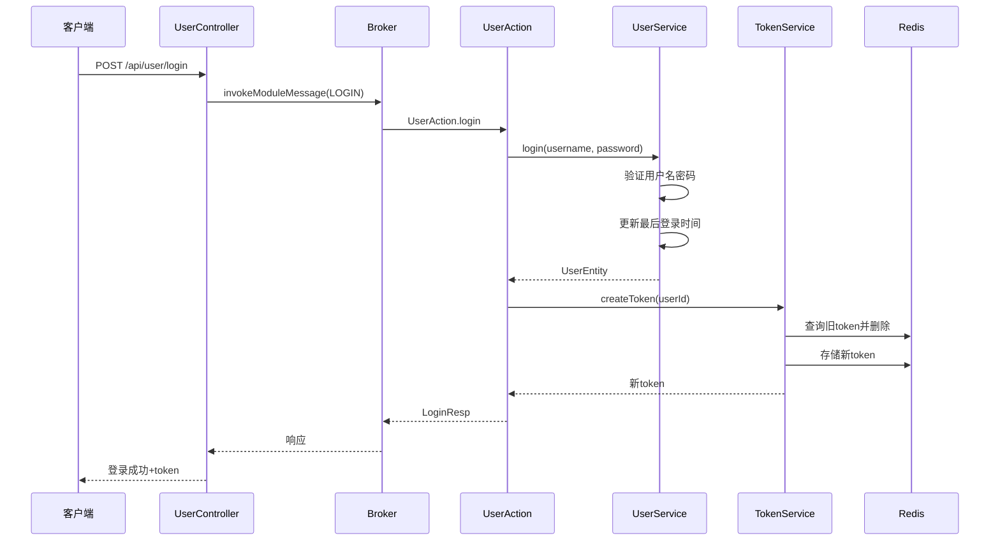
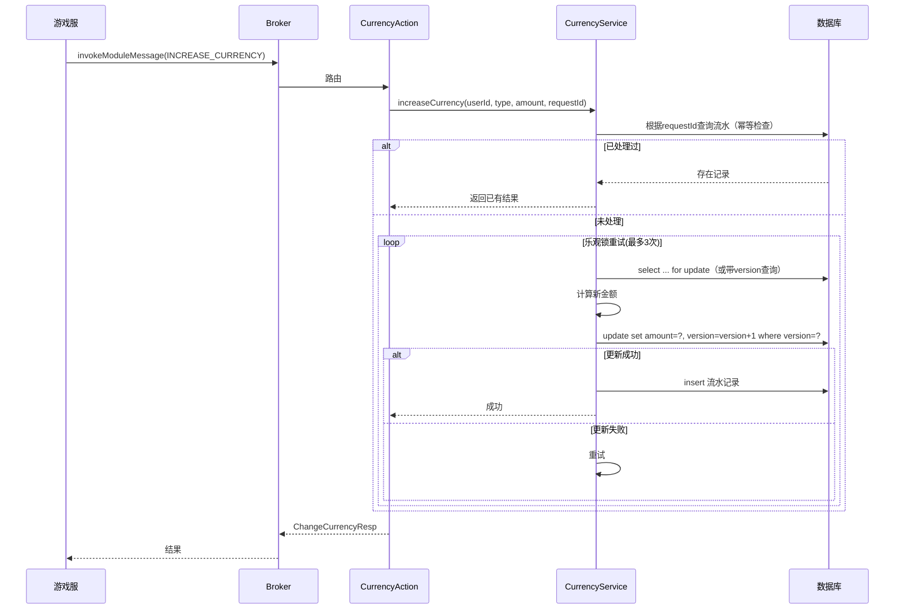

# 用户服务设计文档 v1.1 (上一版本：《用户登录系统设计》)
## 1. 概述
### 1.1 设计目标
设计一个高可用、可扩展的用户服务，作为游戏平台的基础服务，提供用户注册、登录、Token管理、货币管理、用户信息查询等功能。服务采用合并部署模式，同时对外提供HTTP接口（供客户端登录/注册）和对内的RPC接口（供游戏逻辑服调用），充分利用ioGame框架的Action机制实现业务逻辑。
### 1.2 大厂设计理念参考
| 理念 | 说明 | 来源 |
| :--- | :--- | :--- |
| **接口与实现分离** | **解耦核心**：Service 定义接口，确保业务逻辑与具体的协议传输（HTTP/RPC）分离。 | 阿里巴巴 |
| **分层清晰** | **职责明确**：遵循 `Controller` → `Action` → `Service` → `DAO` 的经典流转。 | 通用 |
| **幂等性设计** | **防重机制**：关键操作（如金币充值/结算）支持 `requestId` 校验，防止重复请求。 | 美团/字节 |
| **乐观锁+重试** | **冲突处理**：高并发场景下使用版本号（Version）配合重试机制，替代数据库死锁。 | 微信支付 |
| **单点登录 (SSO)** | **挤号逻辑**：新 Token 生成后失效旧 Token，确保同一账号全局唯一在线。 | 通用 |
| **多级缓存** | **性能优化**：热点数据优先访问本地内存（L1），未命中则请求 Redis（L2）。 | 蚂蚁金服 |
| **操作审计** | **安全追溯**：对金币变更、封禁等关键操作记录完整流水，支持后期对账与审计。 | 金融级要求 |
### 1.3 整体架构图

## 2. 模块划分
### 2.1 代码模块结构
```text
game-platform-backend/
├── game-common/                     # 公共模块（协议、枚举、异常）
│   └── src/main/java/.../common/
│       ├── cmd/                     # 路由命令常量
│       │   ├── CmdModule.java
│       │   ├── UserCmd.java
│       │   ├── CurrencyCmd.java
│       │   ├── TokenCmd.java
│       │   └── AdminCmd.java
│       ├── exception/               # 错误码
│       │   └── GameCode.java
│       └── model/                   # RPC协议类（DTO）
│           ├── user/
│           ├── currency/
│           ├── token/
│           └── admin/
├── starters/
│   ├── game-starter-redis/          # Redis starter
│   └── game-starter-mybatis/        # MyBatis-Plus starter
├── service-user/                    # 用户服务
│   ├── src/main/java/.../user/
│   │   ├── UserApplication.java     # Spring Boot启动类
│   │   ├── action/                  # RPC Action（业务入口）
│   │   │   ├── user/UserAction.java
│   │   │   ├── currency/CurrencyAction.java
│   │   │   ├── token/TokenAction.java
│   │   │   └── admin/AdminAction.java
│   │   ├── controller/              # HTTP薄转发层（按业务拆分）
│   │   │   ├── UserController.java
│   │   │   ├── CurrencyController.java
│   │   │   ├── TokenController.java
│   │   │   └── AdminController.java
│   │   ├── service/                 # 业务逻辑
│   │   │   ├── UserService.java
│   │   │   ├── CurrencyService.java
│   │   │   ├── TokenService.java
│   │   │   └── StatsService.java
│   │   ├── entity/                  # 数据库实体
│   │   │   ├── UserEntity.java
│   │   │   ├── UserCurrencyEntity.java
│   │   │   ├── UserStatsEntity.java
│   │   │   └── CurrencyChangeLogEntity.java
│   │   ├── mapper/                  # MyBatis-Plus Mapper
│   │   │   ├── UserMapper.java
│   │   │   ├── UserCurrencyMapper.java
│   │   │   ├── UserStatsMapper.java
│   │   │   └── CurrencyChangeLogMapper.java
│   │   └── converter/               # Entity ↔ DTO 转换器
│   │       ├── UserConverter.java
│   │       ├── CurrencyConverter.java
│   │       └── StatsConverter.java
│   └── src/main/resources/
│       ├── application.yml
│       └── mapper/*.xml
└── ...
```
### 2.2 分层职责
| 层次 | 职责 | 技术 |
| :--- | :--- | :--- |
| **HTTP Controller** | **接入转发**：接收客户端或后台 HTTP 请求，校验基础参数，通过 Broker 转发至内部 RPC Action。 | Spring MVC |
| **RPC Action** | **逻辑编排**：作为内部通信端点，执行业务前置校验，并协同调用 Service 层。 | ioGame Action |
| **Service** | **核心业务**：封装核心业务逻辑、处理数据库事务、执行多级缓存操作。 | Spring Service + `@Transactional` |
| **DAO** | **持久化层**：执行 SQL 操作，负责实体对象与数据库表之间的映射与存取。 | MyBatis-Plus |
| **Converter** | **模型转换**：处理 Entity（数据库实体）与 DTO（传输对象）之间的解耦转换。 | MapStruct |

## 3. 数据库设计 (比《用户登录系统设计》高一个版本)
### 3.1 表结构 
用户表 user
```sql
CREATE TABLE `user` (
    `id` bigint(20) NOT NULL COMMENT '用户ID（雪花算法）',
    `username` varchar(64) NOT NULL COMMENT '用户名',
    `password` varchar(128) NOT NULL COMMENT 'BCrypt加密密码',
    `nickname` varchar(64) DEFAULT NULL COMMENT '昵称',
    `avatar` varchar(255) DEFAULT NULL COMMENT '头像URL',
    `status` tinyint(4) DEFAULT 1 COMMENT '状态：0禁用，1正常',
    `last_login_time` datetime DEFAULT NULL COMMENT '最后登录时间',
    `create_time` datetime NOT NULL DEFAULT CURRENT_TIMESTAMP,
    `update_time` datetime NOT NULL DEFAULT CURRENT_TIMESTAMP ON UPDATE CURRENT_TIMESTAMP,
    `create_by` varchar(64) DEFAULT NULL,
    `update_by` varchar(64) DEFAULT NULL,
    `del_flag` tinyint(1) NOT NULL DEFAULT 0,
    `extra` json DEFAULT NULL,
    PRIMARY KEY (`id`),
    UNIQUE KEY `uk_username` (`username`),
    KEY `idx_del_flag` (`del_flag`)
) ENGINE=InnoDB DEFAULT CHARSET=utf8mb4 COMMENT='用户表';
```
用户货币表 user_currency
```sql
CREATE TABLE `user_currency` (
    `user_id` bigint(20) NOT NULL,
    `currency_type` varchar(32) NOT NULL COMMENT 'GOLD, DIAMOND, ALLIANCE_COIN',
    `amount` bigint(20) NOT NULL DEFAULT 0,
    `version` int(11) NOT NULL DEFAULT 0 COMMENT '乐观锁版本号',
    `create_time` datetime NOT NULL DEFAULT CURRENT_TIMESTAMP,
    `update_time` datetime NOT NULL DEFAULT CURRENT_TIMESTAMP ON UPDATE CURRENT_TIMESTAMP,
    PRIMARY KEY (`user_id`, `currency_type`)
) ENGINE=InnoDB DEFAULT CHARSET=utf8mb4;
```
用户统计表 user_stats
```sql
CREATE TABLE `user_stats` (
    `user_id` bigint(20) NOT NULL,
    `total_games` int(11) NOT NULL DEFAULT 0,
    `win_games` int(11) NOT NULL DEFAULT 0,
    `consecutive_wins` int(11) NOT NULL DEFAULT 0,
    `consecutive_losses` int(11) NOT NULL DEFAULT 0,
    `extra` json DEFAULT NULL,
    `create_time` datetime NOT NULL DEFAULT CURRENT_TIMESTAMP,
    `update_time` datetime NOT NULL DEFAULT CURRENT_TIMESTAMP ON UPDATE CURRENT_TIMESTAMP,
    PRIMARY KEY (`user_id`)
) ENGINE=InnoDB DEFAULT CHARSET=utf8mb4;
```
货币变更流水表 currency_change_log
```sql
CREATE TABLE `currency_change_log` (
    `id` bigint(20) NOT NULL,
    `user_id` bigint(20) NOT NULL,
    `currency_type` varchar(32) NOT NULL,
    `change_amount` bigint(20) NOT NULL,
    `before_amount` bigint(20) NOT NULL,
    `after_amount` bigint(20) NOT NULL,
    `change_type` varchar(32) NOT NULL COMMENT 'RECHARGE, GAME_WIN, GAME_LOSE, ADMIN, etc.',
    `order_id` varchar(64) DEFAULT NULL COMMENT '关联订单ID',
    `remark` varchar(255) DEFAULT NULL,
    `create_time` datetime NOT NULL DEFAULT CURRENT_TIMESTAMP,
    PRIMARY KEY (`id`),
    KEY `idx_user_id` (`user_id`),
    KEY `idx_request_id` (`request_id`)
) ENGINE=InnoDB DEFAULT CHARSET=utf8mb4;
```
### 3.2 Redis 设计
| Key 格式 | 用途 | TTL | 数据结构 |
| :--- | :--- | :--- | :--- |
| **{prefix}:{env}:token:{token}** | **身份映射**：通过 Token 获取用户 ID，用于鉴权与路由转发。 | 24h | String |
| **{prefix}:{env}:user:token:{userId}** | **互踢逻辑**：存储用户当前的有效 Token，用于实现单点登录（SSO）。 | 24h | String |
| **{prefix}:{env}:user:online:{userId}** | **在线心跳**：维护用户实时在线状态，配合心跳包定时续期。 | 60s | String |
| **{prefix}:{env}:user:room:{userId}** | **断线重连**：记录用户当前所在的游戏房间，支持重连后自动拉回对局。 | 会话结束 | String |
| **{prefix}:{env}:lock:currency:{userId}** | **并发控制**：保证货币操作（如金币扣除）的原子性，防止超卖或连点。 | 10s | Lock (String) |

## 4. 接口设计
### 4.1 RPC 命令规划
用户模块 (cmd=1)

| 子命令 (Cmd ID) | 功能 | 说明 |
| :--- | :--- | :--- |
| **1** | **注册** | **Register**：创建新用户账号并初始化金币等基础资产。 |
| **2** | **登录** | **Login**：验证凭证、生成 Token 并建立 `UserSession` 会话。 |
| **3** | **获取用户信息** | **GetUserInfo**：拉取用户基础资料、资产余额及战绩统计。 |
| **4** | **登出** | **Logout**：主动失效 Token 并清理 Redis 中的在线状态信息。 |

货币模块 (cmd=2)

| 子命令 (Sub-Cmd) | 功能 (Function) | 说明 (Description) |
| :--- | :--- | :--- |
| **1** | **查询货币** | **GetCurrency**：实时拉取用户账户余额（金币、钻石等）。 |
| **2** | **增加货币** | **IncreaseCurrency**：处理对局获胜、每日签到或充值后的资产下发。 |
| **3** | **减少货币** | **DecreaseCurrency**：处理报名费扣除、下注或购买道具的资产扣除。 |
| **4** | **查询流水** | **GetCurrencyLog**：调取历史变更记录，用于对账及展示账单详情。 |

Token模块 (cmd=3)

| 子命令 (Sub-Cmd) | 功能 (Function) | 说明 (Description) |
| :--- | :--- | :--- |
| **1** | **刷新 Token** | **RefreshToken**：延长 Session 有效期，避免玩家在对局中因 Token 过期而掉线。 |
| **2** | **验证 Token** | **VerifyToken**：内部 RPC 调用，供网关（Gateway）或游戏服校验请求合法性。 |
| **3** | **强制踢下线** | **KickUser**：处理管理后台封禁、账号异地登录或检测到作弊行为时的强制断开。 |

后台管理模块 (cmd=4)

| 子命令 | 功能 | 说明 |
| :--- | :--- | :--- |
| **1** | **查询用户列表** | **QueryUsers**：管理后台分页拉取玩家基础信息、等级及注册时间。 |
| **2** | **调整货币** | **AdjustCurrency**：管理员手动干预（如补偿金币、扣除异常所得）。 |
| **3** | **封禁/解封** | **BanUser**：修改用户状态位，禁止其登录或参与对局（黑名单管理）。 |
| **4** | **查询货币流水** | **GetCurrencyLog**：审计特定用户的金币变动轨迹，用于排查作弊或异常数据。 |

## 4.2 HTTP 接口（对外 - 客户端）
所有客户端接口路径前缀为 /api，运行在端口 8081，需要用户Token校验（除登录/注册外）。

| 路径 | 方法 | 说明 |
| :--- | :--- | :--- |
| **/api/user/register** | `POST` | **用户注册**：创建账号并初始化游戏基础数据。 |
| **/api/user/login** | `POST` | **身份鉴权**：验证凭证，生成并返回用于 WebSocket 连接的 `token`。 |
| **/api/user/info** | `GET` | **资料获取**：拉取当前登录用户的个人基本信息与状态。 |
| **/api/user/logout** | `POST` | **安全登出**：清理服务端 Session，使当前 `token` 立即失效。 |
| **/api/currency/list** | `GET` | **资产查询**：获取用户名下所有类型的货币余额（金币、钻石等）。 |
| **/api/token/refresh** | `POST` | **续期机制**：在不重新登录的情况下延长 `token` 有效期。 |

Controller 拆分对应关系：

| Controller | 路径前缀 | 功能 |
| :--- | :--- | :--- |
| **UserController** | `/api/user` | **用户管理**：负责处理账号注册、登录鉴权、注销登录以及基础个人资料查询。 |
| **CurrencyController** | `/api/currency` | **资产管理**：负责查询用户的各类账户余额（如金币、钻石）及变动历史。 |
| **TokenController** | `/api/token` | **令牌维护**：专门负责 Token 的生命周期管理，包括手动续期与合法性校验。 |

## 4.3 HTTP 接口（后台管理）
后台管理接口路径前缀为 /admin/api，建议运行在独立端口 8082 或通过独立网关转发，需要管理员身份验证和IP白名单。

| 路径 | 方法 | 说明 | 权限 |
| :--- | :--- | :--- | :--- |
| **/admin/api/user/list** | `GET` | **列表查询**：分页检索系统所有玩家的基础信息。 | `ADMIN` |
| **/admin/api/user/detail** | `GET` | **深度画像**：查看特定玩家的详细资产、对局统计及登录历史。 | `ADMIN` |
| **/admin/api/user/ban** | `POST` | **账号惩戒** | 执行封禁或解封操作，限制非法用户进入对局。 | `ADMIN` |
| **/admin/api/user/kick** | `POST` | **会话中断** | 强制断开用户的 WebSocket 连接（如处理异常挂机）。 | `ADMIN` |
| **/admin/api/currency/adjust** | `POST` | **货币调账** | 管理员手动修正金币/钻石余额（如补发奖励或罚款）。 | `ADMIN` |
| **/admin/api/currency/log** | `GET` | **流水追踪** | 调取玩家所有货币变动日志，用于异常数据审计。 | `ADMIN` |

安全措施：
- 接口仅允许内网或VPN访问（可通过防火墙策略）。 
- 使用独立的 Admin Token（长期有效，定期更换）。 
- 操作日志记录（谁、什么时间、操作了什么）。

## 5. 关键流程设计
### 5.1 注册流程

### 5.2 登录与Token生成流程

### 5.3 货币变更（幂等+乐观锁）

## 6. 高可用与扩展设计
### 6.1 数据库
- 读写分离：主库写入，从库读取（可使用MyBatis-Plus插件或中间件）。
- 分库分表：用户量超过千万后，可按 user_id 哈希分库分表（ShardingSphere）。
- 历史流水归档：货币流水表定期迁移至归档库。
### 6.2 缓存策略
- 一级缓存：Caffeine本地缓存，缓存用户基本信息，TTL 5分钟。
- 二级缓存：Redis集群，存储Token、用户在线状态等。
- 缓存穿透防护：空值缓存或布隆过滤器。
### 6.3 限流与熔断
- 限流：注册/登录接口使用 @RateLimit（基于令牌桶），单用户每分钟最多3次尝试。 
- 熔断：使用Resilience4j或Sentinel，防止下游服务雪崩。
### 6.4 幂等性
- 货币变更：客户端传入 requestId（UUID），服务端使用Redis记录已处理的ID，保证操作只执行一次。
- 接口幂等：HTTP GET天然幂等，POST可支持通过幂等Token机制。
### 6.5 监控与告警
- 业务指标：注册量、登录成功率、Token验证QPS、货币操作耗时。 
- 技术指标：JVM、数据库连接池、Redis命中率。 
- 告警：登录失败率突增、货币操作失败率超阈值。

## 7. 错误码规范
格式：XYYZZZ

| 段 (Segment) | 含义 (Meaning) | 说明 |
| :--- | :--- | :--- |
| **X** | **大类 (Category)** | **1**: 系统级错误 (Network/Server) <br> **2**: 业务级错误 (Account/Logic) <br> **3**: 游戏对局错误 (Gameplay) |
| **YY** | **子模块 (Module)** | **01**: 用户模块 <br> **02**: 货币模块 <br> **03**: Token/Auth 模块 <br> **04**: 后台管理模块 |
| **ZZZ** | **具体错误 (Error)** | 具体异常标识。如 `001` 代表不存在，`002` 代表余额不足等。 |

示例：
```java
// 用户模块 (201xxx)
USER_NOT_FOUND(201001, "用户不存在"),
USER_DISABLED(201002, "用户已被禁用"),
USERNAME_EXISTS(201003, "用户名已存在"),
PASSWORD_ERROR(201004, "密码错误"),
TOKEN_INVALID(201005, "Token无效"),
TOKEN_EXPIRED(201006, "Token已过期"),

// 货币模块 (202xxx)
CURRENCY_NOT_ENOUGH(202001, "货币不足"),
CURRENCY_TYPE_ERROR(202002, "货币类型错误"),
CURRENCY_OPERATION_CONFLICT(202003, "操作冲突，请重试"),

// Token模块 (203xxx)
REFRESH_TOKEN_FAILED(203001, "Token刷新失败"),
KICK_USER_FAILED(203002, "踢用户下线失败"),
```
## 8. 部署架构
### 8.1 服务配置

| 服务 | 端口 | 协议 | 实例数 | 说明 |
| :--- | :--- | :--- | :--- | :--- |
| **user-service (客户端接口)** | 8081 | HTTP | 2+ | **高可用接入**：处理玩家登录、注册等流量，需配合 Nginx 负载均衡。 |
| **user-service (管理接口)** | 8082 | HTTP | 同实例 | **内网管理**：与客户端接口同进程，但通过不同端口隔离，确保管理流量安全。 |
| **game-broker** | 10200 | TCP | 3 | **中转枢纽**：ioGame 核心，负责服务发现与消息路由，需奇数实例保证共识。 |
| **game-gateway** | 10100 | WebSocket | 2+ | **连接网关**：维护玩家长连接，支持水平扩展以承载更高在线人数。 |
| **doudizhu-logic** | 内部 | TCP | N | **游戏逻辑**：斗地主核心逻辑服，根据在线对局数动态伸缩（N 个实例）。 |
| **MySQL** | 3306 | TCP | 主从 | **持久化存储**：主节点负责写操作，从节点负责读操作，确保数据安全。 |
| **Redis** | 6379 | TCP | 哨兵/集群 | **高速缓存**：存储 Token 及在线状态，建议使用集群模式应对高并发请求。 |

### 8.2 启动顺序
1. Broker集群 
2. Redis & MySQL 
3. 用户服务（user-service） 
4. 游戏对外服（gateway） 
5. 游戏逻辑服（doudizhu等）
### 8.3 容器化部署
1. 使用Docker镜像打包，Kubernetes编排。 
2. 健康检查端点：/actuator/health 
3. 优雅停机：利用Spring Boot的 server.shutdown=graceful

## 9. 测试策略
| 测试层级 | 覆盖范围 | 工具 |
| :--- | :--- | :--- |
| **单元测试** | **Service层核心逻辑**：验证金币计算、牌型判定等纯业务代码，不依赖外部环境。 | JUnit 5 + Mockito |
| **集成测试** | **数据一致性**：验证 DAO 层 SQL、数据库事务、实体类自动填充（MyBatis-Plus）。 | @SpringBootTest + Testcontainers |
| **接口测试** | **RPC 通信**：验证 ioGame Action 的消息路由、协议序列化及返回结果的正确性。 | ioGame 官方测试工具 (Testing Kit) |
| **压力测试** | **高并发性能**：模拟海量玩家同时注册、登录及对局结算时的货币并发扣减。 | JMeter |

## 10. 未来演进方向
- 服务拆分：将货币服务独立为单独的服务（service-currency），通过RPC调用。 
- 消息队列：货币变更流水通过MQ异步写入，降低主事务压力。 
- 多语言国际化：错误码消息支持i18n。 
- 智能限流：根据实时负载动态调整限流阈值。 
- A/B测试：支持灰度发布和实验分组。

## 11. 增加风控
### 11.1 调整数据库表结构
```sql
-- 1. 用户表
DROP TABLE IF EXISTS `user`;
CREATE TABLE IF NOT EXISTS `user` (
    `id` bigint(20) NOT NULL COMMENT '用户ID（主键，对内使用，推荐使用分布式ID生成器）',
    `user_code` varchar(32) NOT NULL COMMENT '用户编码（对外公开的唯一业务编码）',
    `username` varchar(64) DEFAULT NULL COMMENT '用户名（唯一，可选）',
    `mobile` varchar(20) DEFAULT NULL COMMENT '手机号（唯一，用于登录）',
    `email` varchar(100) DEFAULT NULL COMMENT '邮箱（唯一，用于登录）',
    `password` varchar(128) NOT NULL COMMENT '密码（BCrypt加密）',
    `bind_mobile` tinyint(1) NOT NULL DEFAULT 0 COMMENT '手机号是否已绑定（0：未绑定，1：已绑定）',
    `bind_email` tinyint(1) NOT NULL DEFAULT 0 COMMENT '邮箱是否已绑定（0：未绑定，1：已绑定）',
    `nickname` varchar(64) DEFAULT NULL COMMENT '昵称',
    `avatar` varchar(255) DEFAULT NULL COMMENT '头像URL',
    `status` tinyint(4) DEFAULT 1 COMMENT '状态：0禁用，1正常',
    `last_login_time` datetime DEFAULT NULL COMMENT '最后登录时间',
    `last_login_ip` varchar(45) DEFAULT NULL COMMENT '最后登录IP',
    `last_login_device_id` varchar(128) DEFAULT NULL COMMENT '最后登录设备ID',
    `last_login_latitude` decimal(10,7) DEFAULT NULL COMMENT '最后登录纬度',
    `last_login_longitude` decimal(10,7) DEFAULT NULL COMMENT '最后登录经度',
    `create_time` datetime NOT NULL DEFAULT CURRENT_TIMESTAMP COMMENT '创建时间',
    `update_time` datetime NOT NULL DEFAULT CURRENT_TIMESTAMP ON UPDATE CURRENT_TIMESTAMP COMMENT '更新时间',
    `create_by` varchar(64) DEFAULT NULL COMMENT '创建人',
    `update_by` varchar(64) DEFAULT NULL COMMENT '更新人',
    `del_flag` tinyint(1) NOT NULL DEFAULT 0 COMMENT '逻辑删除标记',
    `extra` json DEFAULT NULL COMMENT '扩展字段',
    PRIMARY KEY (`id`),
    UNIQUE KEY `uk_user_code` (`user_code`),
    UNIQUE KEY `uk_username` (`username`),
    UNIQUE KEY `uk_mobile` (`mobile`),
    UNIQUE KEY `uk_email` (`email`),
    KEY `idx_last_login_time` (`last_login_time`),
    KEY `idx_del_flag` (`del_flag`)
) ENGINE=InnoDB DEFAULT CHARSET=utf8mb4 COLLATE=utf8mb4_unicode_ci COMMENT='用户表';

-- 2. 用户风控表（与user表一对一）
DROP TABLE IF EXISTS `user_risk`;
CREATE TABLE IF NOT EXISTS `user_risk` (
    `user_id` bigint(20) NOT NULL COMMENT '用户ID',
    `register_ip` varchar(45) DEFAULT NULL COMMENT '注册IP',
    `register_device_id` varchar(128) DEFAULT NULL COMMENT '注册设备ID',
    `register_user_agent` varchar(255) DEFAULT NULL COMMENT '注册UserAgent',
    `register_channel` varchar(32) DEFAULT NULL COMMENT '注册渠道',
    `register_latitude` decimal(10,7) DEFAULT NULL COMMENT '注册纬度',
    `register_longitude` decimal(10,7) DEFAULT NULL COMMENT '注册经度',
    `risk_score` int(11) DEFAULT 0 COMMENT '风险评分（0-100，越高风险越大）',
    `device_fingerprint` varchar(128) DEFAULT NULL COMMENT '设备指纹（用于设备唯一标识）',
    `first_login_time` datetime DEFAULT NULL COMMENT '首次登录时间',
    `first_login_ip` varchar(45) DEFAULT NULL COMMENT '首次登录IP',
    `first_login_device_id` varchar(128) DEFAULT NULL COMMENT '首次登录设备ID',
    `update_time` datetime NOT NULL DEFAULT CURRENT_TIMESTAMP ON UPDATE CURRENT_TIMESTAMP COMMENT '更新时间',
    PRIMARY KEY (`user_id`),
    KEY `idx_register_ip` (`register_ip`),
    KEY `idx_device_fingerprint` (`device_fingerprint`)
) ENGINE=InnoDB DEFAULT CHARSET=utf8mb4 COLLATE=utf8mb4_unicode_ci COMMENT='用户风控表';

-- 3. 用户货币表
DROP TABLE IF EXISTS `user_currency`;
CREATE TABLE IF NOT EXISTS `user_currency` (
    `user_id` bigint(20) NOT NULL COMMENT '用户ID',
    `currency_type` varchar(32) NOT NULL COMMENT '货币类型：GOLD, DIAMOND, ALLIANCE_COIN',
    `amount` bigint(20) NOT NULL DEFAULT 0 COMMENT '数量',
    `version` int(11) NOT NULL DEFAULT 0 COMMENT '乐观锁版本号',
    `create_time` datetime NOT NULL DEFAULT CURRENT_TIMESTAMP COMMENT '创建时间',
    `update_time` datetime NOT NULL DEFAULT CURRENT_TIMESTAMP ON UPDATE CURRENT_TIMESTAMP COMMENT '更新时间',
    PRIMARY KEY (`user_id`, `currency_type`),
    KEY `idx_amount` (`amount`)
) ENGINE=InnoDB DEFAULT CHARSET=utf8mb4 COLLATE=utf8mb4_unicode_ci COMMENT='用户货币表';

-- 4. 用户统计表
DROP TABLE IF EXISTS `user_stats`;
CREATE TABLE IF NOT EXISTS `user_stats` (
    `user_id` bigint(20) NOT NULL COMMENT '用户ID',
    `total_games` int(11) NOT NULL DEFAULT 0 COMMENT '总局数',
    `win_games` int(11) NOT NULL DEFAULT 0 COMMENT '胜局数',
    `consecutive_wins` int(11) NOT NULL DEFAULT 0 COMMENT '连胜次数',
    `consecutive_losses` int(11) NOT NULL DEFAULT 0 COMMENT '连败次数',
    `extra` json DEFAULT NULL COMMENT '扩展字段',
    `create_time` datetime NOT NULL DEFAULT CURRENT_TIMESTAMP COMMENT '创建时间',
    `update_time` datetime NOT NULL DEFAULT CURRENT_TIMESTAMP ON UPDATE CURRENT_TIMESTAMP COMMENT '更新时间',
    PRIMARY KEY (`user_id`)
) ENGINE=InnoDB DEFAULT CHARSET=utf8mb4 COLLATE=utf8mb4_unicode_ci COMMENT='用户统计表';

-- 5. 货币变更流水表（幂等+审计）
DROP TABLE IF EXISTS `currency_change_log`;
CREATE TABLE IF NOT EXISTS `currency_change_log` (
    `id` bigint(20) NOT NULL COMMENT '流水ID（雪花算法）',
    `user_id` bigint(20) NOT NULL COMMENT '用户ID',
    `currency_type` varchar(32) NOT NULL COMMENT '货币类型',
    `change_amount` bigint(20) NOT NULL COMMENT '变更数量（正增负减）',
    `before_amount` bigint(20) NOT NULL COMMENT '变更前数量',
    `after_amount` bigint(20) NOT NULL COMMENT '变更后数量',
    `change_type` varchar(32) NOT NULL COMMENT '变更类型：RECHARGE, GAME_WIN, GAME_LOSE, ADMIN, etc.',
    `order_id` varchar(64) DEFAULT NULL COMMENT '关联订单ID',
    `remark` varchar(255) DEFAULT NULL COMMENT '备注',
    `create_time` datetime NOT NULL DEFAULT CURRENT_TIMESTAMP COMMENT '创建时间',
    PRIMARY KEY (`id`),
    KEY `idx_user_id` (`user_id`),
    KEY `idx_order_id` (`order_id`),
    KEY `idx_create_time` (`create_time`)
) ENGINE=InnoDB DEFAULT CHARSET=utf8mb4 COLLATE=utf8mb4_unicode_ci COMMENT='货币变更流水表';

-- 6. 用户登录日志表（安全审计、风控、活动统计）
DROP TABLE IF EXISTS `user_login_log`;
CREATE TABLE IF NOT EXISTS `user_login_log` (
    `id` bigint(20) NOT NULL COMMENT '主键ID（雪花算法）',
    `user_id` bigint(20) DEFAULT NULL COMMENT '用户ID（失败时可能为null）',
    `login_time` datetime NOT NULL DEFAULT CURRENT_TIMESTAMP COMMENT '登录时间',
    `login_ip` varchar(45) DEFAULT NULL COMMENT '登录IP',
    `login_device_id` varchar(128) DEFAULT NULL COMMENT '登录设备ID',
    `login_user_agent` varchar(255) DEFAULT NULL COMMENT 'UserAgent',
    `login_latitude` decimal(10,7) DEFAULT NULL COMMENT '登录纬度',
    `login_longitude` decimal(10,7) DEFAULT NULL COMMENT '登录经度',
    `login_result` tinyint(4) NOT NULL DEFAULT 1 COMMENT '登录结果：1成功，0失败',
    `fail_reason` varchar(64) DEFAULT NULL COMMENT '失败原因',
    `token` varchar(512) DEFAULT NULL COMMENT '生成的Token（成功时）',
    `extra` json DEFAULT NULL COMMENT '扩展字段',
    PRIMARY KEY (`id`),
    KEY `idx_user_id` (`user_id`),
    KEY `idx_login_time` (`login_time`),
    KEY `idx_login_ip` (`login_ip`),
    KEY `idx_login_result` (`login_result`)
) ENGINE=InnoDB DEFAULT CHARSET=utf8mb4 COLLATE=utf8mb4_unicode_ci COMMENT='用户登录日志表';

-- 测试用户（密码为 123456 的 BCrypt 加密串）
INSERT INTO `user` (`id`, `user_code`, `username`, `mobile`, `email`, `password`, `nickname`, `status`, `create_by`) VALUES
(1001, 'USC1001', 'testuser1', NULL, NULL, '$2a$10$NkM5JqKxY8XxXxXxXxXxO', '测试玩家1', 1, 'system');

INSERT INTO `user_currency` (`user_id`, `currency_type`, `amount`, `version`) VALUES
(1001, 'GOLD', 10000, 0);

INSERT INTO `user_stats` (`user_id`, `total_games`, `win_games`) VALUES
(1001, 10, 6);
```


