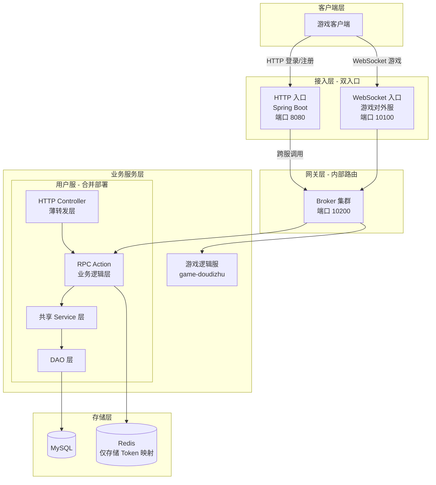
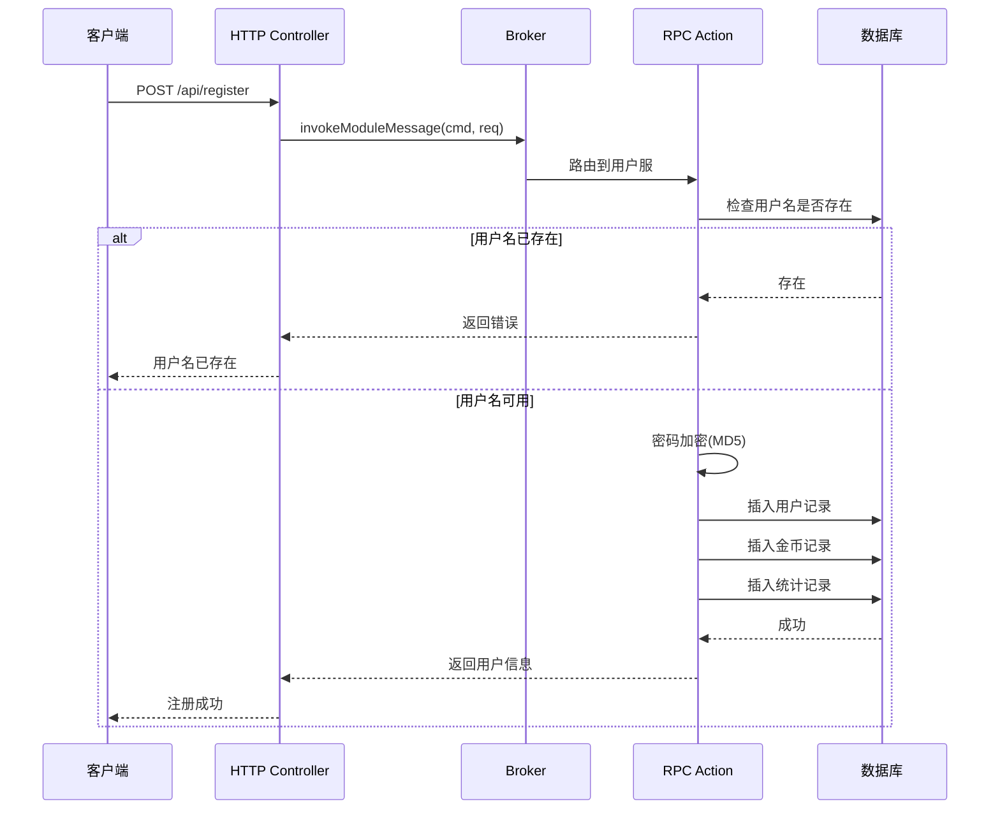
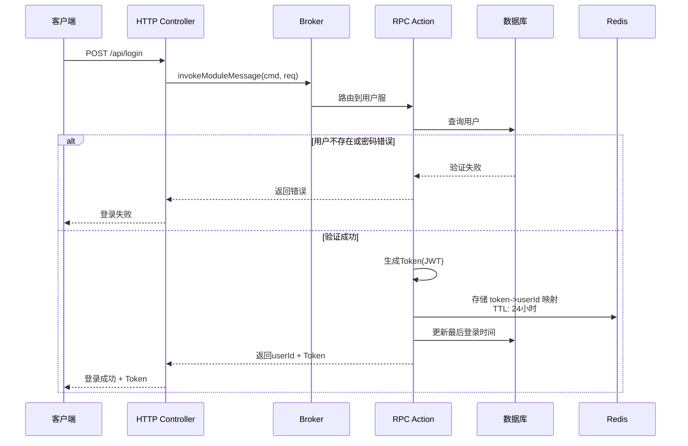
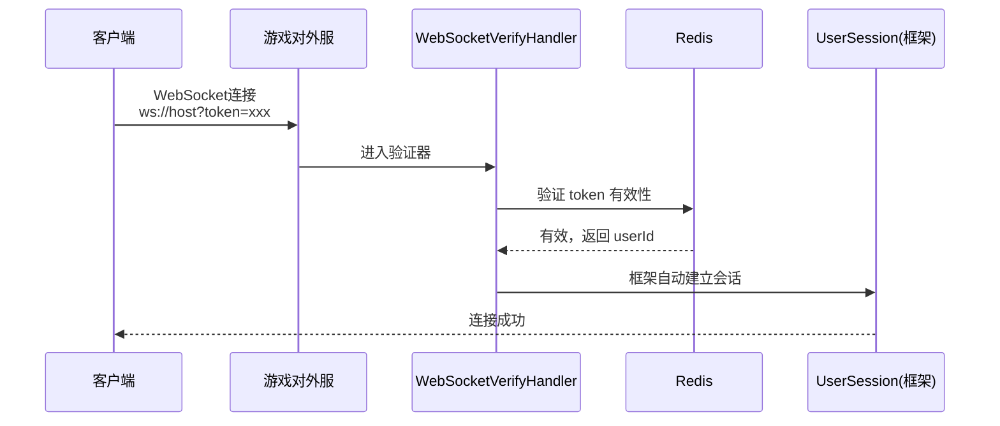
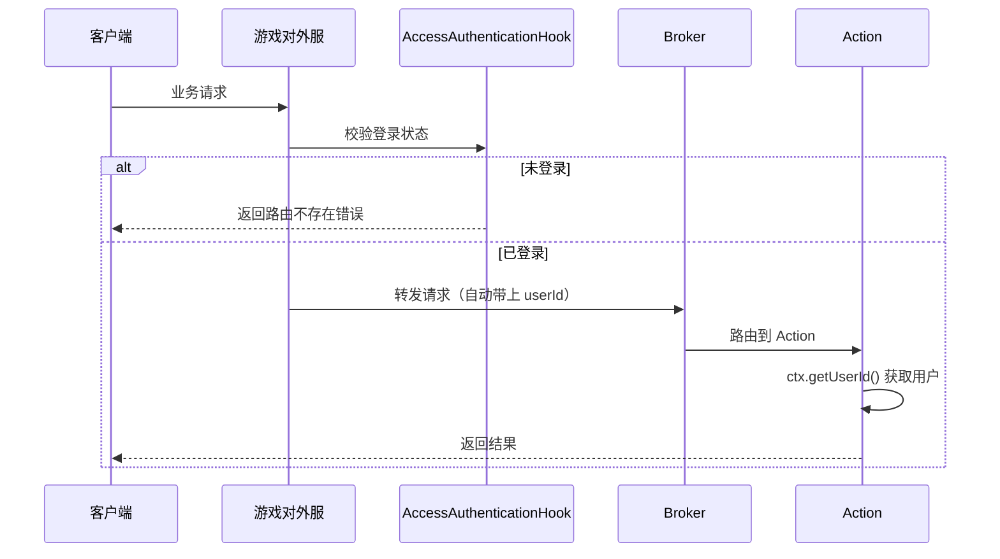
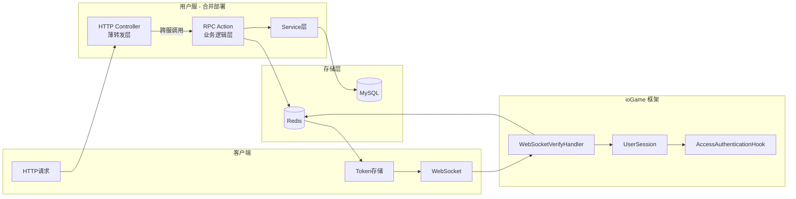
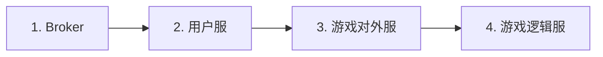
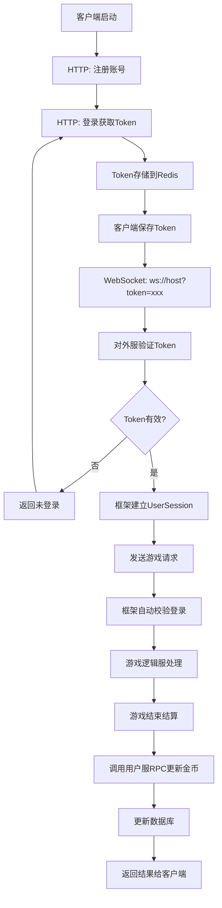

# 用户登录系统设计文档 (v1.0)
## 1. 概述
### 1.1 设计目标
设计一个简单但可扩展的用户登录系统，采用合并部署方案，充分利用 ioGame 框架提供的用户会话管理能力，支持：
- 用户注册（HTTP）
- 用户登录（HTTP）
- Token 生成与验证
- WebSocket 连接认证（利用 ioGame 框架）
- 货币管理（当前只实现金币，预留扩展）
### 1.2 整体架构图

## 2. 数据库设计
### 2.1 表结构
```sql
-- =====================================================
-- 数据库初始化脚本（适配 game-starter-mybatis）
-- =====================================================

-- 1. 用户表（调整字段顺序）
CREATE TABLE `user` (
    -- 主键
    `id` bigint(20) NOT NULL COMMENT '用户ID（雪花算法）',
    
    -- 核心业务字段
    `username` varchar(64) NOT NULL COMMENT '用户名',
    `password` varchar(128) NOT NULL COMMENT '密码（BCrypt加密）',
    `nickname` varchar(64) DEFAULT NULL COMMENT '昵称',
    `avatar` varchar(255) DEFAULT NULL COMMENT '头像URL',
    `status` tinyint(4) DEFAULT 1 COMMENT '状态：0禁用，1正常',
    `last_login_time` datetime DEFAULT NULL COMMENT '最后登录时间',
    
    -- 审计字段（MyBatis-Plus 自动填充）
    `create_time` datetime NOT NULL DEFAULT CURRENT_TIMESTAMP COMMENT '创建时间',
    `update_time` datetime NOT NULL DEFAULT CURRENT_TIMESTAMP ON UPDATE CURRENT_TIMESTAMP COMMENT '更新时间',
    `create_by` varchar(64) DEFAULT NULL COMMENT '创建人',
    `update_by` varchar(64) DEFAULT NULL COMMENT '更新人',
    `del_flag` tinyint(1) NOT NULL DEFAULT 0 COMMENT '逻辑删除标记（0-正常，1-删除）',
    
    -- 扩展字段
    `extra` json DEFAULT NULL COMMENT '扩展字段',
    
    PRIMARY KEY (`id`),
    UNIQUE KEY `uk_username` (`username`),
    KEY `idx_create_time` (`create_time`),
    KEY `idx_del_flag` (`del_flag`)
) ENGINE=InnoDB DEFAULT CHARSET=utf8mb4 COMMENT='用户表';

-- 2. 用户货币表
CREATE TABLE `user_currency` (
    -- 联合主键字段
    `user_id` bigint(20) NOT NULL COMMENT '用户ID',
    `currency_type` varchar(32) NOT NULL COMMENT '货币类型：GOLD, DIAMOND, ALLIANCE_COIN',
    
    -- 核心业务字段
    `amount` bigint(20) NOT NULL DEFAULT 0 COMMENT '数量',
    `version` int(11) NOT NULL DEFAULT 0 COMMENT '版本号（乐观锁）',
    
    -- 审计字段
    `create_time` datetime NOT NULL DEFAULT CURRENT_TIMESTAMP COMMENT '创建时间',
    `update_time` datetime NOT NULL DEFAULT CURRENT_TIMESTAMP ON UPDATE CURRENT_TIMESTAMP COMMENT '更新时间',
    
    PRIMARY KEY (`user_id`, `currency_type`)
) ENGINE=InnoDB DEFAULT CHARSET=utf8mb4 COMMENT='用户货币表';

-- 3. 用户统计表
CREATE TABLE `user_stats` (
    -- 主键
    `user_id` bigint(20) NOT NULL COMMENT '用户ID',
    
    -- 核心业务字段
    `total_games` int(11) NOT NULL DEFAULT 0 COMMENT '总局数',
    `win_games` int(11) NOT NULL DEFAULT 0 COMMENT '胜局数',
    `consecutive_wins` int(11) NOT NULL DEFAULT 0 COMMENT '连胜次数',
    `consecutive_losses` int(11) NOT NULL DEFAULT 0 COMMENT '连败次数',
    
    -- 审计字段
    `create_time` datetime NOT NULL DEFAULT CURRENT_TIMESTAMP COMMENT '创建时间',
    `update_time` datetime NOT NULL DEFAULT CURRENT_TIMESTAMP ON UPDATE CURRENT_TIMESTAMP COMMENT '更新时间',
    
    -- 扩展字段
    `extra` json DEFAULT NULL COMMENT '扩展字段',
    
    PRIMARY KEY (`user_id`)
) ENGINE=InnoDB DEFAULT CHARSET=utf8mb4 COMMENT='用户统计表';

-- 4. 货币变更流水表（审计用）
CREATE TABLE `currency_change_log` (
    -- 主键
    `id` bigint(20) NOT NULL COMMENT '流水ID（雪花算法）',
    
    -- 核心业务字段
    `user_id` bigint(20) NOT NULL COMMENT '用户ID',
    `currency_type` varchar(32) NOT NULL COMMENT '货币类型',
    `change_amount` bigint(20) NOT NULL COMMENT '变更数量（正数增加，负数减少）',
    `before_amount` bigint(20) NOT NULL COMMENT '变更前数量',
    `after_amount` bigint(20) NOT NULL COMMENT '变更后数量',
    `change_type` varchar(32) NOT NULL COMMENT '变更类型：GAME_WIN, GAME_LOSE, RECHARGE, GIFT',
    `order_id` varchar(64) DEFAULT NULL COMMENT '关联订单ID',
    `remark` varchar(255) DEFAULT NULL COMMENT '备注',
    
    -- 审计字段
    `create_time` datetime NOT NULL DEFAULT CURRENT_TIMESTAMP COMMENT '创建时间',
    
    PRIMARY KEY (`id`),
    KEY `idx_user_id` (`user_id`),
    KEY `idx_create_time` (`create_time`)
) ENGINE=InnoDB DEFAULT CHARSET=utf8mb4 COMMENT='货币变更流水表';

```
### 2.2 初始化数据
```sql
-- =====================================================
-- 初始化测试数据
-- =====================================================

-- 插入测试用户（密码: 123456 的 BCrypt 加密示例）
-- 实际使用时需要用 BCrypt.hashpw("123456", BCrypt.gensalt()) 生成
INSERT INTO `user` (`id`, `username`, `password`, `nickname`, `create_by`) VALUES
(1001, 'testuser1', '$2a$10$X8LM7aHT7DftIss3rqJx3eTGNhjuf87hhs/5uln6Z5WAW2Se3PNhW', '测试玩家1', 'system'),
(1002, 'testuser2', '$2a$10$X8LM7aHT7DftIss3rqJx3eTGNhjuf87hhs/5uln6Z5WAW2Se3PNhW', '测试玩家2', 'system'),
(1003, 'testuser3', '$2a$10$X8LM7aHT7DftIss3rqJx3eTGNhjuf87hhs/5uln6Z5WAW2Se3PNhW', '测试玩家3', 'system');

-- 初始化金币
INSERT INTO `user_currency` (`user_id`, `currency_type`, `amount`) VALUES
(1001, 'GOLD', 10000),
(1002, 'GOLD', 10000),
(1003, 'GOLD', 10000);

-- 初始化统计
INSERT INTO `user_stats` (`user_id`) VALUES (1001), (1002), (1003);
```
### 2.3 Redis 存储设计
利用 ioGame 框架管理用户会话，Redis 只存储 Token 到 userId 的映射：

| Key 格式 | Value | TTL | 说明 |
| :--- | :--- | :--- | :--- |
| **token:{token}** | `userId` | 24小时 | **身份映射**：Token 到用户 ID 的核心映射，用于接入层（Lotus）进行身份校验与路由转发。 |

不需要存储（由 ioGame 框架管理）：
- ❌ 用户在线状态
- ❌ 用户会话信息
- ❌ 顶号/踢人状态

## 3. 核心流程设计
### 3.1 用户注册流程

### 3.2 用户登录流程

### 3.3 WebSocket 连接认证流程（利用 ioGame 框架）

### 3.4 业务请求校验流程（利用 ioGame 框架）

### 3.5 数据流转图

## 4. 模块设计
### 4.1 目录结构
```text
service-user/
├── pom.xml
├── src/main/java/com/pokergame/user/
│   ├── UserApplication.java           # Spring Boot 启动类
│   ├── UserLogicServer.java           # ioGame 逻辑服启动类
│   ├── controller/
│   │   └── UserHttpController.java    # HTTP 接口（薄转发层）
│   ├── action/
│   │   └── UserRpcAction.java         # RPC 接口（业务逻辑层）
│   ├── service/
│   │   ├── UserService.java
│   │   └── CurrencyService.java
│   ├── manager/
│   │   └── CurrencyManager.java
│   ├── dao/
│   │   ├── UserDao.java
│   │   └── UserCurrencyDao.java
│   ├── model/
│   │   ├── User.java
│   │   └── UserCurrency.java
│   └── config/
│       ├── RedisConfig.java
│       └── TokenService.java
└── src/main/resources/
    ├── application.yml
    └── mapper/
        ├── UserMapper.xml
        └── UserCurrencyMapper.xml

game-external/
└── src/main/java/com/pokergame/external/
    └── handler/
        └── MyWebSocketVerifyHandler.java   # WebSocket Token 验证器
```
## 5. 部署架构
### 5.1 启动顺序

### 5.2 端口规划
| 服务 | 协议 | 端口    | 说明 |
| :--- | :--- |:------| :--- |
| **用户服 (User Service)** | HTTP | 8081  | **业务入口**：处理玩家登录、注册、账号信息查询及 Web 端管理接口。 |
| **游戏对外服 (Gateway)** | WebSocket | 10100 | **长连接网关**：处理实时对局操作，支持全双工通信（如出牌广播）。 |
| **Broker** | 内部协议 (gRPC/TCP) | 10200 | **中转中枢**：负责集群内各服务间的路由转发与负载均衡。 |
| **MySQL** | - | 3306  | **持久化层**：存储用户账号、金币余额、战绩等结构化核心数据。 |
| **Redis** | - | 6379  | **高速缓存**：存储 Token 映射、在线玩家状态及对局临时快照。 |
## 6. 闭环验证

## 7. 总结
| 组件 (Component) | 职责 (Responsibility) | 技术实现 (Tech Stack) |
| :--- | :--- | :--- |
| **用户服 HTTP** | **薄转发层**：处理外部登录/注册请求并转发至业务层。 | Spring Boot / Spring MVC |
| **用户服 RPC** | **业务逻辑层**：执行账号校验、金币发放等核心业务逻辑。 | ioGame Action (Internal RPC) |
| **Token 验证** | **连接验证**：在 WebSocket 握手阶段验证 Token 合法性。 | WebSocketVerifyHandler |
| **登录校验** | **请求钩子**：对每个业务请求进行身份与权限前置校验。 | AccessAuthenticationHook |
| **会话管理** | **在线状态**：维护用户连接实例与实时在线状态。 | ioGame UserSession |
| **Token 存储** | **映射维护**：存储 Token 与 UserId 的绑定关系。 | Redis (KV Store) |
| **数据持久化** | **核心存储**：持久化用户信息、资产余额及对局统计。 | MySQL / MyBatis-Plus |
