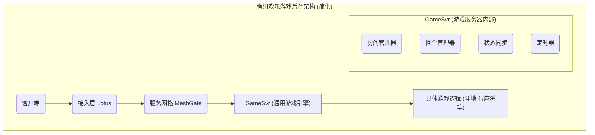
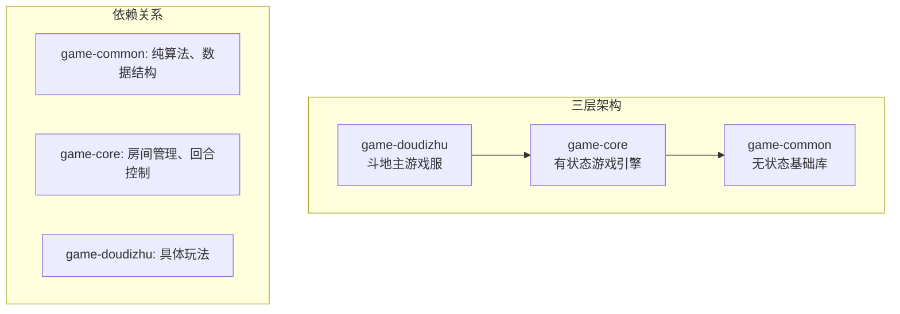
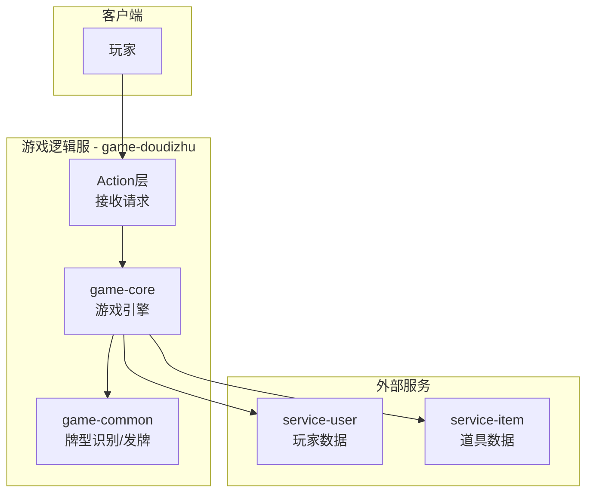
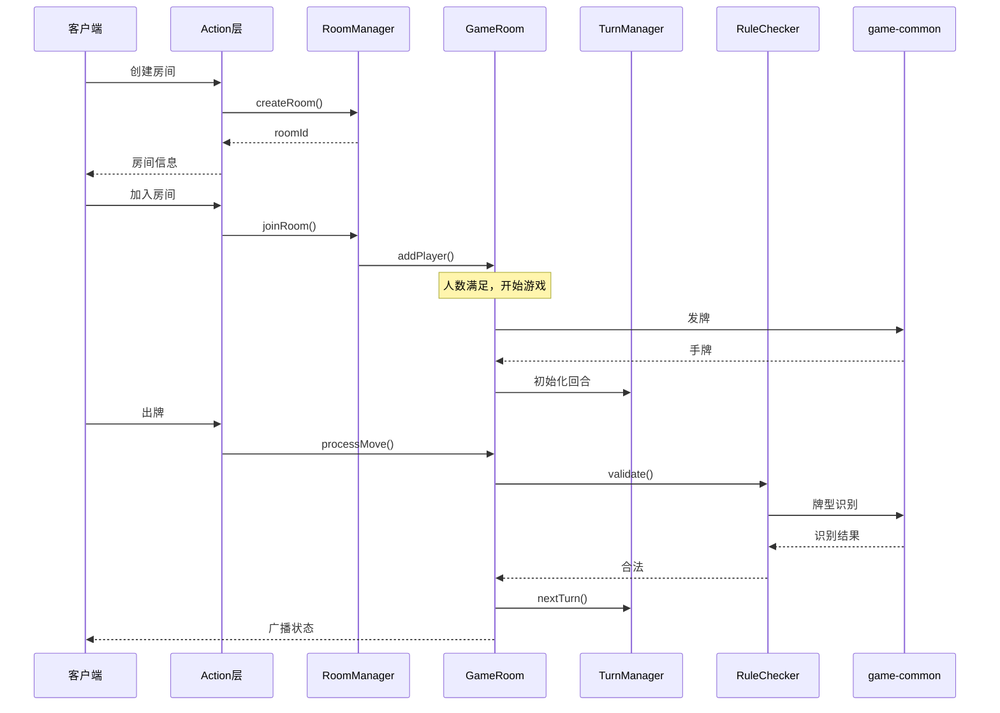
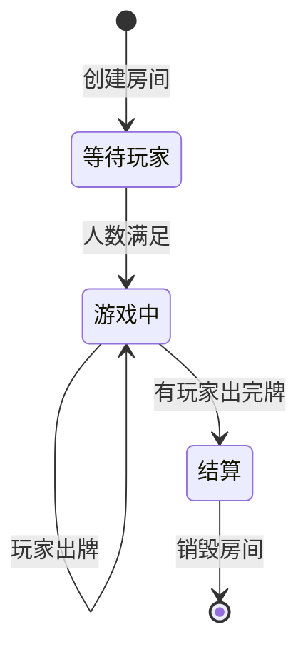
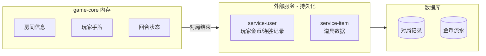
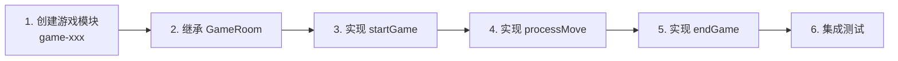

# 通用游戏引擎设计（废弃）
“游戏引擎”或“回合制框架”（Turn-Based Framework）。  
它把回合管理、定时器、房间状态同步等通用逻辑封装起来，让各个游戏（斗地主、德州等）可以像搭积木一样快速接入，专注于实现自己的核心玩法。

以腾讯的实践为例，这种设计模式非常普遍。他们的后台架构中，GameSvr 就是这样一个承载了所有游戏通用逻辑的服务
- 核心思想：将房间管理、回合控制、状态同步、定时器等所有游戏都需要的通用逻辑，沉淀到一个底层的“游戏框架”中。 
- 业务扩展：具体的玩法（如牌型判断）则通过插件、脚本或继承的方式注入。这样开发新游戏时，开发者只需关注玩法本身，极大地提升了研发效率。
## 1. 模块概述
### 1.1 模块定位
game-core 是棋牌游戏平台的有状态游戏引擎模块，位于 game-common（无状态基础库）和具体游戏逻辑服（如 game-doudizhu）之间。

### 1.2 核心职责

| 职责 | 说明 | 是否有状态 |
| :--- | :--- | :---: |
| **房间管理 (RoomMgr)** | 负责房间的全生命周期（创建、加入、销毁），维护房间内的玩家列表及准备状态。 | ✅ 有状态 |
| **回合管理 (TurnMgr)** | 核心流程控制：维护当前操作玩家索引、出牌顺序（顺/逆时针）及回合切换逻辑。 | ✅ 有状态 |
| **定时器管理 (Timer)** | 驱动游戏推进：处理玩家出牌倒计时、自动托管、抽牌动画延时等时间任务。 | ✅ 有状态 |
| **状态同步 (StateMgr)** | 维护游戏当前的快照（如：当前底池、已出牌记录），并在变化时通知所有相关客户端。 | ✅ 有状态 |
| **规则执行 (RuleChecker)** | **逻辑网关**：将当前请求透传给 `game-common` 进行牌型校验，自身不保存校验规则。 | ❌ 无状态 |
### 1.3 与 game-common 的关系

| 对比项 | game-common (工具层) | game-core (引擎层) |
| :--- | :--- | :--- |
| **是否有状态** | ❌ **无状态** (Stateless) | ✅ **有状态** (Stateful) |
| **核心职责** | 牌型识别、大小比较、基础常量定义 | 房间管理、回合控制、筹码计算、发牌逻辑 |
| **存储方式** | **无存储**：纯函数式调用，随借随还 | **内存存储**：使用 `ConcurrentHashMap` 维护房间与玩家状态 |
| **依赖关系** | **最底层**：被所有模块引用，不依赖其他业务 | **中间层**：深度依赖 `game-common` 进行牌型校验 |
| **数据持久化** | **不涉及**：仅处理内存中的牌组计算 | **不涉及**：仅维护对局实时状态（持久化由 Data 服务负责） |
| **生命周期** | **永久**：随 JVM 启动加载，全局复用 | **动态**：随游戏对局创建而生成，随对局结算而销毁 |
## 2. 运行机制
### 2.1 整体架构图

### 2.2 核心组件交互

### 2.3 生命周期

### 3. 核心类设计

### 4. 数据存储说明
### 4.1 game-core 不涉及持久化
| 数据类型 | 存储位置 | 生命周期 | 是否持久化 |
| :--- | :--- | :--- | :---: |
| **房间信息 (Room Info)** | 内存 (`ConcurrentHashMap`) | 房间创建至销毁（由房间管理器控制） | ❌ 否 |
| **玩家手牌 (Player Hand)** | 内存 | 单个对局（Hand）从开始到结算期间 | ❌ 否 |
| **回合状态 (Turn State)** | 内存 | 对局期间，随操作（Action）实时更新 | ❌ 否 |
| **定时任务 (Timer Task)** | 内存 | 随任务执行（如：倒计时结束）后自动销毁 | ❌ 否 |
### 4.2 数据流向

### 4.3 为什么 game-core 不需要持久化？
| 原因 | 说明 |
| :--- | :--- |
| **临时性 (Ephemerality)** | 游戏对局属于**瞬时状态**（Transient State），一旦结算完成并产生最终战报，中间过程数据（如：某一回合的具体手牌）通常不再具有保留价值。 |
| **高硬性能 (Performance)** | 扑克类游戏对响应延迟极其敏感。**内存操作**（纳秒级）远快于磁盘或分布式数据库（毫秒级），是保证万人在线流畅发牌、出牌的核心支撑。 |
| **设计简化 (Simplicity)** | 将核心逻辑限制在单机内存中，可以完全避免**分布式事务**、锁竞争及数据一致性等复杂架构问题，极大提升了开发与调试效率。 |
| **职责分离 (Separation)** | **分层架构**原则：`game-core` 只负责“算牌”与“跑逻辑”；而金币扣除、胜率统计等涉及资产的数据持久化，交由专门的 `Account/Data Service` 异步处理。 |

## 5. 游戏开发流程
### 5.1 创建新游戏的步骤

### 5.2 斗地主游戏示例
```java
// game-doudizhu 中的实现
public class DoudizhuRoom extends GameRoom {
    
    private final DoudizhuRuleChecker ruleChecker = new DoudizhuRuleChecker();
    private final HandRankEvaluator rankEvaluator = new HandRankEvaluator();
    
    public DoudizhuRoom(String roomId, long ownerId, int maxPlayers) {
        super(roomId, "DOUDIZHU", ownerId, maxPlayers);
    }
    
    @Override
    protected void startGame() {
        // 1. 发牌
        // 2. 确定地主
        // 3. 初始化回合管理器
        // 4. 开始第一回合
    }
    
    @Override
    public void processMove(long playerId, Object moveData) {
        // 1. 校验回合
        // 2. 校验出牌合法性（调用 ruleChecker）
        // 3. 更新游戏状态
        // 4. 切换回合
        // 5. 检查游戏结束
    }
    
    @Override
    protected void endGame() {
        // 1. 计算结算
        // 2. 通知 service-user 更新金币
        // 3. 销毁房间
    }
}
```
