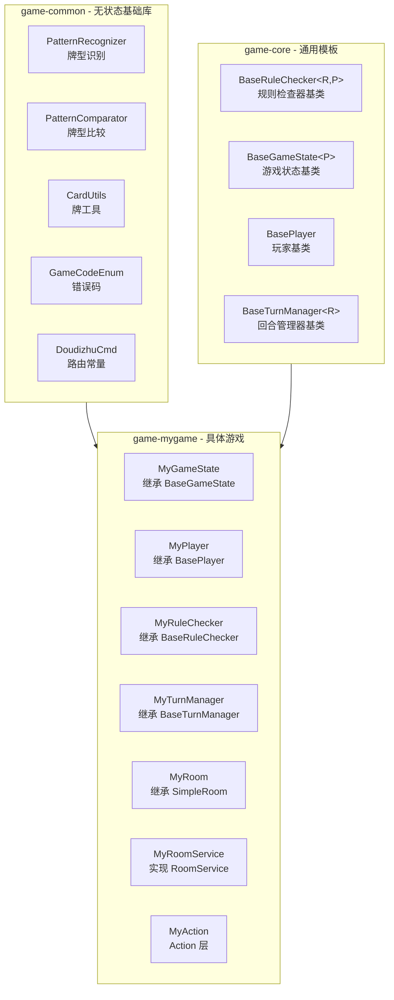
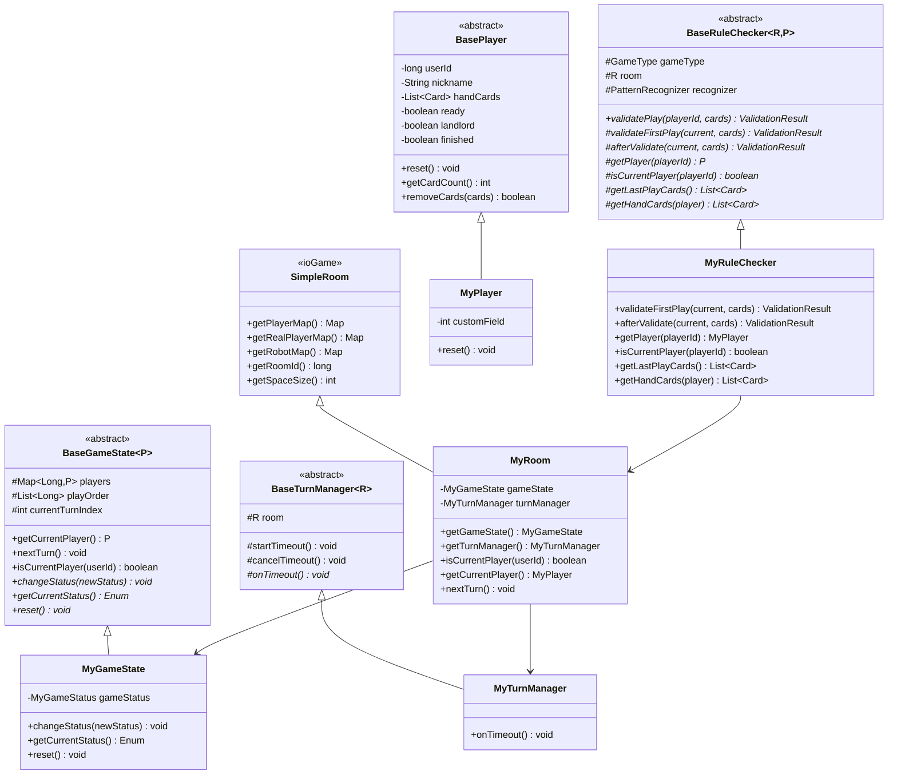
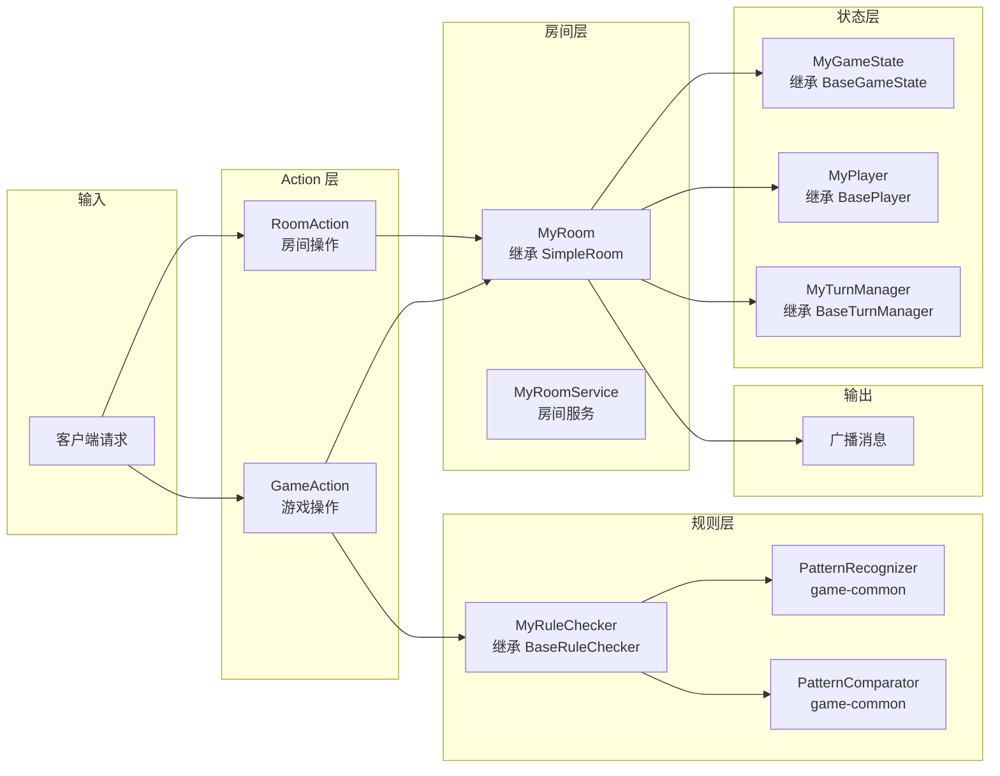

# 新游戏逻辑服开发指南
## 1. 概述
### 1.1 架构图

### 1.2 完整类图

## 2. 继承 game-core 的基类
### 2.1 定义游戏状态枚举
```java
// enums/MyGameStatus.java
package com.pokergame.mygame.enums;

/**
 * 游戏状态枚举
 * 
 * @author poker-platform
 */
public enum MyGameStatus {
    WAITING,    // 等待玩家
    READY,      // 准备中
    PLAYING,    // 游戏中
    FINISHED    // 已结束
}
```
### 2.2 定义玩家类（继承 BasePlayer）
```java
// room/MyPlayer.java
package com.pokergame.mygame.room;

import com.pokergame.core.state.BasePlayer;
import lombok.Getter;
import lombok.Setter;

/**
 * 游戏玩家
 * 
 * 继承 BasePlayer，扩展游戏特有属性
 * 
 * @author poker-platform
 */
@Getter
@Setter
public class MyPlayer extends BasePlayer {
    
    /** 游戏特有属性（如叫地主倍数、下注金额等） */
    private int customField;
    
    @Override
    public void reset() {
        super.reset();
        this.customField = 0;
    }
}
```
### 2.3 定义游戏状态类（继承 BaseGameState）
```java
// state/MyGameState.java
package com.pokergame.mygame.state;

import com.pokergame.core.state.BaseGameState;
import com.pokergame.mygame.enums.MyGameStatus;
import com.pokergame.mygame.room.MyPlayer;
import lombok.extern.slf4j.Slf4j;

/**
 * 游戏状态
 * 
 * 继承 BaseGameState，实现游戏特有的状态管理
 * 
 * @author poker-platform
 */
@Slf4j
public class MyGameState extends BaseGameState<MyPlayer> {
    
    private MyGameStatus gameStatus = MyGameStatus.WAITING;
    
    @Override
    public void changeStatus(Enum<?> newStatus) {
        this.gameStatus = (MyGameStatus) newStatus;
        log.info("游戏状态变更: {}", gameStatus);
    }
    
    @Override
    public Enum<?> getCurrentStatus() {
        return gameStatus;
    }
    
    @Override
    public void reset() {
        this.gameStatus = MyGameStatus.WAITING;
        this.playOrder.clear();
        this.currentTurnIndex = 0;
        this.landlordId = 0;
        this.landlordExtraCards.clear();
        this.lastPlayCards = null;
        this.lastPlayPlayerId = 0;
        this.lastPattern = null;
        this.bombCount = 0;
        this.multiplier = 1;
        
        for (MyPlayer player : players.values()) {
            player.reset();
        }
    }
}
```
### 2.4 定义规则检查器（继承 BaseRuleChecker）
```java
// rule/MyRuleChecker.java
package com.pokergame.mygame.rule;

import com.pokergame.common.card.Card;
import com.pokergame.common.game.GameType;
import com.pokergame.common.pattern.PatternResult;
import com.pokergame.common.rule.ValidationResult;
import com.pokergame.core.rule.BaseRuleChecker;
import com.pokergame.mygame.room.MyPlayer;
import com.pokergame.mygame.room.MyRoom;
import lombok.extern.slf4j.Slf4j;

import java.util.List;

/**
 * 游戏规则检查器
 * 
 * 继承 BaseRuleChecker，实现游戏特有的规则
 * 
 * @author poker-platform
 */
@Slf4j
public class MyRuleChecker extends BaseRuleChecker<MyRoom, MyPlayer> {
    
    public MyRuleChecker(MyRoom room) {
        super(GameType.MY_GAME, room);
    }
    
    // ==================== 必须实现的抽象方法 ====================
    
    @Override
    protected MyPlayer getPlayer(long playerId) {
        return room.getMyPlayer(playerId);
    }
    
    @Override
    protected boolean isCurrentPlayer(long playerId) {
        return room.isCurrentPlayer(playerId);
    }
    
    @Override
    protected List<Card> getLastPlayCards() {
        return room.getLastPlayCards();
    }
    
    @Override
    protected List<Card> getHandCards(MyPlayer player) {
        return player.getHandCards();
    }
    
    // ==================== 钩子方法（根据需要重写） ====================
    
    /**
     * 首出校验
     */
    @Override
    protected ValidationResult validateFirstPlay(PatternResult current, List<Card> cards) {
        // 默认：首出任何牌都可以
        // 子类可重写实现特殊规则（如斗地主首出不能出炸弹）
        return ValidationResult.success(current.getPattern(), current.getMainRank(), 0);
    }
    
    /**
     * 校验后处理
     */
    @Override
    protected ValidationResult afterValidate(PatternResult current, List<Card> cards) {
        // 默认：无特殊处理
        // 子类可重写实现炸弹倍率等逻辑
        return ValidationResult.success(current.getPattern(), current.getMainRank(), 0);
    }
}
```
### 2.5 定义回合管理器（继承 BaseTurnManager）
```java
// turn/MyTurnManager.java
package com.pokergame.mygame.turn;

import com.pokergame.core.state.BaseTurnManager;
import com.pokergame.mygame.enums.InternalOperation;
import com.pokergame.mygame.room.MyRoom;
import lombok.extern.slf4j.Slf4j;

/**
 * 游戏回合管理器
 * 
 * 继承 BaseTurnManager，实现超时回调
 * 
 * @author poker-platform
 */
@Slf4j
public class MyTurnManager extends BaseTurnManager<MyRoom> {
    
    public MyTurnManager(MyRoom room) {
        super(room);
    }
    
    @Override
    protected void onTimeout() {
        log.info("房间 {} 玩家 {} 出牌超时", room.getRoomId(), room.getCurrentPlayer());
        // 超时处理：自动过牌或托管
        room.operation(InternalOperation.TIMEOUT);
    }
    
    @Override
    protected String generateTaskId() {
        return "mygame_timeout_" + room.getRoomId() + "_" + System.currentTimeMillis();
    }
}
```
## 3. 核心组件关系图

## 4. 开发新游戏步骤清单
| 步骤 | 任务 | 预计代码量 | 是否必须 |
| :--- | :--- | :--- | :---: |
| **1** | **定义游戏状态枚举** `MyGameStatus` | ~5行 | ✅ |
| **2** | **定义玩家类** `MyPlayer` 继承 `BasePlayer` | ~15行 | ✅ |
| **3** | **定义游戏状态类** `MyGameState` 继承 `BaseGameState` | ~40行 | ✅ |
| **4** | **定义规则检查器** `MyRuleChecker` 继承 `BaseRuleChecker` | ~50行 | ✅ |
| **5** | **定义回合管理器** `MyTurnManager` 继承 `BaseTurnManager` | ~20行 | ✅ |
| **6** | **定义房间类** `MyRoom` 继承 `SimpleRoom` | ~80行 | ✅ |
| **7** | **定义房间服务** `MyRoomService` 实现 `RoomService` | ~60行 | ✅ |
| **8** | **定义 Action 层**（处理房间与游戏具体操作请求） | ~100行 | ✅ |
| **9** | **定义广播工具** `MyBroadcastKit` | ~50行 | ✅ |
| **10** | **定义 OperationHandler**（执行简单的原子状态变更） | ~50行 | ✅ |


